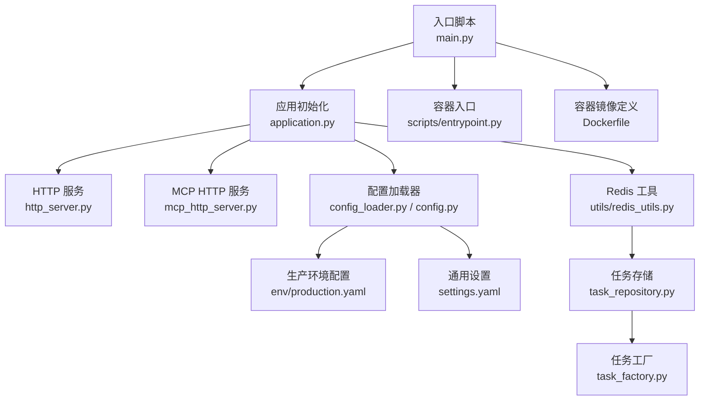
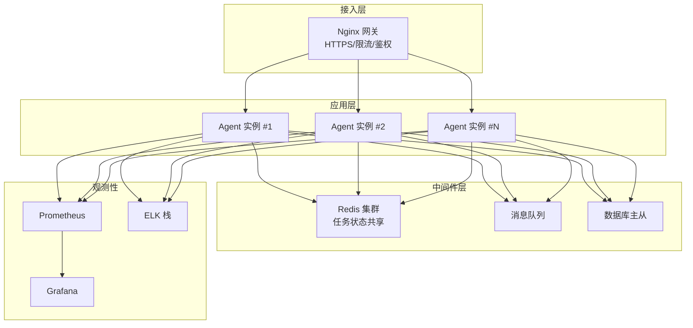
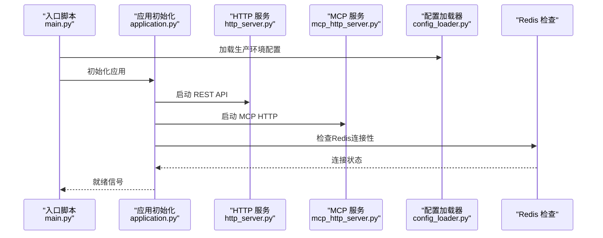
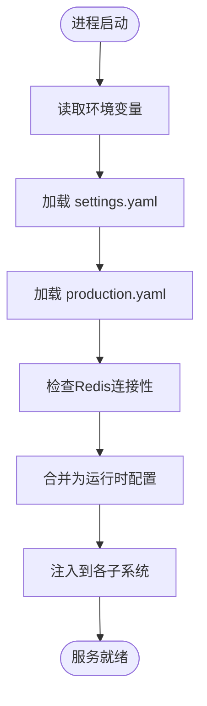
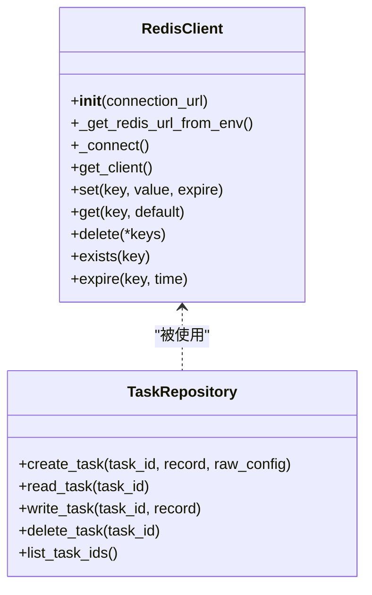
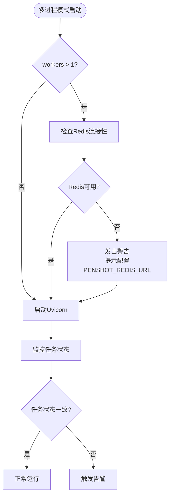
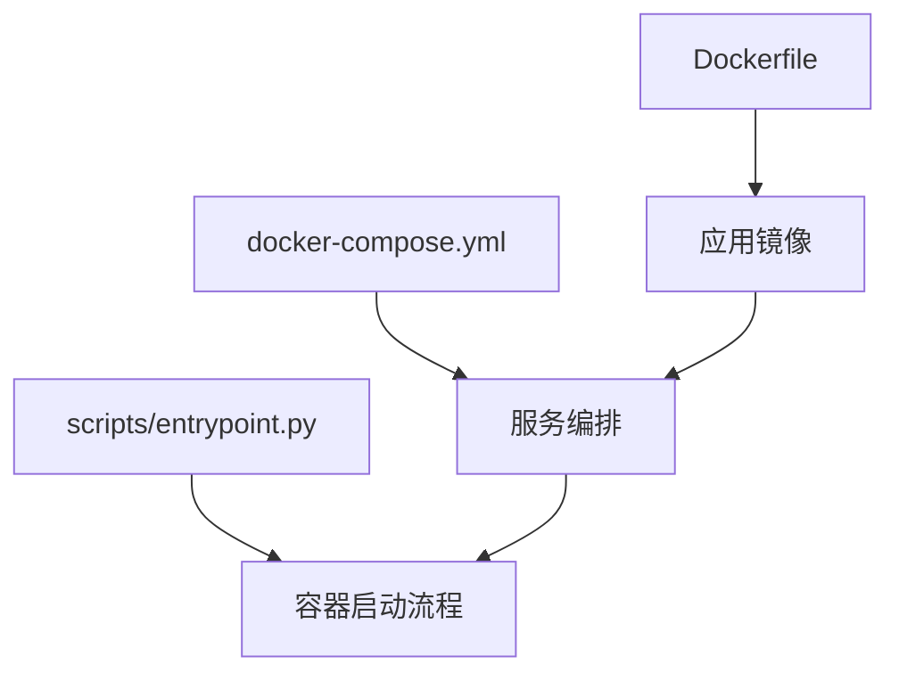
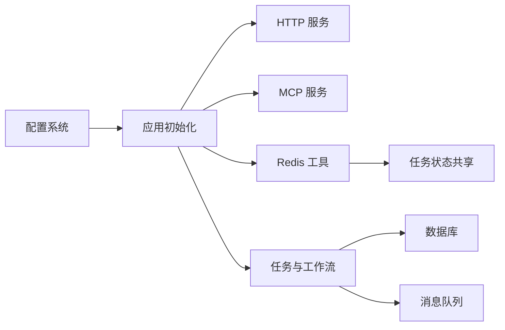

# 生产环境部署

<cite>
**本文引用的文件**   
- [README_zh.md](file://README_zh.md)
- [Dockerfile](file://Dockerfile)
- [docker-compose.yml](file://docker-compose.yml)
- [main.py](file://main.py)
- [src/penshot/http_server.py](file://src/penshot/http_server.py)
- [src/penshot/mcp_http_server.py](file://src/penshot/mcp_http_server.py)
- [src/penshot/app/application.py](file://src/penshot/app/application.py)
- [src/penshot/config/config.py](file://src/penshot/config/config.py)
- [src/penshot/config/config_loader.py](file://src/penshot/config/config_loader.py)
- [src/penshot/config/settings.yaml](file://src/penshot/config/settings.yaml)
- [src/penshot/config/env/production.yaml](file://src/penshot/config/env/production.yaml)
- [src/penshot/config/logging.yaml](file://src/penshot/config/logging.yaml)
- [src/penshot/utils/redis_utils.py](file://src/penshot/utils/redis_utils.py)
- [src/penshot/neopen/task/task_repository.py](file://src/penshot/neopen/task/task_repository.py)
- [src/penshot/neopen/task/task_factory.py](file://src/penshot/neopen/task/task_factory.py)
- [scripts/entrypoint.py](file://scripts/entrypoint.py)
</cite>

## 更新摘要
**变更内容**   
- 增强了多进程模式下的Redis连接性检查和分布式任务状态一致性验证
- 添加了全面的警告系统，用于检测多进程模式下Redis不可用的情况
- 更新了任务存储机制，支持Redis集群模式和内存回退
- 完善了生产环境的监控和故障排查指南

## 目录
1. [简介](#简介)
2. [项目结构](#项目结构)
3. [核心组件](#核心组件)
4. [架构总览](#架构总览)
5. [详细组件分析](#详细组件分析)
6. [依赖分析](#依赖分析)
7. [性能考虑](#性能考虑)
8. [故障排查指南](#故障排查指南)
9. [结论](#结论)
10. [附录](#附录)

## 简介
本指南面向在生产环境中部署 Video Shot Agent 的运维与平台工程团队，覆盖硬件要求、基准测试方法、负载均衡与反向代理（Nginx）配置、高可用架构（数据库主从复制、Redis 集群、消息队列）、安全加固（HTTPS、访问控制、API 限流）、监控告警（Prometheus + Grafana）以及日志采集与分析（ELK）。文档同时结合仓库中的实际代码与配置文件，给出可落地的部署建议与最佳实践。

**更新** 新增了多进程模式下的Redis连接性检查和分布式任务状态一致性验证机制，确保在高并发场景下任务状态的可靠性和一致性。

## 项目结构
仓库采用分层与模块化组织：应用入口、HTTP/MCP 服务、配置加载、任务与工作流编排、外部客户端（LLM/缓存等）、工具与实用库。关键路径包括：
- 应用启动与进程管理：入口脚本与容器镜像构建
- HTTP 服务：REST API 与 MCP HTTP 服务
- 配置系统：多环境 YAML 与运行时配置模型
- 缓存与中间件：Redis 集成
- 日志与结构化输出：统一日志配置

**图示来源**
- [main.py:1-141](file://main.py#L1-L141)
- [src/penshot/app/application.py:1-131](file://src/penshot/app/application.py#L1-L131)
- [src/penshot/http_server.py:1-200](file://src/penshot/http_server.py#L1-L200)
- [src/penshot/mcp_http_server.py:1-200](file://src/penshot/mcp_http_server.py#L1-L200)
- [src/penshot/config/config_loader.py:1-200](file://src/penshot/config/config_loader.py#L1-L200)
- [src/penshot/config/config.py:1-200](file://src/penshot/config/config.py#L1-L200)
- [src/penshot/config/env/production.yaml:1-251](file://src/penshot/config/env/production.yaml#L1-L251)
- [src/penshot/config/settings.yaml:1-200](file://src/penshot/config/settings.yaml#L1-L200)
- [src/penshot/utils/redis_utils.py:1-318](file://src/penshot/utils/redis_utils.py#L1-L318)
- [src/penshot/neopen/task/task_repository.py:1-155](file://src/penshot/neopen/task/task_repository.py#L1-L155)
- [src/penshot/neopen/task/task_factory.py:1-699](file://src/penshot/neopen/task/task_factory.py#L1-L699)
- [scripts/entrypoint.py:1-200](file://scripts/entrypoint.py#L1-L200)
- [Dockerfile:1-200](file://Dockerfile#L1-L200)

章节来源
- [README_zh.md:1-200](file://README_zh.md#L1-L200)
- [Dockerfile:1-200](file://Dockerfile#L1-L200)
- [docker-compose.yml:1-200](file://docker-compose.yml#L1-L200)
- [main.py:1-141](file://main.py#L1-L141)
- [src/penshot/app/application.py:1-131](file://src/penshot/app/application.py#L1-L131)
- [src/penshot/http_server.py:1-200](file://src/penshot/http_server.py#L1-L200)
- [src/penshot/mcp_http_server.py:1-200](file://src/penshot/mcp_http_server.py#L1-L200)
- [src/penshot/config/config.py:1-200](file://src/penshot/config/config.py#L1-L200)
- [src/penshot/config/config_loader.py:1-200](file://src/penshot/config/config_loader.py#L1-L200)
- [src/penshot/config/settings.yaml:1-200](file://src/penshot/config/settings.yaml#L1-L200)
- [src/penshot/config/env/production.yaml:1-251](file://src/penshot/config/env/production.yaml#L1-L251)
- [src/penshot/utils/redis_utils.py:1-318](file://src/penshot/utils/redis_utils.py#L1-L318)
- [src/penshot/neopen/task/task_repository.py:1-155](file://src/penshot/neopen/task/task_repository.py#L1-L155)
- [src/penshot/neopen/task/task_factory.py:1-699](file://src/penshot/neopen/task/task_factory.py#L1-L699)
- [scripts/entrypoint.py:1-200](file://scripts/entrypoint.py#L1-L200)

## 核心组件
- 应用启动与生命周期
  - 入口脚本负责解析参数、加载配置、初始化应用并启动服务。
  - 应用初始化模块负责注册路由、中间件、工作流与任务处理器。
- HTTP 服务
  - REST API 服务暴露业务接口，供前端或上游网关调用。
  - MCP HTTP 服务提供模型协作协议接口，便于与外部系统集成。
- 配置系统
  - 支持多环境 YAML 配置，生产环境通过独立配置文件注入。
  - 配置加载器将环境变量与 YAML 合并为运行时配置对象。
- 缓存与状态
  - Redis 工具用于会话、缓存与分布式锁等能力。
  - **新增** 多进程模式下的Redis连接性检查和分布式任务状态一致性验证。
- 容器化与编排
  - Dockerfile 定义运行环境与依赖。
  - docker-compose.yml 提供本地与小型集群编排示例。

**更新** 增强了多进程模式下的Redis连接性检查，在启动时自动检测Redis可用性并提供详细的警告信息。

章节来源
- [main.py:1-141](file://main.py#L1-L141)
- [src/penshot/app/application.py:1-131](file://src/penshot/app/application.py#L1-L131)
- [src/penshot/http_server.py:1-200](file://src/penshot/http_server.py#L1-L200)
- [src/penshot/mcp_http_server.py:1-200](file://src/penshot/mcp_http_server.py#L1-L200)
- [src/penshot/config/config.py:1-200](file://src/penshot/config/config.py#L1-L200)
- [src/penshot/config/config_loader.py:1-200](file://src/penshot/config/config_loader.py#L1-L200)
- [src/penshot/config/settings.yaml:1-200](file://src/penshot/config/settings.yaml#L1-L200)
- [src/penshot/config/env/production.yaml:1-251](file://src/penshot/config/env/production.yaml#L1-L251)
- [src/penshot/utils/redis_utils.py:1-318](file://src/penshot/utils/redis_utils.py#L1-L318)
- [src/penshot/neopen/task/task_repository.py:1-155](file://src/penshot/neopen/task/task_repository.py#L1-L155)
- [Dockerfile:1-200](file://Dockerfile#L1-L200)
- [docker-compose.yml:1-200](file://docker-compose.yml#L1-L200)

## 架构总览
生产环境推荐采用"网关 + 多实例服务 + 共享中间件"的架构：
- 网关层：Nginx 作为反向代理与负载均衡，提供 HTTPS 终止、访问控制与限流。
- 应用层：多个 Video Shot Agent 实例水平扩展，无状态或弱状态设计，依赖共享中间件。
- 中间件层：Redis 集群（缓存/会话/分布式锁）、消息队列（异步任务/削峰填谷）、数据库（持久化存储，主从复制）。
- 观测性：Prometheus 抓取指标，Grafana 可视化，ELK 收集与分析日志。

**更新** 在多进程模式下，所有任务状态都通过Redis进行跨进程共享，确保分布式任务的一致性。

[此图为概念架构图，无需图示来源]

## 详细组件分析

### 应用启动与服务发现
- 入口脚本负责参数解析与环境准备，随后调用应用初始化模块完成路由注册与中间件装配。
- 应用初始化模块根据配置加载不同环境的 YAML，并将配置注入到各子系统（如 LLM 客户端、缓存、任务处理器）。
- HTTP 服务与 MCP 服务分别监听端口，对外暴露 REST 与 MCP 协议接口。

**更新** 在多进程模式下，启动时会进行Redis连接性检查，如果Redis不可用会发出警告并提示配置PENSHOT_REDIS_URL环境变量。

**图示来源**
- [main.py:1-141](file://main.py#L1-L141)
- [src/penshot/app/application.py:1-131](file://src/penshot/app/application.py#L1-L131)
- [src/penshot/http_server.py:1-200](file://src/penshot/http_server.py#L1-L200)
- [src/penshot/mcp_http_server.py:1-200](file://src/penshot/mcp_http_server.py#L1-L200)
- [src/penshot/config/config_loader.py:1-200](file://src/penshot/config/config_loader.py#L1-L200)

章节来源
- [main.py:1-141](file://main.py#L1-L141)
- [src/penshot/app/application.py:1-131](file://src/penshot/app/application.py#L1-L131)
- [src/penshot/http_server.py:1-200](file://src/penshot/http_server.py#L1-L200)
- [src/penshot/mcp_http_server.py:1-200](file://src/penshot/mcp_http_server.py#L1-L200)
- [src/penshot/config/config_loader.py:1-200](file://src/penshot/config/config_loader.py#L1-L200)

### 配置系统与多环境管理
- 通用设置位于 settings.yaml，包含基础运行时参数。
- 生产环境配置位于 env/production.yaml，覆盖敏感信息与资源限制。
- 配置加载器按优先级合并环境变量与 YAML，生成最终配置对象供各模块使用。

**更新** 生产环境配置中包含了Redis集群支持和任务TTL配置，确保分布式任务的一致性。

**图示来源**
- [src/penshot/config/config_loader.py:1-200](file://src/penshot/config/config_loader.py#L1-L200)
- [src/penshot/config/config.py:1-200](file://src/penshot/config/config.py#L1-L200)
- [src/penshot/config/settings.yaml:1-200](file://src/penshot/config/settings.yaml#L1-L200)
- [src/penshot/config/env/production.yaml:1-251](file://src/penshot/config/env/production.yaml#L1-L251)

章节来源
- [src/penshot/config/config_loader.py:1-200](file://src/penshot/config/config_loader.py#L1-L200)
- [src/penshot/config/config.py:1-200](file://src/penshot/config/config.py#L1-L200)
- [src/penshot/config/settings.yaml:1-200](file://src/penshot/config/settings.yaml#L1-L200)
- [src/penshot/config/env/production.yaml:1-251](file://src/penshot/config/env/production.yaml#L1-L251)

### 缓存与会话（Redis）
- Redis 工具提供连接池、键值存取与分布式锁能力。
- 生产环境建议使用 Redis 集群模式，提升吞吐与可用性。
- 会话保持可通过网关层 Cookie 粘性或基于 Redis 的会话存储实现。

**更新** Redis客户端现在支持集群模式配置，包括启动节点列表和SSL连接选项。连接失败时会记录详细的错误信息并提供内存回退机制。

**图示来源**
- [src/penshot/utils/redis_utils.py:1-318](file://src/penshot/utils/redis_utils.py#L1-L318)
- [src/penshot/neopen/task/task_repository.py:1-155](file://src/penshot/neopen/task/task_repository.py#L1-L155)

章节来源
- [src/penshot/utils/redis_utils.py:1-318](file://src/penshot/utils/redis_utils.py#L1-L318)
- [src/penshot/neopen/task/task_repository.py:1-155](file://src/penshot/neopen/task/task_repository.py#L1-L155)

### 多进程模式验证与分布式任务状态一致性
**新增** 系统在多进程模式下增强了Redis连接性检查和分布式任务状态一致性验证：

- **启动时检查**：当workers > 1时，系统会自动检查Redis连接性
- **警告机制**：如果Redis不可用，会发出详细警告并提示配置PENSHOT_REDIS_URL
- **任务状态共享**：所有任务状态通过Redis进行跨进程共享，避免进程间分裂
- **回退机制**：Redis不可用时自动回退到内存存储，但会记录警告

**图示来源**
- [main.py:105-124](file://main.py#L105-L124)
- [src/penshot/utils/redis_utils.py:100-137](file://src/penshot/utils/redis_utils.py#L100-L137)
- [src/penshot/neopen/task/task_repository.py:23-39](file://src/penshot/neopen/task/task_repository.py#L23-L39)

章节来源
- [main.py:105-124](file://main.py#L105-L124)
- [src/penshot/utils/redis_utils.py:100-137](file://src/penshot/utils/redis_utils.py#L100-L137)
- [src/penshot/neopen/task/task_repository.py:23-39](file://src/penshot/neopen/task/task_repository.py#L23-L39)

### 容器化与编排
- Dockerfile 定义 Python 运行环境、依赖安装与镜像优化策略。
- docker-compose.yml 提供本地开发与小规模集群的编排模板，可扩展现有服务以引入 Redis、MQ、DB 等中间件。
- scripts/entrypoint.py 可作为容器入口，执行健康检查、预热或优雅关闭逻辑。

**图示来源**
- [Dockerfile:1-200](file://Dockerfile#L1-L200)
- [docker-compose.yml:1-200](file://docker-compose.yml#L1-L200)
- [scripts/entrypoint.py:1-200](file://scripts/entrypoint.py#L1-L200)

章节来源
- [Dockerfile:1-200](file://Dockerfile#L1-L200)
- [docker-compose.yml:1-200](file://docker-compose.yml#L1-L200)
- [scripts/entrypoint.py:1-200](file://scripts/entrypoint.py#L1-L200)

## 依赖分析
- 外部依赖
  - Redis：缓存、会话、分布式锁、任务状态共享
  - 消息队列：异步任务、解耦与削峰
  - 数据库：持久化存储，建议主从复制
  - LLM 客户端：OpenAI/Qwen/Ollama/HuggingFace 等（由客户端工厂选择）
- 内部依赖
  - 配置系统为全局依赖，贯穿所有模块
  - HTTP 与 MCP 服务依赖应用初始化与配置
  - 任务与工作流依赖缓存与持久化

**更新** Redis现在不仅是缓存和会话存储，还承担分布式任务状态共享的重要职责，特别是在多进程模式下。

**图示来源**
- [src/penshot/config/config.py:1-200](file://src/penshot/config/config.py#L1-L200)
- [src/penshot/app/application.py:1-131](file://src/penshot/app/application.py#L1-L131)
- [src/penshot/http_server.py:1-200](file://src/penshot/http_server.py#L1-L200)
- [src/penshot/mcp_http_server.py:1-200](file://src/penshot/mcp_http_server.py#L1-L200)
- [src/penshot/utils/redis_utils.py:1-318](file://src/penshot/utils/redis_utils.py#L1-L318)
- [src/penshot/neopen/task/task_repository.py:1-155](file://src/penshot/neopen/task/task_repository.py#L1-L155)

章节来源
- [src/penshot/config/config.py:1-200](file://src/penshot/config/config.py#L1-L200)
- [src/penshot/app/application.py:1-131](file://src/penshot/app/application.py#L1-L131)
- [src/penshot/http_server.py:1-200](file://src/penshot/http_server.py#L1-L200)
- [src/penshot/mcp_http_server.py:1-200](file://src/penshot/mcp_http_server.py#L1-L200)
- [src/penshot/utils/redis_utils.py:1-318](file://src/penshot/utils/redis_utils.py#L1-L318)
- [src/penshot/neopen/task/task_repository.py:1-155](file://src/penshot/neopen/task/task_repository.py#L1-L155)

## 性能考虑
- 硬件要求（建议）
  - CPU：每实例 4–8 核（视 LLM 调用频率与并发而定）
  - 内存：每实例 8–16 GB（含缓存与工作流状态）
  - 磁盘：SSD，至少 50 GB（日志与临时文件）
  - 网络：低延迟内网，带宽满足视频片段处理需求
- 基准测试方法
  - 并发请求压测：使用 wrk/k6 对 REST API 进行 QPS 与延迟评估
  - 端到端流水线：模拟完整视频分镜任务，测量吞吐与时延分布
  - 资源利用率：CPU/内存/IO/网络监控，识别瓶颈点
  - 回归基线：在 CI 中记录关键指标，防止性能退化
- 优化建议
  - 启用连接池与缓存预热
  - 合理设置线程/进程数与超时
  - 使用异步任务与批处理降低峰值压力
  - 对大对象进行压缩与分页传输
  - **新增** 在多进程模式下确保Redis集群的高可用性配置

**更新** 针对多进程模式，建议配置Redis集群以提升性能和可用性，避免单点故障。

[本节为通用指导，不直接分析具体文件]

## 故障排查指南
- 常见问题定位
  - 启动失败：检查环境变量与 YAML 配置是否一致；确认端口占用与健康检查
  - 连接异常：验证 Redis/DB/MQ 地址、认证与网络连通性
  - **新增** 多进程模式问题：检查Redis连接性，查看启动时的警告信息
  - 性能问题：查看 Prometheus 指标与慢查询日志，定位热点接口与资源争用
- 日志与观测
  - 统一日志格式：JSON 结构化字段包含 request_id、user_id、trace_id、level、message
  - 指标暴露：HTTP 服务暴露标准指标端点，Prometheus 定期抓取
  - 告警规则：错误率、延迟 P99、资源使用率阈值触发告警
  - **新增** Redis连接性监控：监控Redis连接状态和任务状态一致性
- 回滚与恢复
  - 灰度发布：逐步放量新实例，观察指标后全量切换
  - 数据一致性：任务幂等与重试机制，避免重复处理
  - **新增** 任务状态恢复：利用Redis中的任务快照进行状态恢复

**更新** 新增了多进程模式下的故障排查指南，包括Redis连接性检查和任务状态一致性验证。

章节来源
- [src/penshot/config/logging.yaml:1-37](file://src/penshot/config/logging.yaml#L1-L37)
- [src/penshot/http_server.py:1-200](file://src/penshot/http_server.py#L1-L200)
- [src/penshot/mcp_http_server.py:1-200](file://src/penshot/mcp_http_server.py#L1-L200)
- [main.py:105-124](file://main.py#L105-L124)
- [src/penshot/utils/redis_utils.py:100-137](file://src/penshot/utils/redis_utils.py#L100-L137)

## 结论
通过网关+多实例+共享中间件的架构，Video Shot Agent 可在生产环境获得高可用与可扩展性。**新增的多进程模式验证和Redis连接性检查机制**进一步增强了系统的稳定性和可靠性，确保在分布式环境下任务状态的一致性和数据的完整性。配合完善的监控告警与日志体系，能够快速定位问题并保障服务质量。建议在上线前完成基准测试与安全加固，持续优化性能与稳定性。

**更新** 强调了多进程模式下的Redis连接性检查对于保证分布式任务一致性的重要性。

[本节为总结，不直接分析具体文件]

## 附录

### 生产环境硬件要求与基准测试清单
- 硬件规格与容量规划
- 压测场景与指标基线
- 资源预留与弹性伸缩策略
- **新增** Redis集群配置要求和性能调优建议

[本节为通用指导，不直接分析具体文件]

### 负载均衡与反向代理（Nginx）
- HTTPS 终止与证书管理
- 反向代理与负载均衡策略（轮询/最少连接/加权）
- 会话保持（Cookie 粘性或基于 Redis 的会话存储）
- 访问控制（IP 白名单、鉴权头校验）
- API 限流（令牌桶/漏桶算法）

[本节为通用指导，不直接分析具体文件]

### 高可用架构设计
- 数据库主从复制：读写分离、故障转移、备份策略
- **更新** Redis 集群：分片与副本、持久化与扩容、连接性监控
- 消息队列：分区与消费者组、死信队列与重试策略
- **新增** 多进程模式下的任务状态一致性保障机制

[本节为通用指导，不直接分析具体文件]

### 安全加固措施
- HTTPS 强制与 TLS 版本控制
- 最小权限原则与密钥管理
- 输入校验与输出编码
- 审计日志与合规要求
- **新增** Redis连接安全性配置和访问控制

[本节为通用指导，不直接分析具体文件]

### 监控告警系统搭建
- Prometheus 指标采集：自定义指标与标准指标
- Grafana 可视化：仪表盘与看板
- 告警规则：错误率、延迟、资源使用率、业务指标
- **新增** Redis连接性监控和多进程模式健康检查

[本节为通用指导，不直接分析具体文件]

### 日志收集与分析方案（ELK）
- 结构化日志格式规范
- Filebeat/Fluent Bit 采集与转发
- Elasticsearch 索引策略与保留周期
- Kibana 检索与可视化
- **新增** 多进程模式下的任务状态一致性日志记录

[本节为通用指导，不直接分析具体文件]