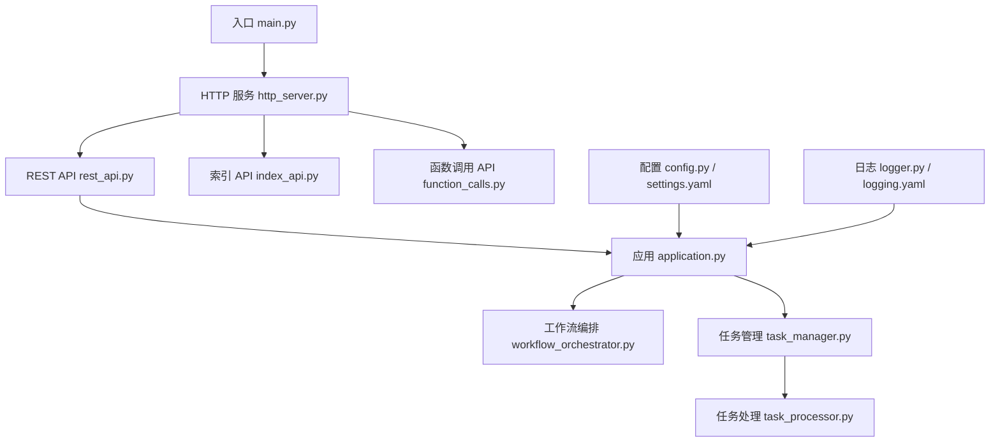
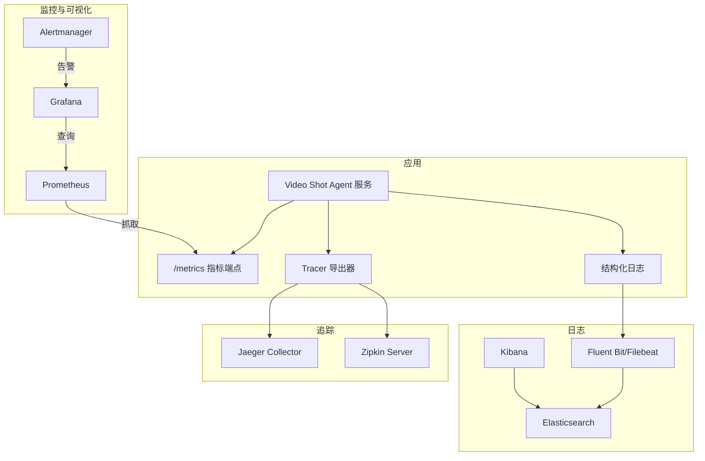
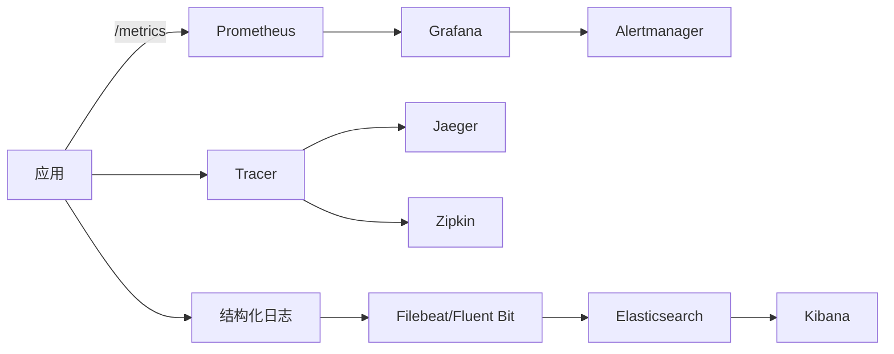

# 监控告警

<cite>
**本文引用的文件**   
- [main.py](file://main.py)
- [http_server.py](file://src/penshot/http_server.py)
- [mcp_http_server.py](file://src/penshot/mcp_http_server.py)
- [application.py](file://src/penshot/app/application.py)
- [config.py](file://src/penshot/config/config.py)
- [settings.yaml](file://src/penshot/config/settings.yaml)
- [logging.yaml](file://src/penshot/config/logging.yaml)
- [logger.py](file://src/penshot/logger.py)
- [workflow_orchestrator.py](file://src/penshot/neopen/agent/workflow/workflow_orchestrator.py)
- [task_manager.py](file://src/penshot/task/task_manager.py)
- [task_processor.py](file://src/penshot/task/task_processor.py)
- [rest_api.py](file://src/penshot/api/rest_api.py)
- [index_api.py](file://src/penshot/api/index_api.py)
- [function_calls.py](file://src/penshot/api/function_calls.py)
- [docker-compose.yml](file://docker-compose.yml)
</cite>

## 目录
1. [简介](#简介)
2. [项目结构](#项目结构)
3. [核心组件](#核心组件)
4. [架构总览](#架构总览)
5. [详细组件分析](#详细组件分析)
6. [依赖关系分析](#依赖关系分析)
7. [性能考量](#性能考量)
8. [故障排查指南](#故障排查指南)
9. [结论](#结论)
10. [附录](#附录)

## 简介
本指南面向 Video Shot Agent 的运维与研发人员，提供一套可落地的监控、可视化、告警、分布式追踪与日志聚合方案。内容覆盖：
- Prometheus 指标采集配置与应用内埋点建议
- Grafana 仪表板与关键业务指标展示
- 告警规则（错误率、响应时间、资源使用）
- 分布式追踪集成（Jaeger/Zipkin）
- 日志聚合与分析（ELK/EFK），结构化日志规范

本指南以仓库现有代码为基础，结合通用最佳实践给出实施步骤与参考配置路径，确保在不侵入核心业务逻辑的前提下完成观测性建设。

## 项目结构
Video Shot Agent 采用分层模块化设计：入口与 HTTP 服务位于应用层，工作流编排与任务处理位于核心业务层，配置与日志在独立模块中管理。为便于监控接入，建议在以下位置进行埋点与扩展：
- HTTP 入口层：统一拦截请求耗时、状态码、路由维度统计
- 工作流编排层：记录节点执行耗时、重试次数、失败原因
- 任务管理层：记录任务生命周期事件、队列长度、吞吐
- 外部客户端层：记录 LLM/工具调用延迟、错误率、令牌用量等

图示来源
- [main.py:1-200](file://main.py#L1-L200)
- [http_server.py:1-200](file://src/penshot/http_server.py#L1-L200)
- [rest_api.py:1-200](file://src/penshot/api/rest_api.py#L1-L200)
- [index_api.py:1-200](file://src/penshot/api/index_api.py#L1-L200)
- [function_calls.py:1-200](file://src/penshot/api/function_calls.py#L1-L200)
- [application.py:1-200](file://src/penshot/app/application.py#L1-L200)
- [workflow_orchestrator.py:1-200](file://src/penshot/neopen/agent/workflow/workflow_orchestrator.py#L1-L200)
- [task_manager.py:1-200](file://src/penshot/task/task_manager.py#L1-L200)
- [task_processor.py:1-200](file://src/penshot/task/task_processor.py#L1-L200)
- [config.py:1-200](file://src/penshot/config/config.py#L1-L200)
- [settings.yaml:1-200](file://src/penshot/config/settings.yaml#L1-L200)
- [logger.py:1-200](file://src/penshot/logger.py#L1-L200)
- [logging.yaml:1-200](file://src/penshot/config/logging.yaml#L1-L200)

章节来源
- [main.py:1-200](file://main.py#L1-L200)
- [http_server.py:1-200](file://src/penshot/http_server.py#L1-L200)
- [application.py:1-200](file://src/penshot/app/application.py#L1-L200)
- [config.py:1-200](file://src/penshot/config/config.py#L1-L200)
- [settings.yaml:1-200](file://src/penshot/config/settings.yaml#L1-L200)
- [logger.py:1-200](file://src/penshot/logger.py#L1-L200)
- [logging.yaml:1-200](file://src/penshot/config/logging.yaml#L1-L200)

## 核心组件
- HTTP 服务与中间件：用于统一收集请求级指标（方法、路径、状态码、耗时）、错误计数、并发度等
- 工作流编排器：用于记录节点级耗时、重试、失败分类、输出质量审计结果
- 任务管理器与处理器：用于记录任务生命周期、队列深度、吞吐、失败率
- 配置与日志：集中化配置加载与结构化日志输出，便于 ELK/EFK 聚合

章节来源
- [http_server.py:1-200](file://src/penshot/http_server.py#L1-L200)
- [workflow_orchestrator.py:1-200](file://src/penshot/neopen/agent/workflow/workflow_orchestrator.py#L1-L200)
- [task_manager.py:1-200](file://src/penshot/task/task_manager.py#L1-L200)
- [task_processor.py:1-200](file://src/penshot/task/task_processor.py#L1-L200)
- [config.py:1-200](file://src/penshot/config/config.py#L1-L200)
- [logger.py:1-200](file://src/penshot/logger.py#L1-L200)

## 架构总览
下图展示了监控告警体系与应用的集成关系：Prometheus 抓取应用暴露的指标端点；Grafana 从 Prometheus 拉取数据并渲染面板；Alertmanager 根据规则触发告警；Jaeger/Zipkin 接收链路追踪数据；ELK/EFK 聚合结构化日志。

图示来源
- [http_server.py:1-200](file://src/penshot/http_server.py#L1-L200)
- [workflow_orchestrator.py:1-200](file://src/penshot/neopen/agent/workflow/workflow_orchestrator.py#L1-L200)
- [task_manager.py:1-200](file://src/penshot/task/task_manager.py#L1-L200)
- [task_processor.py:1-200](file://src/penshot/task/task_processor.py#L1-L200)
- [logger.py:1-200](file://src/penshot/logger.py#L1-L200)
- [logging.yaml:1-200](file://src/penshot/config/logging.yaml#L1-L200)
- [docker-compose.yml:1-200](file://docker-compose.yml#L1-L200)

## 详细组件分析

### Prometheus 指标采集与应用埋点
目标
- 暴露标准 /metrics 端点，供 Prometheus 定期抓取
- 定义自定义指标：请求级、任务级、工作流节点级、外部调用级
- 保证指标标签维度合理、基数可控

建议埋点位置
- HTTP 层：方法、路径、状态码、耗时直方图、错误计数
- 工作流编排：节点名称、阶段、耗时、重试次数、失败原因
- 任务管理：任务类型、状态、队列长度、吞吐、失败率
- 外部客户端：LLM 提供商、模型名、令牌用量、延迟、错误率

指标命名约定
- 前缀：video_shot_agent_
- 类别：http_requests_total、http_request_duration_seconds、workflow_node_duration_seconds、task_queue_length、llm_call_duration_seconds、llm_tokens_total、errors_total
- 标签：method、path、status_code、node_name、stage、task_type、provider、model、error_type

示例指标清单（说明性）
- video_shot_agent_http_requests_total{method, path, status_code}
- video_shot_agent_http_request_duration_seconds_bucket{method, path, le}
- video_shot_agent_workflow_node_duration_seconds_sum{node_name, stage}
- video_shot_agent_task_queue_length{task_type}
- video_shot_agent_llm_call_duration_seconds_sum{provider, model}
- video_shot_agent_errors_total{error_type}

章节来源
- [http_server.py:1-200](file://src/penshot/http_server.py#L1-L200)
- [workflow_orchestrator.py:1-200](file://src/penshot/neopen/agent/workflow/workflow_orchestrator.py#L1-L200)
- [task_manager.py:1-200](file://src/penshot/task/task_manager.py#L1-L200)
- [task_processor.py:1-200](file://src/penshot/task/task_processor.py#L1-L200)

### Grafana 可视化仪表板
关键面板建议
- 服务健康概览：QPS、P95/P99 延迟、错误率、活跃连接数
- 工作流节点性能：各节点耗时分布、重试率、失败原因占比
- 任务处理吞吐：入队/出队速率、积压长度、失败率
- 外部调用质量：LLM 延迟、令牌消耗、供应商错误率对比
- 资源使用：CPU、内存、磁盘、网络（由 Node Exporter 或容器运行时提供）

面板构建要点
- 使用 PromQL 聚合：rate()、histogram_quantile()、sum by()、avg_over_time()
- 设置合理的阈值与时间窗口，避免抖动误报
- 将关键面板导出为 JSON，纳入版本控制

章节来源
- [http_server.py:1-200](file://src/penshot/http_server.py#L1-L200)
- [workflow_orchestrator.py:1-200](file://src/penshot/neopen/agent/workflow/workflow_orchestrator.py#L1-L200)
- [task_manager.py:1-200](file://src/penshot/task/task_manager.py#L1-L200)

### 告警规则配置
建议告警项
- 错误率过高：基于状态码 5xx 比例超过阈值（如 5%）持续 5 分钟
- 响应时间劣化：P95/P99 延迟超过基线（如 2s/5s）持续 5 分钟
- 任务积压：队列长度持续增长且无下降趋势
- 外部调用异常：LLM 供应商错误率突增或延迟飙升
- 资源使用：CPU/内存/磁盘使用率超过阈值

告警级别与通知
- P0：影响可用性（错误率、延迟严重劣化）
- P1：性能退化（延迟升高、吞吐下降）
- P2：容量预警（资源使用接近上限）
- 通知渠道：企业微信/钉钉/邮件/短信

章节来源
- [http_server.py:1-200](file://src/penshot/http_server.py#L1-L200)
- [workflow_orchestrator.py:1-200](file://src/penshot/neopen/agent/workflow/workflow_orchestrator.py#L1-L200)
- [task_manager.py:1-200](file://src/penshot/task/task_manager.py#L1-L200)

### 分布式追踪集成（Jaeger/Zipkin）
集成方式
- 在服务启动时初始化 Tracer，注入到 HTTP 中间件与工作流节点
- 为关键操作创建 Span：HTTP 请求、工作流节点、外部 LLM 调用
- 通过 OTLP/Jaeger Thrift/Zipkin HTTP 导出器上报

建议 Span 粒度
- 请求级：包含 method、path、user_id、trace_id
- 节点级：包含 node_name、stage、输入摘要、输出摘要（脱敏）
- 外部调用：包含 provider、model、token_count、缓存命中

章节来源
- [http_server.py:1-200](file://src/penshot/http_server.py#L1-L200)
- [workflow_orchestrator.py:1-200](file://src/penshot/neopen/agent/workflow/workflow_orchestrator.py#L1-L200)
- [task_processor.py:1-200](file://src/penshot/task/task_processor.py#L1-L200)

### 日志聚合分析（ELK/EFK）与结构化日志
日志规范
- 格式：JSON 结构化字段（timestamp、level、service、trace_id、span_id、message、metadata）
- 字段：包含请求上下文、任务 ID、节点名称、错误堆栈、外部调用摘要
- 脱敏：禁止输出敏感信息（密钥、用户隐私）

采集与存储
- 使用 Filebeat/Fluent Bit 收集容器 stdout 或本地日志文件
- 写入 Elasticsearch，Kibana 进行检索与可视化
- 建立索引策略与保留策略，控制成本

章节来源
- [logger.py:1-200](file://src/penshot/logger.py#L1-L200)
- [logging.yaml:1-200](file://src/penshot/config/logging.yaml#L1-L200)
- [docker-compose.yml:1-200](file://docker-compose.yml#L1-L200)

## 依赖关系分析
监控相关依赖关系如下：应用通过 HTTP 中间件暴露指标；Prometheus 抓取指标；Grafana 查询 Prometheus；Alertmanager 消费规则并发送告警；Tracer 导出至 Jaeger/Zipkin；日志经采集器写入 ES，Kibana 检索。

图示来源
- [http_server.py:1-200](file://src/penshot/http_server.py#L1-L200)
- [workflow_orchestrator.py:1-200](file://src/penshot/neopen/agent/workflow/workflow_orchestrator.py#L1-L200)
- [task_manager.py:1-200](file://src/penshot/task/task_manager.py#L1-L200)
- [logger.py:1-200](file://src/penshot/logger.py#L1-L200)
- [logging.yaml:1-200](file://src/penshot/config/logging.yaml#L1-L200)
- [docker-compose.yml:1-200](file://docker-compose.yml#L1-L200)

章节来源
- [http_server.py:1-200](file://src/penshot/http_server.py#L1-L200)
- [workflow_orchestrator.py:1-200](file://src/penshot/neopen/agent/workflow/workflow_orchestrator.py#L1-L200)
- [task_manager.py:1-200](file://src/penshot/task/task_manager.py#L1-L200)
- [logger.py:1-200](file://src/penshot/logger.py#L1-L200)
- [logging.yaml:1-200](file://src/penshot/config/logging.yaml#L1-L200)
- [docker-compose.yml:1-200](file://docker-compose.yml#L1-L200)

## 性能考量
- 指标采样与降采样：对高频指标使用合适的 bucket 与聚合窗口，避免高基数标签导致存储膨胀
- 批量上报：对外部调用与日志采用批量写入，降低网络与 IO 开销
- 异步处理：指标记录与日志写入尽量异步，避免阻塞主流程
- 资源隔离：监控组件与业务容器资源配额分离，防止相互影响
- 容量规划：根据 QPS 与数据保留策略估算 Prometheus/ES 存储需求

[本节为通用指导，不直接分析具体文件]

## 故障排查指南
常见问题与定位步骤
- 指标缺失：检查 /metrics 端点是否可达、标签基数是否过大、Prometheus 抓取间隔与超时
- 告警风暴：调整阈值与持续时间，增加抑制与静默策略
- 追踪断链：确认 Tracer 初始化与中间件注入是否正确，跨进程传播 trace_id
- 日志丢失：检查采集器权限、磁盘空间、ES 集群健康与索引策略
- 性能退化：结合 Grafana 面板与 Jaeger/Zipkin 链路，定位瓶颈节点

章节来源
- [http_server.py:1-200](file://src/penshot/http_server.py#L1-L200)
- [workflow_orchestrator.py:1-200](file://src/penshot/neopen/agent/workflow/workflow_orchestrator.py#L1-L200)
- [task_manager.py:1-200](file://src/penshot/task/task_manager.py#L1-L200)
- [logger.py:1-200](file://src/penshot/logger.py#L1-L200)
- [logging.yaml:1-200](file://src/penshot/config/logging.yaml#L1-L200)

## 结论
通过在 HTTP 层、工作流编排层、任务管理层与外部客户端层进行系统化埋点，并结合 Prometheus/Grafana/Alertmanager、Jaeger/Zipkin、ELK/EFK 的完整观测链路，可实现对 Video Shot Agent 的全方位监控与快速排障。建议将指标、面板、告警规则与日志规范纳入版本化管理，持续迭代优化。

[本节为总结性内容，不直接分析具体文件]

## 附录

### 部署参考（Docker Compose）
- 在 docker-compose.yml 中添加 Prometheus、Grafana、Alertmanager、Jaeger/Zipkin、Elasticsearch/Kibana 等服务
- 将应用 /metrics 端口映射至宿主机，供 Prometheus 抓取
- 配置环境变量以启用 Tracer 与结构化日志输出

章节来源
- [docker-compose.yml:1-200](file://docker-compose.yml#L1-L200)

### 配置与环境变量
- 在 settings.yaml 中新增监控相关配置项（如指标开关、标签白名单、导出器地址）
- 在 config.py 中加载并注入到应用组件
- 在 logging.yaml 中定义结构化日志模板与输出目标

章节来源
- [settings.yaml:1-200](file://src/penshot/config/settings.yaml#L1-200)
- [config.py:1-200](file://src/penshot/config/config.py#L1-200)
- [logging.yaml:1-200](file://src/penshot/config/logging.yaml#L1-200)