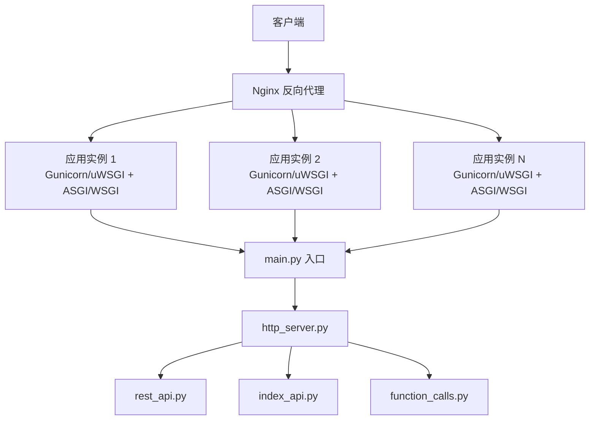
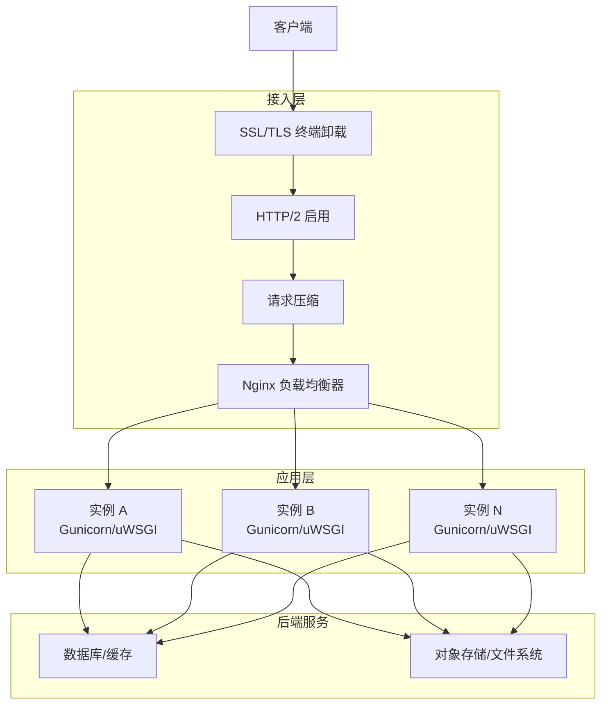
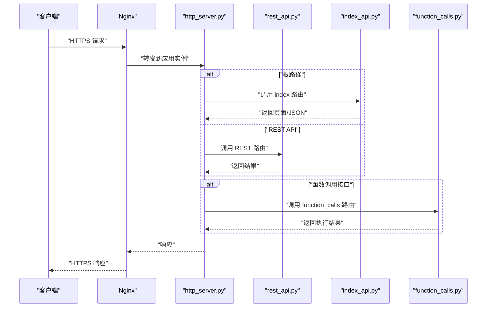
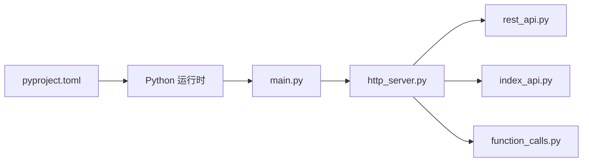

# 负载均衡配置

<cite>
**本文引用的文件**   
- [main.py](file://main.py)
- [http_server.py](file://src/penshot/http_server.py)
- [mcp_http_server.py](file://src/penshot/mcp_http_server.py)
- [application.py](file://src/penshot/app/application.py)
- [rest_api.py](file://src/penshot/api/rest_api.py)
- [index_api.py](file://src/penshot/api/index_api.py)
- [function_calls.py](file://src/penshot/api/function_calls.py)
- [docker-compose.yml](file://docker-compose.yml)
- [Dockerfile](file://Dockerfile)
- [pyproject.toml](file://pyproject.toml)
- [README_zh.md](file://README_zh.md)
</cite>

## 目录
1. [简介](#简介)
2. [项目结构](#项目结构)
3. [核心组件](#核心组件)
4. [架构总览](#架构总览)
5. [详细组件分析](#详细组件分析)
6. [依赖分析](#依赖分析)
7. [性能考虑](#性能考虑)
8. [故障排查指南](#故障排查指南)
9. [结论](#结论)
10. [附录](#附录)

## 简介
本指南面向部署 Video Shot Agent 的生产环境，提供从 Nginx 反向代理到应用进程（Gunicorn/uWSGI）的完整负载均衡与高可用配置建议。内容涵盖：
- Nginx 上游服务器、健康检查、会话保持策略
- Gunicorn/uWSGI 多进程模型与 Worker 数量计算
- 负载均衡算法选择（轮询、最少连接、IP 哈希）及适用场景
- SSL/TLS 终端卸载、HTTP/2 支持、请求压缩优化
- 性能调优参数与监控指标采集

## 项目结构
Video Shot Agent 采用 Python Web 服务形态，入口由 main.py 启动，内部通过 http_server 暴露 HTTP API；API 路由集中在 api 模块中；容器化构建与编排分别由 Dockerfile 和 docker-compose.yml 管理。

图表来源
- [main.py:1-200](file://main.py#L1-L200)
- [http_server.py:1-200](file://src/penshot/http_server.py#L1-L200)
- [rest_api.py:1-200](file://src/penshot/api/rest_api.py#L1-L200)
- [index_api.py:1-200](file://src/penshot/api/index_api.py#L1-L200)
- [function_calls.py:1-200](file://src/penshot/api/function_calls.py#L1-L200)

章节来源
- [main.py:1-200](file://main.py#L1-L200)
- [http_server.py:1-200](file://src/penshot/http_server.py#L1-L200)
- [rest_api.py:1-200](file://src/penshot/api/rest_api.py#L1-L200)
- [index_api.py:1-200](file://src/penshot/api/index_api.py#L1-L200)
- [function_calls.py:1-200](file://src/penshot/api/function_calls.py#L1-L200)

## 核心组件
- 应用入口与生命周期
  - main.py 负责初始化并启动服务，作为所有请求的统一入口。
  - http_server.py 封装了 HTTP 服务器的创建与运行逻辑。
- API 层
  - rest_api.py、index_api.py、function_calls.py 定义业务接口与处理逻辑。
- 容器化与编排
  - Dockerfile 定义镜像构建步骤。
  - docker-compose.yml 定义多实例编排与服务发现。

章节来源
- [main.py:1-200](file://main.py#L1-L200)
- [http_server.py:1-200](file://src/penshot/http_server.py#L1-L200)
- [rest_api.py:1-200](file://src/penshot/api/rest_api.py#L1-L200)
- [index_api.py:1-200](file://src/penshot/api/index_api.py#L1-L200)
- [function_calls.py:1-200](file://src/penshot/api/function_calls.py#L1-L200)
- [Dockerfile:1-200](file://Dockerfile#L1-L200)
- [docker-compose.yml:1-200](file://docker-compose.yml#L1-L200)

## 架构总览
下图展示了生产环境的典型流量路径：客户端经 Nginx 进行 TLS 终止与负载均衡，再分发至多个应用实例；每个实例内包含 WSGI/ASGI 服务器与应用进程。

图表来源
- [docker-compose.yml:1-200](file://docker-compose.yml#L1-L200)
- [Dockerfile:1-200](file://Dockerfile#L1-L200)

## 详细组件分析

### Nginx 反向代理与负载均衡
- 上游服务器设置
  - 使用 upstream 块声明多个应用实例地址，结合健康检查与权重分配。
  - 建议为每个实例配置独立的端口或基于容器网络的服务名。
- 健康检查配置
  - 启用主动健康检查，针对 /health 或自定义探针端点返回 200 判定存活。
  - 失败阈值与重试间隔需根据业务 SLA 调整。
- 会话保持策略
  - 若应用无状态，优先使用轮询或最少连接。
  - 需要会话保持时，使用 IP 哈希或 Cookie 持久化，注意跨节点迁移成本。
- 负载均衡算法选择
  - 轮询：适用于各实例处理能力相近且请求耗时接近的场景。
  - 最少连接：适合长连接或请求耗时差异较大的场景。
  - IP 哈希：用于会话保持，但可能引发热点不均。
- SSL/TLS 终端卸载
  - 在 Nginx 统一终止 TLS，减轻应用实例 CPU 压力。
  - 合理配置证书、协议版本与加密套件。
- HTTP/2 支持
  - 启用 HTTP/2 提升多路复用能力，降低延迟。
  - 注意与旧版客户端兼容性。
- 请求压缩优化
  - 对文本类响应启用 gzip/br 压缩，权衡 CPU 与带宽。
  - 控制最小长度阈值与压缩级别。

章节来源
- [docker-compose.yml:1-200](file://docker-compose.yml#L1-L200)
- [Dockerfile:1-200](file://Dockerfile#L1-L200)

### Gunicorn/uWSGI 多进程配置
- 进程模型选择
  - Gunicorn：推荐同步 worker 或 gevent/eventlet 异步 worker，视 I/O 特征而定。
  - uWSGI：可选 sync、asyncio、gevent 等模式。
- Worker 数量计算
  - 经验公式：Worker = CPU 核数 × (1 + I/O 等待系数)。
  - 对于 CPU 密集型任务，取较小倍数；对于 I/O 密集，可增大倍数。
  - 结合内存限制与单进程占用估算上限。
- 进程间通信优化
  - 避免共享内存与全局状态，尽量无状态设计。
  - 使用外部缓存/队列（如 Redis）进行跨进程协调。
- 超时与重试
  - 合理设置请求超时、worker 重启策略与优雅关闭。
- 日志与指标
  - 输出结构化日志，便于集中收集与分析。
  - 暴露 Prometheus 指标端点或使用 sidecar 采集。

章节来源
- [main.py:1-200](file://main.py#L1-L200)
- [http_server.py:1-200](file://src/penshot/http_server.py#L1-L200)
- [pyproject.toml:1-200](file://pyproject.toml#L1-L200)

### API 路由与处理流程
- 入口与路由
  - main.py 启动后，http_server.py 加载路由，将请求分发至 rest_api、index_api、function_calls 等模块。
- 关键流程
  - 接收请求 → 鉴权/限流（可选）→ 业务处理 → 返回响应。
  - 错误码与异常应统一处理，便于监控与告警。

图表来源
- [http_server.py:1-200](file://src/penshot/http_server.py#L1-L200)
- [rest_api.py:1-200](file://src/penshot/api/rest_api.py#L1-L200)
- [index_api.py:1-200](file://src/penshot/api/index_api.py#L1-L200)
- [function_calls.py:1-200](file://src/penshot/api/function_calls.py#L1-L200)

章节来源
- [http_server.py:1-200](file://src/penshot/http_server.py#L1-L200)
- [rest_api.py:1-200](file://src/penshot/api/rest_api.py#L1-L200)
- [index_api.py:1-200](file://src/penshot/api/index_api.py#L1-L200)
- [function_calls.py:1-200](file://src/penshot/api/function_calls.py#L1-L200)

### 容器化与编排
- Dockerfile
  - 定义基础镜像、依赖安装、工作目录与启动命令。
- docker-compose.yml
  - 定义多实例服务、端口映射、环境变量与健康检查。
  - 便于本地测试与集群扩展。

章节来源
- [Dockerfile:1-200](file://Dockerfile#L1-L200)
- [docker-compose.yml:1-200](file://docker-compose.yml#L1-L200)

## 依赖分析
- 运行时依赖
  - Python 包依赖由 pyproject.toml 管理，确保构建一致性与可重现性。
- 服务依赖
  - 应用可能依赖数据库、缓存、对象存储等外部服务，需在编排文件中声明。
- 组件耦合
  - http_server 与 API 模块解耦良好，便于横向扩展与独立演进。

图表来源
- [pyproject.toml:1-200](file://pyproject.toml#L1-L200)
- [main.py:1-200](file://main.py#L1-L200)
- [http_server.py:1-200](file://src/penshot/http_server.py#L1-L200)
- [rest_api.py:1-200](file://src/penshot/api/rest_api.py#L1-L200)
- [index_api.py:1-200](file://src/penshot/api/index_api.py#L1-L200)
- [function_calls.py:1-200](file://src/penshot/api/function_calls.py#L1-L200)

章节来源
- [pyproject.toml:1-200](file://pyproject.toml#L1-L200)
- [main.py:1-200](file://main.py#L1-L200)
- [http_server.py:1-200](file://src/penshot/http_server.py#L1-L200)
- [rest_api.py:1-200](file://src/penshot/api/rest_api.py#L1-L200)
- [index_api.py:1-200](file://src/penshot/api/index_api.py#L1-L200)
- [function_calls.py:1-200](file://src/penshot/api/function_calls.py#L1-L200)

## 性能考虑
- 并发模型
  - 根据 I/O 特征选择同步或异步 worker，避免阻塞型操作影响吞吐。
- 资源配额
  - 为每个实例设置合理的 CPU/内存限制，防止资源争用。
- 连接池
  - 对外部服务（数据库、缓存、对象存储）使用连接池，减少握手开销。
- 缓存策略
  - 热点数据入缓存，降低后端压力。
- 压缩与传输
  - 启用 HTTP/2 与适当压缩，平衡 CPU 与带宽。
- 监控与告警
  - 采集 QPS、延迟、错误率、资源利用率等指标，建立基线与阈值告警。

[本节为通用指导，不直接分析具体文件]

## 故障排查指南
- 常见问题定位
  - 确认 Nginx 健康检查是否通过，查看上游实例状态。
  - 检查应用日志与错误堆栈，定位异常请求。
  - 验证 SSL 证书与协议版本兼容性。
- 性能瓶颈识别
  - 观察 CPU、内存、磁盘 I/O、网络带宽使用情况。
  - 分析慢查询与外部依赖延迟。
- 回滚与恢复
  - 使用滚动更新与蓝绿发布策略，快速回滚问题版本。
  - 保留足够历史版本与快照以便恢复。

章节来源
- [README_zh.md:1-200](file://README_zh.md#L1-L200)

## 结论
通过合理的 Nginx 反向代理与多实例应用部署，配合合适的负载均衡算法与进程模型，可实现 Video Shot Agent 的高可用与高性能。在生产环境中，务必完善监控与告警体系，持续优化资源配置与代码实现。

[本节为总结性内容，不直接分析具体文件]

## 附录
- 术语说明
  - 反向代理：位于客户端与后端服务之间，负责转发请求与响应。
  - 负载均衡：将请求分发到多个后端实例，提高可用性与吞吐。
  - 会话保持：确保同一客户端的请求始终路由到同一实例。
- 参考文档
  - 项目中文说明与使用说明见 README_zh.md。

章节来源
- [README_zh.md:1-200](file://README_zh.md#L1-L200)