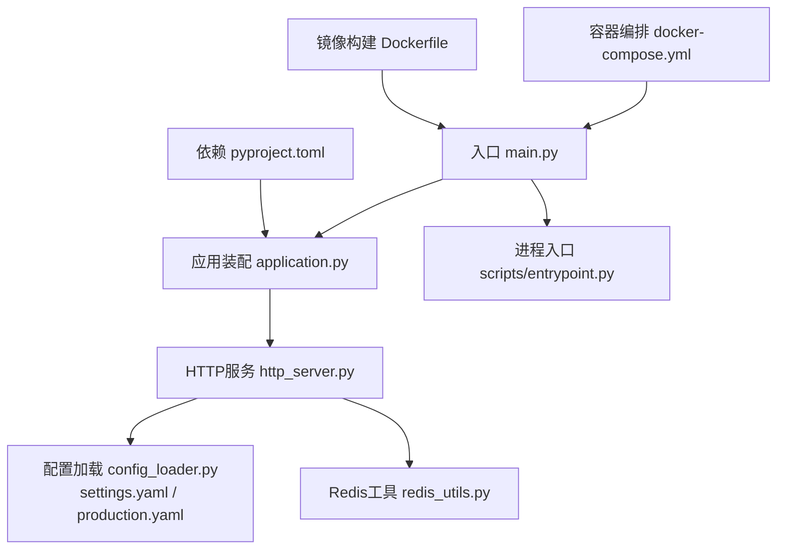
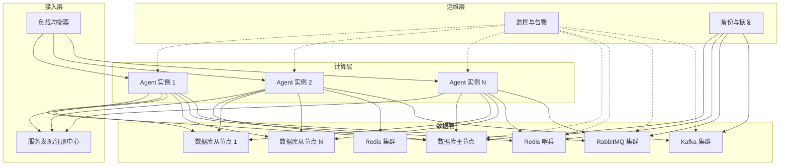
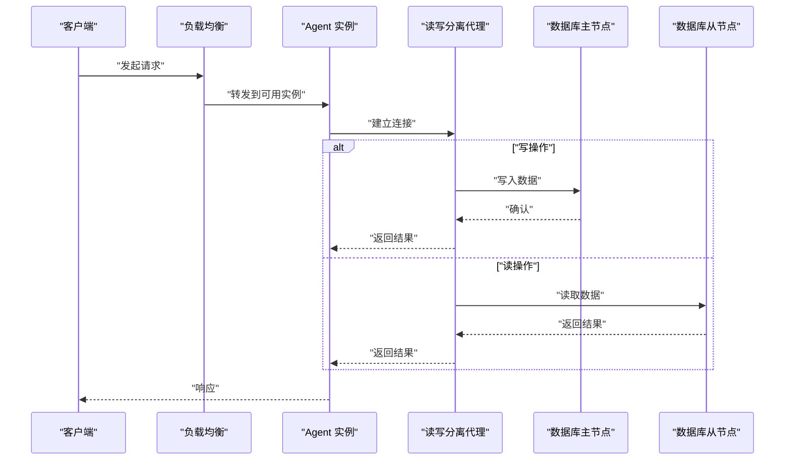
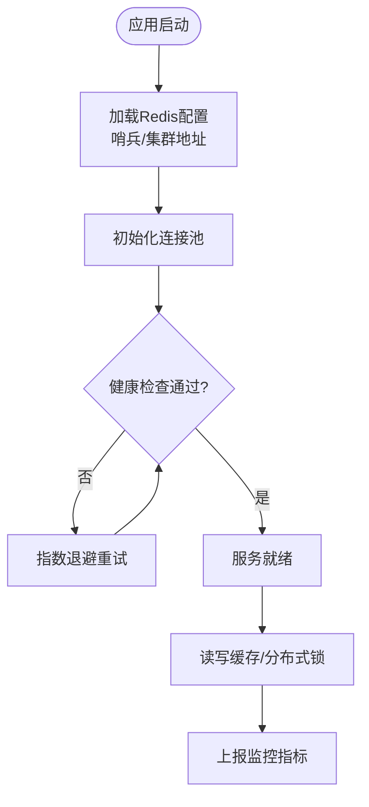
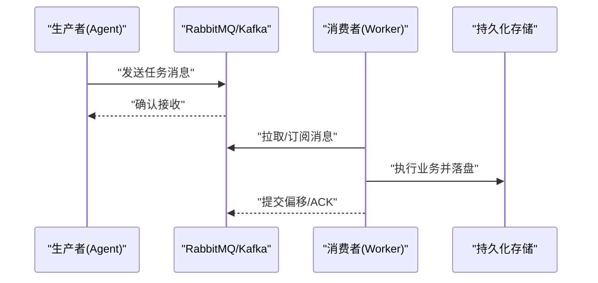
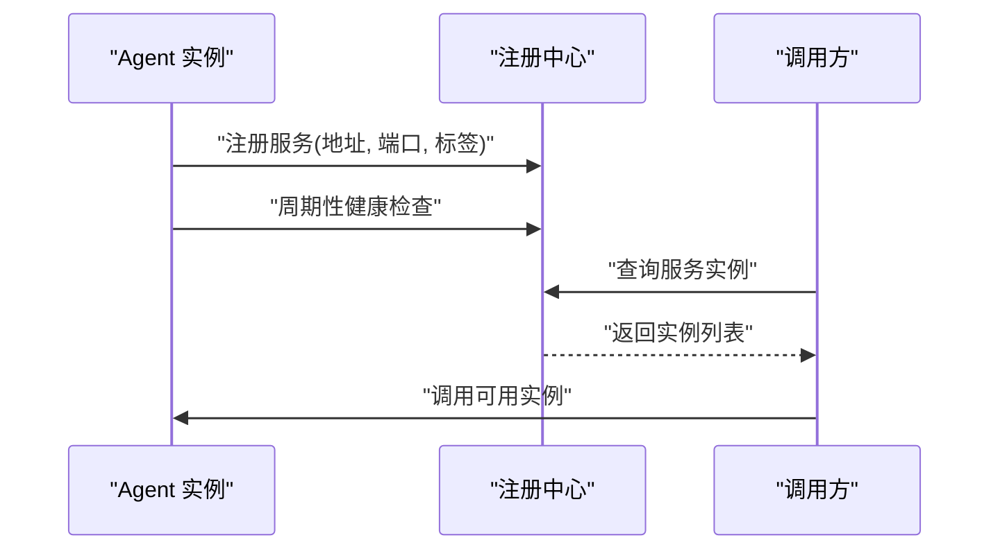
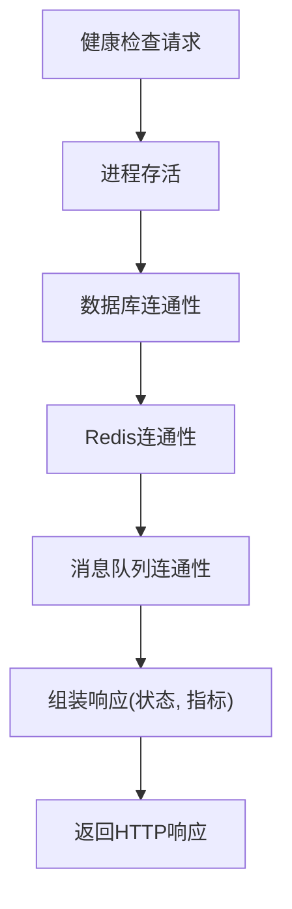
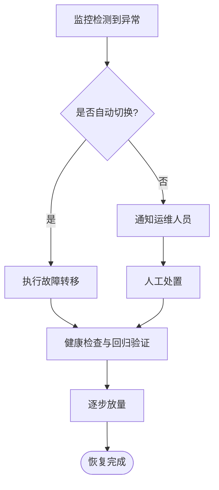
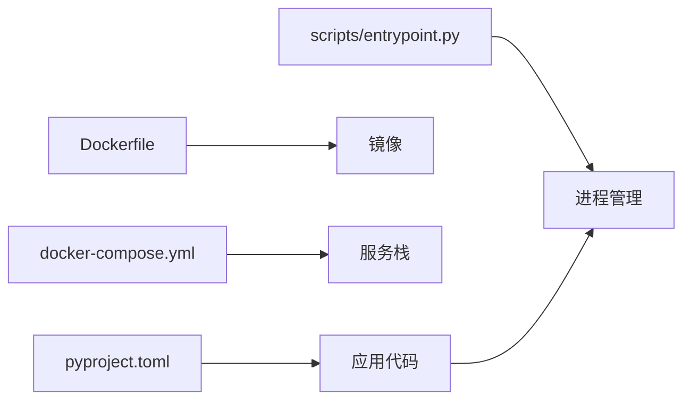

# 高可用架构

<cite>
**本文引用的文件**   
- [docker-compose.yml](file://docker-compose.yml)
- [main.py](file://main.py)
- [src/penshot/http_server.py](file://src/penshot/http_server.py)
- [src/penshot/app/application.py](file://src/penshot/app/application.py)
- [src/penshot/config/config_loader.py](file://src/penshot/config/config_loader.py)
- [src/penshot/config/settings.yaml](file://src/penshot/config/settings.yaml)
- [src/penshot/config/env/production.yaml](file://src/penshot/config/env/production.yaml)
- [src/penshot/utils/redis_utils.py](file://src/penshot/utils/redis_utils.py)
- [scripts/backup_data.py](file://scripts/backup_data.py)
- [scripts/entrypoint.py](file://scripts/entrypoint.py)
- [Dockerfile](file://Dockerfile)
- [pyproject.toml](file://pyproject.toml)
</cite>

## 目录
1. [引言](#引言)
2. [项目结构](#项目结构)
3. [核心组件](#核心组件)
4. [架构总览](#架构总览)
5. [详细组件分析](#详细组件分析)
6. [依赖关系分析](#依赖关系分析)
7. [性能考量](#性能考量)
8. [故障排查指南](#故障排查指南)
9. [结论](#结论)
10. [附录](#附录)

## 引言
本文件面向Video Shot Agent的高可用（HA）架构设计，覆盖数据库主从复制与读写分离、自动故障切换；Redis哨兵与集群部署方案；消息队列（RabbitMQ/Kafka）高可用配置；服务发现与注册机制；健康检查端点设计；以及灾难恢复计划（数据备份策略、故障转移流程、业务连续性保障）。文档在给出可落地方案的同时，尽量结合仓库现有实现进行映射说明。

## 项目结构
仓库采用分层组织：应用入口、HTTP服务、配置加载、工具库、脚本与容器化构建等。关键路径包括：
- 应用启动与进程管理：[main.py](file://main.py)、[scripts/entrypoint.py](file://scripts/entrypoint.py)
- HTTP服务与健康检查：[src/penshot/http_server.py](file://src/penshot/http_server.py)
- 应用装配与生命周期：[src/penshot/app/application.py](file://src/penshot/app/application.py)
- 配置加载与环境差异：[src/penshot/config/config_loader.py](file://src/penshot/config/config_loader.py)、[src/penshot/config/settings.yaml](file://src/penshot/config/settings.yaml)、[src/penshot/config/env/production.yaml](file://src/penshot/config/env/production.yaml)
- Redis客户端封装：[src/penshot/utils/redis_utils.py](file://src/penshot/utils/redis_utils.py)
- 数据备份脚本：[scripts/backup_data.py](file://scripts/backup_data.py)
- 容器编排与镜像：[docker-compose.yml](file://docker-compose.yml)、[Dockerfile](file://Dockerfile)
- 依赖声明：[pyproject.toml](file://pyproject.toml)

**图示来源**
- [main.py:1-200](file://main.py#L1-L200)
- [src/penshot/app/application.py:1-200](file://src/penshot/app/application.py#L1-L200)
- [src/penshot/http_server.py:1-200](file://src/penshot/http_server.py#L1-L200)
- [src/penshot/config/config_loader.py:1-200](file://src/penshot/config/config_loader.py#L1-L200)
- [src/penshot/config/settings.yaml:1-200](file://src/penshot/config/settings.yaml#L1-L200)
- [src/penshot/config/env/production.yaml:1-200](file://src/penshot/config/env/production.yaml#L1-L200)
- [src/penshot/utils/redis_utils.py:1-200](file://src/penshot/utils/redis_utils.py#L1-L200)
- [scripts/entrypoint.py:1-200](file://scripts/entrypoint.py#L1-L200)
- [docker-compose.yml:1-200](file://docker-compose.yml#L1-L200)
- [Dockerfile:1-200](file://Dockerfile#L1-L200)
- [pyproject.toml:1-200](file://pyproject.toml#L1-L200)

**章节来源**
- [main.py:1-200](file://main.py#L1-L200)
- [src/penshot/app/application.py:1-200](file://src/penshot/app/application.py#L1-L200)
- [src/penshot/http_server.py:1-200](file://src/penshot/http_server.py#L1-L200)
- [src/penshot/config/config_loader.py:1-200](file://src/penshot/config/config_loader.py#L1-L200)
- [src/penshot/config/settings.yaml:1-200](file://src/penshot/config/settings.yaml#L1-L200)
- [src/penshot/config/env/production.yaml:1-200](file://src/penshot/config/env/production.yaml#L1-L200)
- [src/penshot/utils/redis_utils.py:1-200](file://src/penshot/utils/redis_utils.py#L1-L200)
- [scripts/entrypoint.py:1-200](file://scripts/entrypoint.py#L1-L200)
- [docker-compose.yml:1-200](file://docker-compose.yml#L1-L200)
- [Dockerfile:1-200](file://Dockerfile#L1-L200)
- [pyproject.toml:1-200](file://pyproject.toml#L1-L200)

## 核心组件
- 应用装配器：负责初始化配置、日志、外部依赖（如Redis）、工作流与任务管理器，并暴露HTTP接口。
- HTTP服务：提供REST API与健康检查端点，承载请求路由与中间件。
- 配置系统：支持多环境配置加载，生产环境参数集中管理。
- Redis工具：封装连接池、重试、键空间操作，便于缓存与会话存储。
- 进程入口：用于容器内进程管理与优雅退出。
- 备份脚本：提供数据备份能力，配合定时任务实现容灾。

**章节来源**
- [src/penshot/app/application.py:1-200](file://src/penshot/app/application.py#L1-L200)
- [src/penshot/http_server.py:1-200](file://src/penshot/http_server.py#L1-L200)
- [src/penshot/config/config_loader.py:1-200](file://src/penshot/config/config_loader.py#L1-L200)
- [src/penshot/config/settings.yaml:1-200](file://src/penshot/config/settings.yaml#L1-L200)
- [src/penshot/config/env/production.yaml:1-200](file://src/penshot/config/env/production.yaml#L1-L200)
- [src/penshot/utils/redis_utils.py:1-200](file://src/penshot/utils/redis_utils.py#L1-L200)
- [scripts/entrypoint.py:1-200](file://scripts/entrypoint.py#L1-L200)
- [scripts/backup_data.py:1-200](file://scripts/backup_data.py#L1-L200)

## 架构总览
下图展示Video Shot Agent在高可用场景下的整体拓扑：前端负载均衡接入多个Agent实例，通过服务发现定位；Agent侧使用数据库主从实现读写分离，借助哨兵或代理完成自动故障切换；Redis以哨兵或集群模式提供缓存与分布式锁；消息队列（RabbitMQ/Kafka）作为异步任务总线；统一监控与告警覆盖所有组件。

[此图为概念性架构图，不直接映射具体源码文件]

## 详细组件分析

### 数据库主从复制与读写分离
- 目标
  - 读扩展：将查询流量分流至从节点，提升吞吐。
  - 写一致性：主节点写入，确保强一致。
  - 自动故障切换：主节点异常时快速提升从节点为主，降低中断时间。
- 推荐方案
  - MySQL/MariaDB：基于GTID的主从复制，半同步复制保证数据安全；使用ProxySQL或PXC进行读写分离与故障切换。
  - PostgreSQL：基于WAL的流复制，搭配Patroni+etcd/Consul实现Leader选举与自动切换。
- 配置要点
  - 主节点开启binlog/WAL，设置只读副本数量与延迟阈值。
  - 从节点启用只读模式，限制直连写操作。
  - 读写分离策略：事务内强制走主库，读请求按权重轮询从库。
  - 故障切换：检测超时与心跳失败，触发VIP漂移或DNS更新。
- 与代码集成建议
  - 在应用层通过配置区分“主库”和“从库”连接串，由ORM或连接池根据上下文选择。
  - 对关键写操作增加重试与幂等保护，避免切换期间的重复提交。
  - 健康检查端点需包含数据库连通性与延迟指标。

[此图为概念性流程图，不直接映射具体源码文件]

**章节来源**
- [src/penshot/http_server.py:1-200](file://src/penshot/http_server.py#L1-L200)
- [src/penshot/config/settings.yaml:1-200](file://src/penshot/config/settings.yaml#L1-L200)
- [src/penshot/config/env/production.yaml:1-200](file://src/penshot/config/env/production.yaml#L1-L200)

### Redis高可用：哨兵与集群
- 目标
  - 缓存与分布式锁高可用，避免单点故障。
  - 支持水平扩展与分区，提升容量与吞吐。
- 哨兵模式
  - 至少3个哨兵节点，监控主从，自动故障切换。
  - 客户端通过哨兵地址获取当前主节点，具备重连与重试逻辑。
- 集群模式
  - 分片存储，跨节点迁移，客户端需支持槽位路由。
  - 适用于大规模KV与热点键分散。
- 与代码集成建议
  - 使用[redis_utils.py](file://src/penshot/utils/redis_utils.py)封装连接池、重试、超时与错误分类。
  - 在配置中维护哨兵地址列表或集群节点列表，支持热更新。
  - 健康检查端点应探测Redis可达性与延迟。

**图示来源**
- [src/penshot/utils/redis_utils.py:1-200](file://src/penshot/utils/redis_utils.py#L1-L200)
- [src/penshot/config/settings.yaml:1-200](file://src/penshot/config/settings.yaml#L1-L200)

**章节来源**
- [src/penshot/utils/redis_utils.py:1-200](file://src/penshot/utils/redis_utils.py#L1-L200)
- [src/penshot/config/settings.yaml:1-200](file://src/penshot/config/settings.yaml#L1-L200)

### 消息队列高可用：RabbitMQ与Kafka
- 目标
  - 任务解耦与削峰填谷，保障处理链路弹性与可靠性。
  - 多副本与分区，避免单点故障，支持横向扩展。
- RabbitMQ
  - 镜像队列或Quorum Queue，至少3节点，持久化消息。
  - 客户端使用连接池与故障转移，订阅者具备幂等消费。
- Kafka
  - 多Broker与多副本，合理设置min.insync.replicas与acks。
  - 消费者组与分区再均衡，处理幂等与去重。
- 与代码集成建议
  - 在应用装配阶段初始化生产者/消费者，配置重试、死信队列与监控。
  - 健康检查端点包含队列连通性与积压指标。

[此图为概念性序列图，不直接映射具体源码文件]

**章节来源**
- [src/penshot/app/application.py:1-200](file://src/penshot/app/application.py#L1-L200)
- [src/penshot/http_server.py:1-200](file://src/penshot/http_server.py#L1-L200)

### 服务发现与注册
- 目标
  - 动态扩缩容，自动剔除故障实例，负载均衡透明。
- 方案
  - 轻量级：本地DNS+健康检查，适合小规模。
  - 标准：Consul/Etcd/Nacos，提供注册、发现、健康检查与配置推送。
- 与代码集成建议
  - 在应用启动后向注册中心注册自身IP、端口与版本信息。
  - 定期上报健康状态，未通过则自动摘除。
  - 客户端通过服务发现获取最新实例列表，实现本地负载均衡。

[此图为概念性序列图，不直接映射具体源码文件]

**章节来源**
- [src/penshot/app/application.py:1-200](file://src/penshot/app/application.py#L1-L200)
- [src/penshot/http_server.py:1-200](file://src/penshot/http_server.py#L1-L200)

### 健康检查端点设计
- 目标
  - 为负载均衡与服务发现提供存活与就绪探针。
- 设计要点
  - 存活探针：仅检查进程是否存活。
  - 就绪探针：检查依赖（数据库、Redis、消息队列）连通性与延迟阈值。
  - 元数据：返回版本、实例ID、运行时长、依赖状态摘要。
- 与代码集成建议
  - 在HTTP服务中暴露独立端点，避免与业务接口耦合。
  - 健康检查逻辑复用配置与工具库，统一错误码与指标上报。

**图示来源**
- [src/penshot/http_server.py:1-200](file://src/penshot/http_server.py#L1-L200)
- [src/penshot/config/settings.yaml:1-200](file://src/penshot/config/settings.yaml#L1-L200)

**章节来源**
- [src/penshot/http_server.py:1-200](file://src/penshot/http_server.py#L1-L200)
- [src/penshot/config/settings.yaml:1-200](file://src/penshot/config/settings.yaml#L1-L200)

### 灾难恢复计划
- 数据备份策略
  - 数据库：全量+增量备份，保留周期与异地存储；定期演练恢复。
  - Redis：AOF/RDB持久化，快照导出与对象存储归档。
  - 消息队列：持久化与副本，必要时导出主题/队列数据。
- 故障转移流程
  - 检测：监控与探针触发告警。
  - 决策：自动切换（VIP/DNS/注册中心）或人工介入。
  - 执行：提升新主、更新配置、重启受影响实例。
  - 验证：健康检查与回归测试通过后放量。
- 业务连续性保障
  - 无状态服务多副本部署，会话与状态外置（Redis/DB）。
  - 幂等与重试，避免重复处理。
  - 灰度发布与回滚策略，缩短影响面。

[此图为概念性流程图，不直接映射具体源码文件]

**章节来源**
- [scripts/backup_data.py:1-200](file://scripts/backup_data.py#L1-L200)
- [src/penshot/http_server.py:1-200](file://src/penshot/http_server.py#L1-L200)

## 依赖关系分析
- 运行时依赖
  - Python包与第三方库在[pyproject.toml](file://pyproject.toml)中声明，确保构建与部署一致性。
- 容器化
  - [Dockerfile](file://Dockerfile)定义镜像构建步骤，[docker-compose.yml](file://docker-compose.yml)编排多服务（Agent、数据库、Redis、MQ等），便于本地与预生产环境验证。
- 进程管理
  - [scripts/entrypoint.py](file://scripts/entrypoint.py)作为容器入口，负责信号处理与优雅退出。

**图示来源**
- [pyproject.toml:1-200](file://pyproject.toml#L1-L200)
- [Dockerfile:1-200](file://Dockerfile#L1-L200)
- [docker-compose.yml:1-200](file://docker-compose.yml#L1-L200)
- [scripts/entrypoint.py:1-200](file://scripts/entrypoint.py#L1-L200)

**章节来源**
- [pyproject.toml:1-200](file://pyproject.toml#L1-L200)
- [Dockerfile:1-200](file://Dockerfile#L1-L200)
- [docker-compose.yml:1-200](file://docker-compose.yml#L1-L200)
- [scripts/entrypoint.py:1-200](file://scripts/entrypoint.py#L1-L200)

## 性能考量
- 连接池与并发
  - 数据库与Redis连接池大小按CPU核数与I/O特性调优，避免过度竞争。
- 超时与重试
  - 设置合理的超时与退避策略，防止雪崩；对幂等操作允许有限重试。
- 缓存策略
  - 热点键加TTL与随机过期抖动，避免同时失效；二级缓存考虑本地内存+远端Redis。
- 消息队列
  - 批量发送与消费，压缩与序列化优化；消费者并行度与分区数匹配。
- 监控与限流
  - 关键指标（QPS、延迟、错误率、资源使用）采集与告警；网关层限流与熔断。

[本节为通用指导，不直接分析具体文件]

## 故障排查指南
- 常见问题
  - 数据库切换后连接失败：检查主从状态、VIP/DNS更新、应用重连逻辑。
  - Redis不可用：校验哨兵/集群配置、网络ACL、密码与TLS。
  - 消息积压：查看消费者健康、分区再均衡、死信队列与重试次数。
- 诊断手段
  - 健康检查端点输出依赖状态与延迟。
  - 日志聚合与追踪ID关联请求链路。
  - 指标看板观察峰值与异常波动。
- 应急操作
  - 降级非关键功能，优先保障核心链路。
  - 手动触发备份与恢复演练，验证RTO/RPO。

**章节来源**
- [src/penshot/http_server.py:1-200](file://src/penshot/http_server.py#L1-L200)
- [src/penshot/utils/redis_utils.py:1-200](file://src/penshot/utils/redis_utils.py#L1-L200)
- [scripts/backup_data.py:1-200](file://scripts/backup_data.py#L1-L200)

## 结论
通过数据库主从与读写分离、Redis哨兵/集群、消息队列高可用、服务发现与健康检查，以及完善的备份与故障转移流程，Video Shot Agent可在生产环境实现高可用与弹性伸缩。建议在预生产环境充分演练切换与恢复，持续优化连接池、超时与重试策略，并以监控与告警驱动运维闭环。

[本节为总结性内容，不直接分析具体文件]

## 附录
- 术语
  - RTO：恢复时间目标；RPO：恢复点目标。
  - VIP：虚拟IP；DNS：域名解析。
- 参考实践
  - 读写分离代理选型与配置模板。
  - Redis哨兵与集群最佳实践清单。
  - 消息队列幂等与去重设计模式。

[本节为补充信息，不直接分析具体文件]