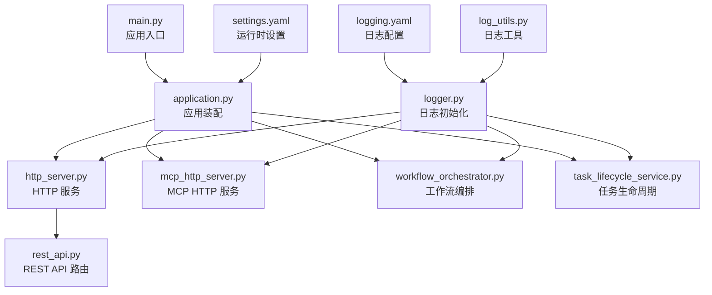
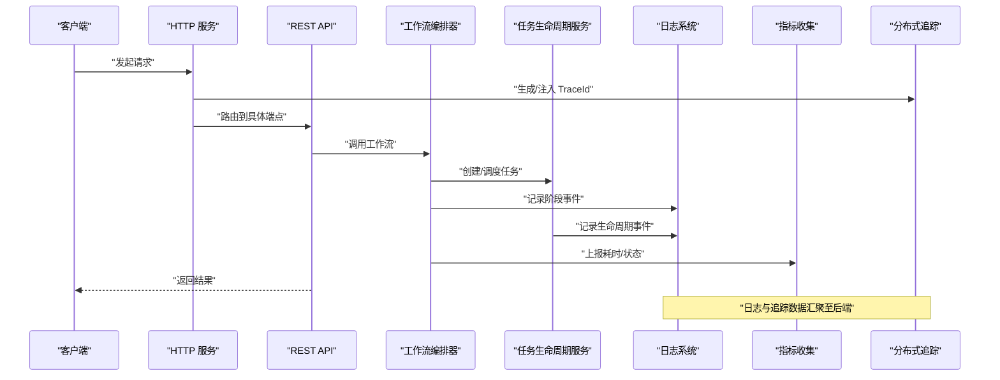
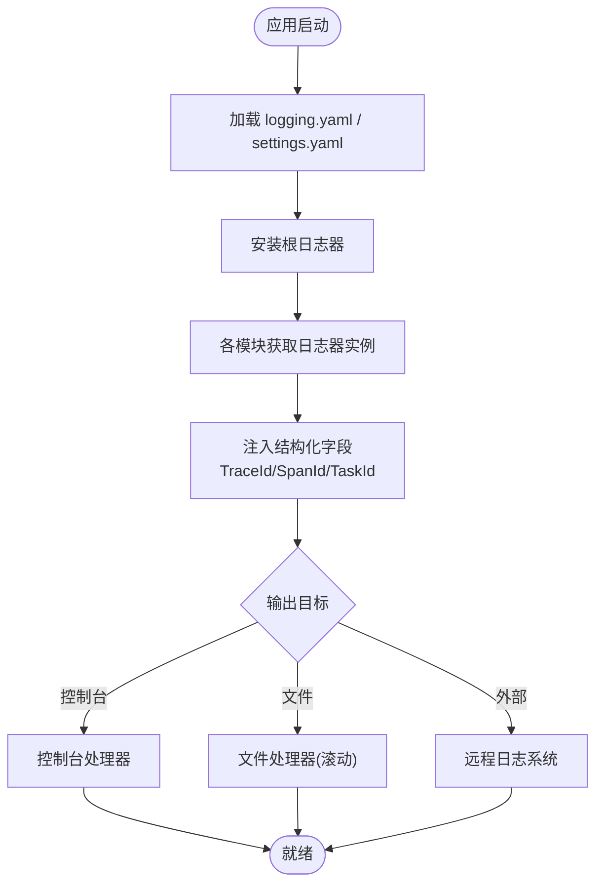
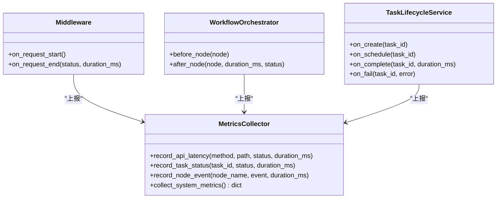
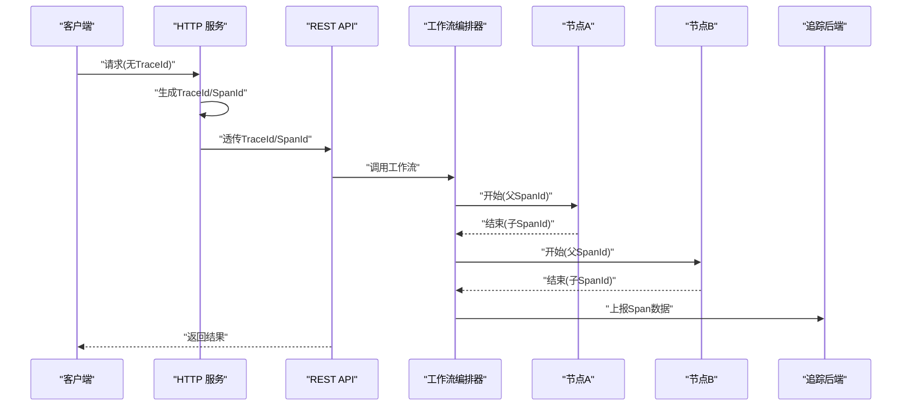
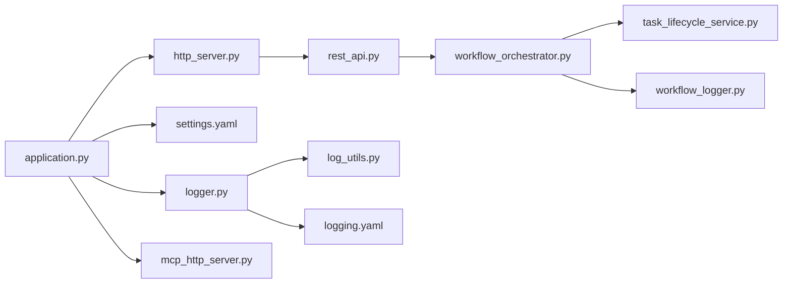

# 监控与日志

<cite>
**本文引用的文件**   
- [main.py](file://main.py)
- [src/penshot/logger.py](file://src/penshot/logger.py)
- [src/penshot/config/logging.yaml](file://src/penshot/config/logging.yaml)
- [src/penshot/config/settings.yaml](file://src/penshot/config/settings.yaml)
- [src/penshot/config/config_loader.py](file://src/penshot/config/config_loader.py)
- [src/penshot/app/application.py](file://src/penshot/app/application.py)
- [src/penshot/http_server.py](file://src/penshot/http_server.py)
- [src/penshot/mcp_http_server.py](file://src/penshot/mcp_http_server.py)
- [src/penshot/api/rest_api.py](file://src/penshot/api/rest_api.py)
- [src/penshot/utils/log_utils.py](file://src/penshot/utils/log_utils.py)
- [src/penshot/agent/workflow/workflow_logger.py](file://src/penshot/agent/workflow/workflow_logger.py)
- [src/penshot/task/task_lifecycle_service.py](file://src/penshot/task/task_lifecycle_service.py)
- [src/penshot/task/task_manager.py](file://src/penshot/task/task_manager.py)
- [src/penshot/agent/workflow/workflow_orchestrator.py](file://src/penshot/agent/workflow/workflow_orchestrator.py)
- [src/penshot/agent/workflow/workflow_state_types.py](file://src/penshot/agent/workflow/workflow_state_types.py)
- [docker-compose.yml](file://docker-compose.yml)
</cite>

## 目录
1. [简介](#简介)
2. [项目结构](#项目结构)
3. [核心组件](#核心组件)
4. [架构总览](#架构总览)
5. [详细组件分析](#详细组件分析)
6. [依赖关系分析](#依赖关系分析)
7. [性能考虑](#性能考虑)
8. [故障排查指南](#故障排查指南)
9. [结论](#结论)
10. [附录](#附录)

## 简介
本文件面向 Video Shot Agent 的“监控与日志”子系统，目标是：
- 说明日志系统的架构设计（级别、格式化、输出目标）
- 定义应用性能监控指标（API 响应时间、内存使用、CPU 占用率等）
- 给出分布式追踪方案（请求链路追踪、Agent 执行状态监控）
- 提供日志分析方法（错误检索、性能瓶颈分析、业务指标统计）
- 配置告警规则与通知机制

## 项目结构
本项目将日志与监控能力集中在以下位置：
- 日志初始化与配置：logger 模块与 YAML 配置
- 应用启动与中间件：HTTP/MCP 服务入口与中间件
- 工作流与任务：工作流编排器、任务生命周期服务
- 工具层：通用日志辅助方法
- 部署：容器编排中可集成外部监控与日志采集

图表来源
- [main.py](file://main.py)
- [src/penshot/app/application.py](file://src/penshot/app/application.py)
- [src/penshot/http_server.py](file://src/penshot/http_server.py)
- [src/penshot/mcp_http_server.py](file://src/penshot/mcp_http_server.py)
- [src/penshot/api/rest_api.py](file://src/penshot/api/rest_api.py)
- [src/penshot/agent/workflow/workflow_orchestrator.py](file://src/penshot/agent/workflow/workflow_orchestrator.py)
- [src/penshot/task/task_lifecycle_service.py](file://src/penshot/task/task_lifecycle_service.py)
- [src/penshot/logger.py](file://src/penshot/logger.py)
- [src/penshot/config/logging.yaml](file://src/penshot/config/logging.yaml)
- [src/penshot/config/settings.yaml](file://src/penshot/config/settings.yaml)
- [src/penshot/utils/log_utils.py](file://src/penshot/utils/log_utils.py)

章节来源
- [main.py](file://main.py)
- [src/penshot/app/application.py](file://src/penshot/app/application.py)
- [src/penshot/http_server.py](file://src/penshot/http_server.py)
- [src/penshot/mcp_http_server.py](file://src/penshot/mcp_http_server.py)
- [src/penshot/api/rest_api.py](file://src/penshot/api/rest_api.py)
- [src/penshot/agent/workflow/workflow_orchestrator.py](file://src/penshot/agent/workflow/workflow_orchestrator.py)
- [src/penshot/task/task_lifecycle_service.py](file://src/penshot/task/task_lifecycle_service.py)
- [src/penshot/logger.py](file://src/penshot/logger.py)
- [src/penshot/config/logging.yaml](file://src/penshot/config/logging.yaml)
- [src/penshot/config/settings.yaml](file://src/penshot/config/settings.yaml)
- [src/penshot/utils/log_utils.py](file://src/penshot/utils/log_utils.py)

## 核心组件
- 日志初始化与配置
  - logger 模块负责在应用启动时加载 logging.yaml 并安装根日志器
  - logging.yaml 定义日志级别、格式、处理器（控制台/文件/可选的外部系统）
  - settings.yaml 提供运行时开关（如是否启用结构化日志、采样策略等）
- 应用与服务
  - application.py 组装服务、注入配置、注册中间件
  - http_server.py 与 mcp_http_server.py 作为 HTTP 入口，承载 REST 与 MCP 协议
  - rest_api.py 暴露 API 端点，便于采集指标与触发任务
- 工作流与任务
  - workflow_orchestrator.py 编排各 Agent 节点，记录关键阶段事件
  - task_lifecycle_service.py 管理任务生命周期，记录创建、调度、完成、失败等事件
  - workflow_logger.py 为工作流节点提供统一的日志写入接口
- 工具
  - log_utils.py 提供上下文关联 ID、结构化字段注入、敏感信息脱敏等通用能力

章节来源
- [src/penshot/logger.py](file://src/penshot/logger.py)
- [src/penshot/config/logging.yaml](file://src/penshot/config/logging.yaml)
- [src/penshot/config/settings.yaml](file://src/penshot/config/settings.yaml)
- [src/penshot/app/application.py](file://src/penshot/app/application.py)
- [src/penshot/http_server.py](file://src/penshot/http_server.py)
- [src/penshot/mcp_http_server.py](file://src/penshot/mcp_http_server.py)
- [src/penshot/api/rest_api.py](file://src/penshot/api/rest_api.py)
- [src/penshot/agent/workflow/workflow_orchestrator.py](file://src/penshot/agent/workflow/workflow_orchestrator.py)
- [src/penshot/task/task_lifecycle_service.py](file://src/penshot/task/task_lifecycle_service.py)
- [src/penshot/agent/workflow/workflow_logger.py](file://src/penshot/agent/workflow/workflow_logger.py)
- [src/penshot/utils/log_utils.py](file://src/penshot/utils/log_utils.py)

## 架构总览
下图展示从请求进入、到工作流执行、再到日志与监控输出的整体流程。

图表来源
- [src/penshot/http_server.py](file://src/penshot/http_server.py)
- [src/penshot/api/rest_api.py](file://src/penshot/api/rest_api.py)
- [src/penshot/agent/workflow/workflow_orchestrator.py](file://src/penshot/agent/workflow/workflow_orchestrator.py)
- [src/penshot/task/task_lifecycle_service.py](file://src/penshot/task/task_lifecycle_service.py)
- [src/penshot/logger.py](file://src/penshot/logger.py)

## 详细组件分析

### 日志系统设计与实现
- 日志级别
  - 建议采用标准五级：DEBUG、INFO、WARNING、ERROR、CRITICAL
  - 不同模块可按职责调整默认级别，生产环境以 INFO 或 WARNING 为主
- 格式化规则
  - 统一 JSON 结构化格式，包含固定字段：时间戳、级别、模块、消息、TraceId、SpanId、任务ID、节点名、耗时等
  - 对敏感字段进行脱敏处理（如密钥、用户标识），避免泄露
- 输出目标
  - 控制台：开发调试
  - 本地文件：按天滚动归档
  - 外部系统：通过配置接入集中式日志平台（如 ELK/Loki）
- 配置方式
  - logging.yaml 定义处理器、格式化器、过滤器
  - settings.yaml 控制是否启用结构化日志、采样比例、输出目标开关
  - logger 模块在应用启动时加载上述配置并安装根日志器

图表来源
- [src/penshot/logger.py](file://src/penshot/logger.py)
- [src/penshot/config/logging.yaml](file://src/penshot/config/logging.yaml)
- [src/penshot/config/settings.yaml](file://src/penshot/config/settings.yaml)
- [src/penshot/utils/log_utils.py](file://src/penshot/utils/log_utils.py)

章节来源
- [src/penshot/logger.py](file://src/penshot/logger.py)
- [src/penshot/config/logging.yaml](file://src/penshot/config/logging.yaml)
- [src/penshot/config/settings.yaml](file://src/penshot/config/settings.yaml)
- [src/penshot/utils/log_utils.py](file://src/penshot/utils/log_utils.py)

### 应用性能监控指标
- 指标清单
  - API 响应时间：P50/P95/P99、QPS、错误率
  - 资源使用：进程内存、RSS、CPU 占用率、GC 次数（如适用）
  - 任务与工作流：任务数、成功率、平均耗时、队列积压
  - 外部依赖：LLM 调用延迟、重试次数、限流/熔断触发次数
- 采集方式
  - 中间件自动埋点：在 HTTP 入口计算请求耗时、记录状态码
  - 工作流节点埋点：在每个节点开始/结束记录耗时与状态
  - 任务生命周期埋点：创建、调度、完成、失败等事件
  - 系统指标：定时采集进程级 CPU/内存
- 存储与展示
  - 指标数据推送至时序数据库（如 Prometheus）
  - 可视化面板（Grafana）展示趋势、阈值告警
  - 结合日志平台做多维下钻分析

图表来源
- [src/penshot/http_server.py](file://src/penshot/http_server.py)
- [src/penshot/api/rest_api.py](file://src/penshot/api/rest_api.py)
- [src/penshot/agent/workflow/workflow_orchestrator.py](file://src/penshot/agent/workflow/workflow_orchestrator.py)
- [src/penshot/task/task_lifecycle_service.py](file://src/penshot/task/task_lifecycle_service.py)

章节来源
- [src/penshot/http_server.py](file://src/penshot/http_server.py)
- [src/penshot/api/rest_api.py](file://src/penshot/api/rest_api.py)
- [src/penshot/agent/workflow/workflow_orchestrator.py](file://src/penshot/agent/workflow/workflow_orchestrator.py)
- [src/penshot/task/task_lifecycle_service.py](file://src/penshot/task/task_lifecycle_service.py)

### 分布式追踪实现
- 链路标识
  - 每个请求分配唯一 TraceId，子任务/节点生成 SpanId，形成树状调用链
  - 通过日志上下文注入，确保日志与追踪数据可关联
- 传播机制
  - HTTP 头携带 TraceId/SpanId，跨服务传递
  - 内部异步任务通过消息体或上下文传递
- 状态监控
  - 工作流节点状态变更（开始、成功、失败、重试）
  - 任务生命周期状态（创建、调度、运行、完成、失败）
- 可视化
  - 将 Trace 数据导出至分布式追踪后端（如 Jaeger/OpenTelemetry Collector）
  - 在 UI 中查看端到端耗时、热点路径、错误分布

图表来源
- [src/penshot/http_server.py](file://src/penshot/http_server.py)
- [src/penshot/api/rest_api.py](file://src/penshot/api/rest_api.py)
- [src/penshot/agent/workflow/workflow_orchestrator.py](file://src/penshot/agent/workflow/workflow_orchestrator.py)

章节来源
- [src/penshot/http_server.py](file://src/penshot/http_server.py)
- [src/penshot/api/rest_api.py](file://src/penshot/api/rest_api.py)
- [src/penshot/agent/workflow/workflow_orchestrator.py](file://src/penshot/agent/workflow/workflow_orchestrator.py)

### 日志分析方法与工具
- 错误日志检索
  - 基于 ERROR/CRITICAL 级别筛选，结合 TraceId 定位问题链路
  - 过滤关键字段（模块、节点名、错误码）快速缩小范围
- 性能瓶颈分析
  - 聚合 API 响应时间分位值，识别慢端点
  - 对比工作流节点耗时，定位最慢步骤
  - 关联外部依赖延迟与重试次数，判断是否为上游瓶颈
- 业务指标统计
  - 任务完成率、失败率、平均耗时
  - 各节点成功率与异常分布
  - 资源使用趋势与峰值时段

章节来源
- [src/penshot/logger.py](file://src/penshot/logger.py)
- [src/penshot/utils/log_utils.py](file://src/penshot/utils/log_utils.py)
- [src/penshot/agent/workflow/workflow_logger.py](file://src/penshot/agent/workflow/workflow_logger.py)
- [src/penshot/task/task_lifecycle_service.py](file://src/penshot/task/task_lifecycle_service.py)

### 告警规则与通知机制
- 告警规则建议
  - API 错误率超过阈值（如 5%）持续 N 分钟
  - P95 响应时间超过阈值（如 2s）持续 N 分钟
  - 任务失败率超过阈值（如 10%）持续 N 分钟
  - 内存/CPU 使用率超过阈值（如 80%/90%）持续 N 分钟
  - 外部依赖超时/限流触发频率异常
- 通知渠道
  - 邮件、企业微信、钉钉、Slack、Webhook
- 实施要点
  - 指标与日志双通道告警，避免误报
  - 分级告警（警告/严重），配合值班轮转
  - 告警收敛与去抖，防止风暴

章节来源
- [src/penshot/config/settings.yaml](file://src/penshot/config/settings.yaml)
- [docker-compose.yml](file://docker-compose.yml)

## 依赖关系分析
- 组件耦合
  - HTTP/MCP 服务依赖日志系统与追踪注入
  - 工作流编排器与任务服务强依赖日志与指标上报
  - 配置模块被应用启动与日志初始化共同依赖
- 外部依赖
  - 日志平台、时序数据库、分布式追踪后端
  - 通知网关（邮件/IM/Webhook）

图表来源
- [src/penshot/app/application.py](file://src/penshot/app/application.py)
- [src/penshot/logger.py](file://src/penshot/logger.py)
- [src/penshot/config/settings.yaml](file://src/penshot/config/settings.yaml)
- [src/penshot/http_server.py](file://src/penshot/http_server.py)
- [src/penshot/mcp_http_server.py](file://src/penshot/mcp_http_server.py)
- [src/penshot/api/rest_api.py](file://src/penshot/api/rest_api.py)
- [src/penshot/agent/workflow/workflow_orchestrator.py](file://src/penshot/agent/workflow/workflow_orchestrator.py)
- [src/penshot/task/task_lifecycle_service.py](file://src/penshot/task/task_lifecycle_service.py)
- [src/penshot/agent/workflow/workflow_logger.py](file://src/penshot/agent/workflow/workflow_logger.py)
- [src/penshot/utils/log_utils.py](file://src/penshot/utils/log_utils.py)
- [src/penshot/config/logging.yaml](file://src/penshot/config/logging.yaml)

章节来源
- [src/penshot/app/application.py](file://src/penshot/app/application.py)
- [src/penshot/logger.py](file://src/penshot/logger.py)
- [src/penshot/config/settings.yaml](file://src/penshot/config/settings.yaml)
- [src/penshot/http_server.py](file://src/penshot/http_server.py)
- [src/penshot/mcp_http_server.py](file://src/penshot/mcp_http_server.py)
- [src/penshot/api/rest_api.py](file://src/penshot/api/rest_api.py)
- [src/penshot/agent/workflow/workflow_orchestrator.py](file://src/penshot/agent/workflow/workflow_orchestrator.py)
- [src/penshot/task/task_lifecycle_service.py](file://src/penshot/task/task_lifecycle_service.py)
- [src/penshot/agent/workflow/workflow_logger.py](file://src/penshot/agent/workflow/workflow_logger.py)
- [src/penshot/utils/log_utils.py](file://src/penshot/utils/log_utils.py)
- [src/penshot/config/logging.yaml](file://src/penshot/config/logging.yaml)

## 性能考虑
- 日志开销控制
  - 生产环境关闭 DEBUG 级别；对高频日志进行采样
  - 避免在热路径打印大对象，必要时仅记录摘要
- 指标上报优化
  - 批量上报与降采样，减少网络与序列化开销
  - 指标维度控制，避免高基数导致存储爆炸
- 追踪采样
  - 全量追踪成本高，建议按百分比采样或按错误/慢请求优先
- 资源监控
  - 定期采集进程级 CPU/内存，设置合理阈值与冷却期

[本节为通用指导，不直接分析具体文件]

## 故障排查指南
- 常见问题
  - 日志缺失或不完整：检查日志初始化顺序与配置加载
  - 追踪断链：确认 HTTP 头透传与异步上下文传递
  - 指标未上报：检查中间件与埋点是否生效
  - 告警风暴：检查阈值与去抖策略
- 排查步骤
  - 通过 TraceId 拉取完整链路日志
  - 对比 API 耗时与节点耗时，定位瓶颈
  - 查看任务生命周期事件，确认失败原因
  - 核对外部依赖状态与限流/熔断情况

章节来源
- [src/penshot/logger.py](file://src/penshot/logger.py)
- [src/penshot/utils/log_utils.py](file://src/penshot/utils/log_utils.py)
- [src/penshot/agent/workflow/workflow_logger.py](file://src/penshot/agent/workflow/workflow_logger.py)
- [src/penshot/task/task_lifecycle_service.py](file://src/penshot/task/task_lifecycle_service.py)

## 结论
通过统一的日志体系、完善的指标采集与分布式追踪，Video Shot Agent 可实现端到端的可观测性。建议在上线前完成：
- 日志与追踪配置联调
- 指标看板与告警规则验证
- 压测与容量评估，确定合适的采样与阈值

[本节为总结，不直接分析具体文件]

## 附录
- 配置项参考
  - logging.yaml：日志级别、格式化、处理器、过滤器
  - settings.yaml：运行时开关（结构化日志、采样、输出目标）
- 部署集成
  - docker-compose.yml：可集成日志/指标/追踪后端服务

章节来源
- [src/penshot/config/logging.yaml](file://src/penshot/config/logging.yaml)
- [src/penshot/config/settings.yaml](file://src/penshot/config/settings.yaml)
- [docker-compose.yml](file://docker-compose.yml)