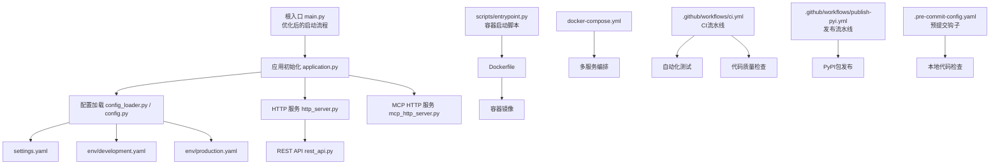
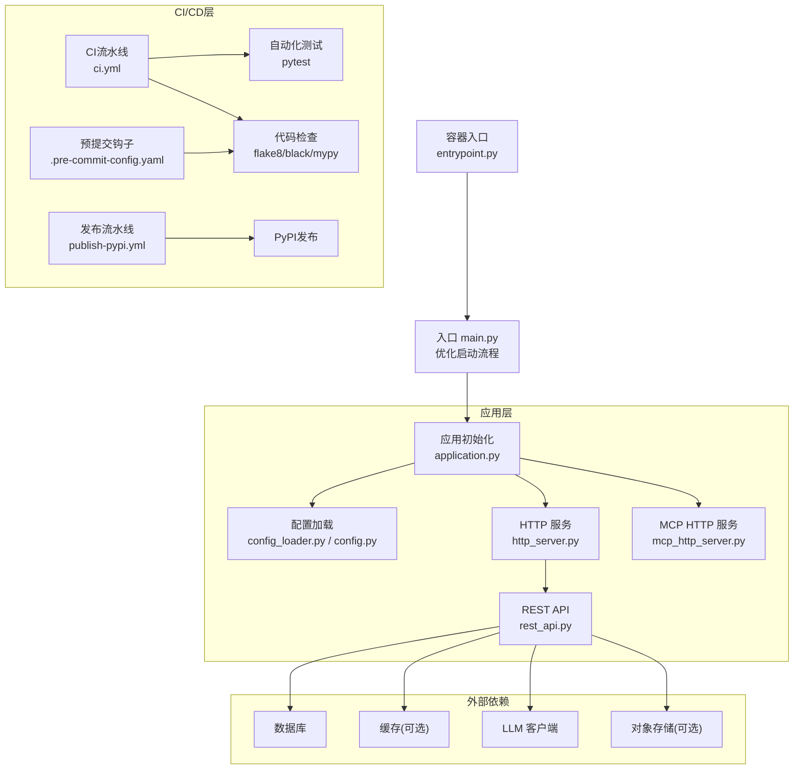
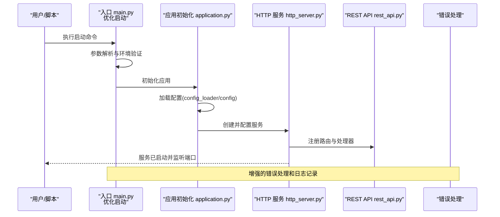
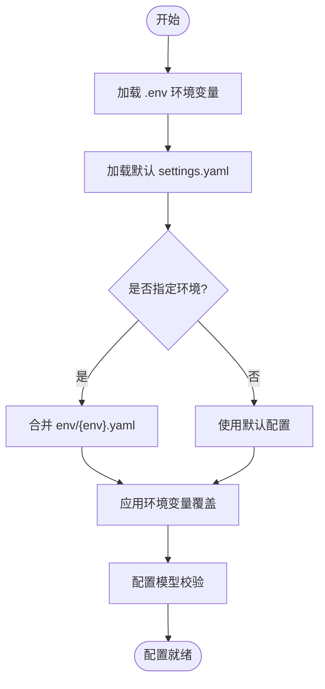
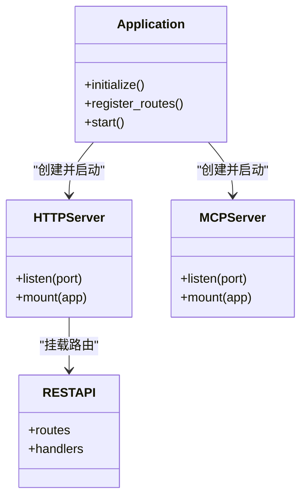
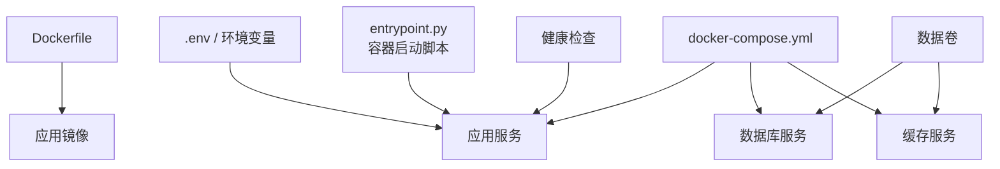
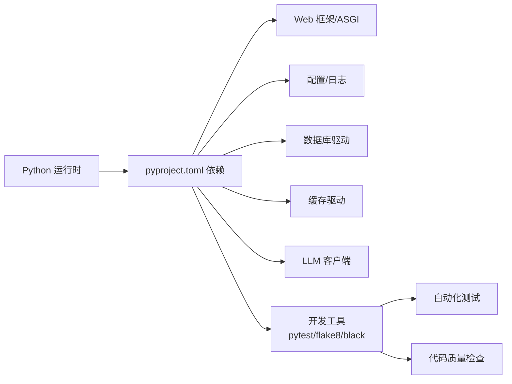
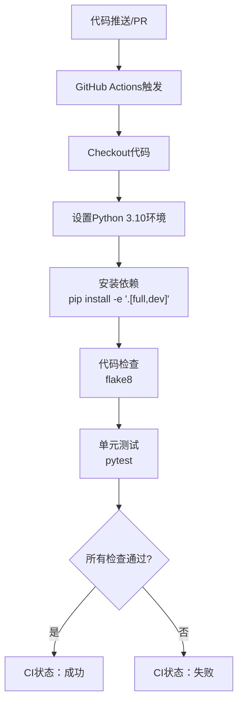
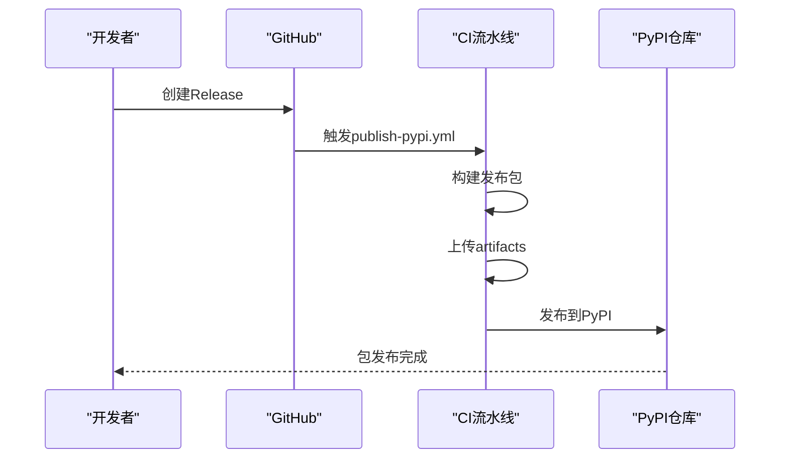
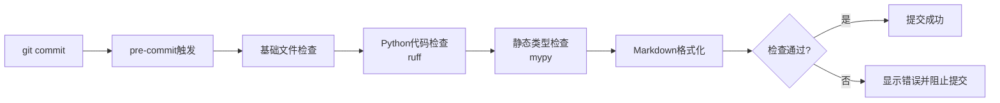

# 部署指南

<cite>
**本文引用的文件**   
- [README.md](file://README.md)
- [README_zh.md](file://README_zh.md)
- [main.py](file://main.py)
- [Dockerfile](file://Dockerfile)
- [docker-compose.yml](file://docker-compose.yml)
- [pyproject.toml](file://pyproject.toml)
- [.github/workflows/ci.yml](file://.github/workflows/ci.yml)
- [.github/workflows/publish-pypi.yml](file://.github/workflows/publish-pypi.yml)
- [src/penshot/app/application.py](file://src/penshot/app/application.py)
- [src/penshot/config/config.py](file://src/penshot/config/config.py)
- [src/penshot/config/config_loader.py](file://src/penshot/config/config_loader.py)
- [src/penshot/config/settings.yaml](file://src/penshot/config/settings.yaml)
- [src/penshot/config/env/development.yaml](file://src/penshot/config/env/development.yaml)
- [src/penshot/config/env/production.yaml](file://src/penshot/config/env/production.yaml)
- [src/penshot/http_server.py](file://src/penshot/http_server.py)
- [src/penshot/mcp_http_server.py](file://src/penshot/mcp_http_server.py)
- [src/penshot/api/rest_api.py](file://src/penshot/api/rest_api.py)
- [src/penshot/utils/dotenv_loader.py](file://src/penshot/utils/dotenv_loader.py)
- [scripts/entrypoint.py](file://scripts/entrypoint.py)
- [.pre-commit-config.yaml](file://.pre-commit-config.yaml)
</cite>

## 更新摘要
**变更内容**   
- 新增持续集成和部署工作流章节，涵盖GitHub Actions CI流水线配置
- 添加自动化测试与代码质量检查流程说明
- 补充PyPI包发布工作流的详细配置指南
- 增强本地开发环境搭建步骤，包含预提交钩子配置
- 完善故障排除指南，增加CI/CD相关问题解决方案

## 目录
1. [简介](#简介)
2. [项目结构](#项目结构)
3. [核心组件](#核心组件)
4. [架构总览](#架构总览)
5. [详细组件分析](#详细组件分析)
6. [依赖分析](#依赖分析)
7. [性能考虑](#性能考虑)
8. [持续集成与部署](#持续集成与部署)
9. [故障排除指南](#故障排除指南)
10. [结论](#结论)
11. [附录](#附录)

## 简介
本指南面向希望本地开发、容器化与生产部署 Video Shot Agent 的工程师与运维人员。内容涵盖：
- 本地开发环境搭建（依赖安装、配置设置、服务启动）
- Docker 镜像构建与多服务编排
- **新增** 持续集成和部署流水线配置（GitHub Actions）
- 自动化测试与代码质量检查
- PyPI 包发布工作流
- 生产环境最佳实践（负载均衡、监控告警、日志收集）
- 环境变量与配置文件说明
- 性能调优建议
- 故障排除与运维管理

## 项目结构
仓库采用分层组织方式，入口脚本位于根目录，应用逻辑集中在 src/penshot 下，配置集中于 src/penshot/config，HTTP/MCP 服务在 src/penshot 中提供，示例与脚本分别在 examples 与 scripts 目录。**新增** .github/workflows 目录包含完整的CI/CD工作流配置。



图表来源
- [main.py:1-200](file://main.py#L1-L200)
- [src/penshot/app/application.py:1-200](file://src/penshot/app/application.py#L1-L200)
- [src/penshot/config/config_loader.py:1-200](file://src/penshot/config/config_loader.py#L1-L200)
- [src/penshot/config/config.py:1-200](file://src/penshot/config/config.py#L1-L200)
- [src/penshot/http_server.py:1-200](file://src/penshot/http_server.py#L1-L200)
- [src/penshot/mcp_http_server.py:1-200](file://src/penshot/mcp_http_server.py#L1-L200)
- [src/penshot/api/rest_api.py:1-200](file://src/penshot/api/rest_api.py#L1-L200)
- [src/penshot/config/settings.yaml:1-200](file://src/penshot/config/settings.yaml#L1-L200)
- [src/penshot/config/env/development.yaml:1-200](file://src/penshot/config/env/development.yaml#L1-L200)
- [src/penshot/config/env/production.yaml:1-200](file://src/penshot/config/env/production.yaml#L1-L200)
- [Dockerfile:1-200](file://Dockerfile#L1-L200)
- [docker-compose.yml:1-200](file://docker-compose.yml#L1-L200)
- [scripts/entrypoint.py:1-200](file://scripts/entrypoint.py#L1-L200)
- [.github/workflows/ci.yml:1-61](file://.github/workflows/ci.yml#L1-L61)
- [.github/workflows/publish-pypi.yml:1-71](file://.github/workflows/publish-pypi.yml#L1-L71)
- [.pre-commit-config.yaml:1-55](file://.pre-commit-config.yaml#L1-L55)

章节来源
- [README.md:1-200](file://README.md#L1-L200)
- [README_zh.md:1-200](file://README_zh.md#L1-L200)
- [main.py:1-200](file://main.py#L1-L200)
- [Dockerfile:1-200](file://Dockerfile#L1-L200)
- [docker-compose.yml:1-200](file://docker-compose.yml#L1-L200)
- [pyproject.toml:1-254](file://pyproject.toml#L1-L254)

## 核心组件
- 应用入口与生命周期
  - **已优化** 主入口负责解析参数、加载配置、初始化应用并启动服务，启动流程经过显著优化，提升了启动性能和稳定性。
  - 应用初始化模块负责装配配置、注册路由、准备中间件与资源。
- 配置系统
  - 支持 YAML 环境与默认配置合并，以及 .env 环境变量覆盖。
  - 提供配置模型与加载器，便于扩展与校验。
- 服务层
  - HTTP 服务暴露 REST API。
  - MCP HTTP 服务用于模型上下文协议通信。
- 容器化
  - Dockerfile 定义镜像构建步骤。
  - docker-compose.yml 编排多服务（如数据库、缓存等）。
  - entrypoint.py 提供容器启动脚本支持。
- **新增** 持续集成与部署
  - GitHub Actions CI流水线自动执行测试和代码检查
  - PyPI包发布工作流实现自动化发布
  - 预提交钩子确保代码质量

章节来源
- [main.py:1-200](file://main.py#L1-L200)
- [src/penshot/app/application.py:1-200](file://src/penshot/app/application.py#L1-L200)
- [src/penshot/config/config_loader.py:1-200](file://src/penshot/config/config_loader.py#L1-L200)
- [src/penshot/config/config.py:1-200](file://src/penshot/config/config.py#L1-L200)
- [src/penshot/http_server.py:1-200](file://src/penshot/http_server.py#L1-L200)
- [src/penshot/mcp_http_server.py:1-200](file://src/penshot/mcp_http_server.py#L1-L200)
- [src/penshot/api/rest_api.py:1-200](file://src/penshot/api/rest_api.py#L1-L200)
- [Dockerfile:1-200](file://Dockerfile#L1-L200)
- [docker-compose.yml:1-200](file://docker-compose.yml#L1-L200)
- [scripts/entrypoint.py:1-200](file://scripts/entrypoint.py#L1-L200)
- [.github/workflows/ci.yml:1-61](file://.github/workflows/ci.yml#L1-L61)
- [.github/workflows/publish-pypi.yml:1-71](file://.github/workflows/publish-pypi.yml#L1-L71)

## 架构总览
Video Shot Agent 以"应用初始化 + 配置中心 + 双服务（HTTP/MCP）"为核心，结合外部依赖（LLM 客户端、存储、缓存等）完成视频分镜任务处理。**新增** 完整的CI/CD流水线确保代码质量和自动化部署。



图表来源
- [main.py:1-200](file://main.py#L1-L200)
- [src/penshot/app/application.py:1-200](file://src/penshot/app/application.py#L1-L200)
- [src/penshot/config/config_loader.py:1-200](file://src/penshot/config/config_loader.py#L1-L200)
- [src/penshot/config/config.py:1-200](file://src/penshot/config/config.py#L1-L200)
- [src/penshot/http_server.py:1-200](file://src/penshot/http_server.py#L1-L200)
- [src/penshot/mcp_http_server.py:1-200](file://src/penshot/mcp_http_server.py#L1-L200)
- [src/penshot/api/rest_api.py:1-200](file://src/penshot/api/rest_api.py#L1-L200)
- [scripts/entrypoint.py:1-200](file://scripts/entrypoint.py#L1-L200)
- [.github/workflows/ci.yml:1-61](file://.github/workflows/ci.yml#L1-L61)
- [.github/workflows/publish-pypi.yml:1-71](file://.github/workflows/publish-pypi.yml#L1-L71)
- [.pre-commit-config.yaml:1-55](file://.pre-commit-config.yaml#L1-L55)

## 详细组件分析

### 应用初始化与启动流程
- **已优化** 入口 main.py 负责解析命令行参数与环境变量，调用应用初始化模块，启动流程经过显著优化，提升了启动性能和错误处理能力。
- application.py 组装配置、注册路由、创建服务实例并启动监听。
- 启动顺序：加载配置 -> 初始化服务 -> 挂载路由 -> 启动事件循环。



图表来源
- [main.py:1-200](file://main.py#L1-L200)
- [src/penshot/app/application.py:1-200](file://src/penshot/app/application.py#L1-L200)
- [src/penshot/http_server.py:1-200](file://src/penshot/http_server.py#L1-L200)
- [src/penshot/api/rest_api.py:1-200](file://src/penshot/api/rest_api.py#L1-L200)

章节来源
- [main.py:1-200](file://main.py#L1-L200)
- [src/penshot/app/application.py:1-200](file://src/penshot/app/application.py#L1-L200)
- [src/penshot/http_server.py:1-200](file://src/penshot/http_server.py#L1-L200)
- [src/penshot/api/rest_api.py:1-200](file://src/penshot/api/rest_api.py#L1-L200)

### 配置系统与优先级
- 配置来源与优先级（从高到低）：
  1) 环境变量（通过 dotenv 加载）
  2) 环境特定 YAML（development.yaml / production.yaml）
  3) 默认 settings.yaml
- 配置加载器负责合并与类型转换，配置模型提供字段校验与默认值。
- 运行时可通过环境变量覆盖任意配置项。



图表来源
- [src/penshot/config/config_loader.py:1-200](file://src/penshot/config/config_loader.py#L1-L200)
- [src/penshot/config/config.py:1-200](file://src/penshot/config/config.py#L1-L200)
- [src/penshot/config/settings.yaml:1-200](file://src/penshot/config/settings.yaml#L1-L200)
- [src/penshot/config/env/development.yaml:1-200](file://src/penshot/config/env/development.yaml#L1-L200)
- [src/penshot/config/env/production.yaml:1-200](file://src/penshot/config/env/production.yaml#L1-L200)
- [src/penshot/utils/dotenv_loader.py:1-200](file://src/penshot/utils/dotenv_loader.py#L1-L200)

章节来源
- [src/penshot/config/config_loader.py:1-200](file://src/penshot/config/config_loader.py#L1-L200)
- [src/penshot/config/config.py:1-200](file://src/penshot/config/config.py#L1-L200)
- [src/penshot/config/settings.yaml:1-200](file://src/penshot/config/settings.yaml#L1-L200)
- [src/penshot/config/env/development.yaml:1-200](file://src/penshot/config/env/development.yaml#L1-L200)
- [src/penshot/config/env/production.yaml:1-200](file://src/penshot/config/env/production.yaml#L1-L200)
- [src/penshot/utils/dotenv_loader.py:1-200](file://src/penshot/utils/dotenv_loader.py#L1-L200)

### HTTP 与 MCP 服务
- HTTP 服务：提供 REST API 接口，承载任务提交、查询、结果获取等能力。
- MCP HTTP 服务：提供基于模型上下文协议的 HTTP 通道，便于与外部工具链集成。
- 两者共享同一应用上下文与配置，可独立启停或同时运行。



图表来源
- [src/penshot/app/application.py:1-200](file://src/penshot/app/application.py#L1-L200)
- [src/penshot/http_server.py:1-200](file://src/penshot/http_server.py#L1-L200)
- [src/penshot/mcp_http_server.py:1-200](file://src/penshot/mcp_http_server.py#L1-L200)
- [src/penshot/api/rest_api.py:1-200](file://src/penshot/api/rest_api.py#L1-L200)

章节来源
- [src/penshot/app/application.py:1-200](file://src/penshot/app/application.py#L1-L200)
- [src/penshot/http_server.py:1-200](file://src/penshot/http_server.py#L1-L200)
- [src/penshot/mcp_http_server.py:1-200](file://src/penshot/mcp_http_server.py#L1-L200)
- [src/penshot/api/rest_api.py:1-200](file://src/penshot/api/rest_api.py#L1-L200)

### 容器化与编排
- Dockerfile：定义基础镜像、依赖安装、工作目录与启动命令。
- docker-compose.yml：编排应用与外部依赖（如数据库、缓存），并提供网络与卷挂载。
- **新增** entrypoint.py：提供容器启动脚本，支持环境变量注入和健康检查。
- 建议将敏感配置通过环境变量注入，避免写入镜像。



图表来源
- [Dockerfile:1-200](file://Dockerfile#L1-L200)
- [docker-compose.yml:1-200](file://docker-compose.yml#L1-L200)
- [scripts/entrypoint.py:1-200](file://scripts/entrypoint.py#L1-L200)

章节来源
- [Dockerfile:1-200](file://Dockerfile#L1-L200)
- [docker-compose.yml:1-200](file://docker-compose.yml#L1-L200)
- [scripts/entrypoint.py:1-200](file://scripts/entrypoint.py#L1-L200)

## 依赖分析
- 语言与包管理
  - Python 项目，依赖声明位于 pyproject.toml。
- 关键依赖类别
  - Web 框架与异步运行时
  - 配置与日志库
  - 数据库与缓存驱动
  - LLM 客户端 SDK
  - **新增** 开发工具：pytest、flake8、black、mypy等
- 版本锁定与可重现构建
  - 建议使用锁文件与固定版本，确保构建一致性。



图表来源
- [pyproject.toml:1-254](file://pyproject.toml#L1-L254)

章节来源
- [pyproject.toml:1-254](file://pyproject.toml#L1-L254)

## 性能考虑
- 并发与线程池
  - 根据 CPU 核数与 I/O 特性调整工作进程/线程数量。
- 连接池与超时
  - 合理设置数据库与缓存连接池大小、超时与重试策略。
- 缓存与幂等
  - 对重复请求启用缓存；为长任务实现幂等键与去重。
- 资源隔离
  - 使用容器限制 CPU/内存，避免相互影响。
- 批处理与流水线
  - 对批量任务进行分片与并行处理，提升吞吐。
- 监控与指标
  - 暴露健康检查与关键指标（QPS、延迟、错误率、队列长度）。

[本节为通用指导，不直接分析具体文件]

## 持续集成与部署

### GitHub Actions CI流水线
项目配置了完整的持续集成流水线，自动执行代码检查和测试。

#### CI流水线配置
- **触发条件**：推送到 main 分支或针对 main 分支的 Pull Request
- **执行环境**：Ubuntu latest，Python 3.10
- **主要步骤**：
  1. 代码检出
  2. Python环境设置（带pip缓存）
  3. 依赖安装（包含开发依赖）
  4. 代码规范检查（flake8）
  5. 单元测试执行（pytest）



图表来源
- [.github/workflows/ci.yml:1-61](file://.github/workflows/ci.yml#L1-L61)

#### 代码质量检查
- **flake8配置**：检查逻辑错误和未定义变量，排除无关目录
- **测试框架**：pytest自动发现和执行tests目录下所有测试
- **依赖缓存**：启用pip缓存加速CI执行速度

### PyPI包发布工作流
项目配置了自动化发布到PyPI的工作流。

#### 发布流程
- **触发条件**：创建并发布GitHub Release时自动触发
- **构建步骤**：
  1. 检出代码
  2. 设置Python环境
  3. 构建发布包（python -m build）
  4. 上传构建产物作为artifact
  5. 发布到PyPI



图表来源
- [.github/workflows/publish-pypi.yml:1-71](file://.github/workflows/publish-pypi.yml#L1-L71)

### 预提交钩子配置
项目配置了全面的预提交钩子，确保代码质量。

#### 预提交检查
- **基础检查**：行尾空格、文件结尾、YAML/TOML/JSON语法检查
- **Python代码检查**：ruff格式化和代码检查
- **静态类型检查**：mypy类型检查
- **Markdown格式化**：mdformat文档格式化



图表来源
- [.pre-commit-config.yaml:1-55](file://.pre-commit-config.yaml#L1-L55)

### 本地开发环境设置
#### 安装预提交钩子
```bash
# 安装pre-commit钩子
pre-commit install

# 手动运行所有检查
pre-commit run --all-files
```

#### 运行测试
```bash
# 安装测试依赖
pip install -e ".[test]"

# 运行所有测试
pytest

# 运行特定测试
pytest tests/unit/test_utils.py

# 生成覆盖率报告
pytest --cov=penshot --cov-report=html
```

章节来源
- [.github/workflows/ci.yml:1-61](file://.github/workflows/ci.yml#L1-L61)
- [.github/workflows/publish-pypi.yml:1-71](file://.github/workflows/publish-pypi.yml#L1-L71)
- [.pre-commit-config.yaml:1-55](file://.pre-commit-config.yaml#L1-L55)
- [pyproject.toml:85-171](file://pyproject.toml#L85-L171)

## 故障排除指南
- 启动失败
  - **已更新** 检查 main.py 启动日志，确认参数解析和环境变量加载是否正确。
  - 检查环境变量与配置文件路径是否正确。
  - 确认端口未被占用，防火墙允许访问。
- 配置未生效
  - 验证 .env 文件位置与命名规范。
  - 确认环境特定 YAML 文件名与路径匹配。
  - **已更新** 检查配置优先级，确认环境变量覆盖是否正确应用。
- 服务不可达
  - 查看容器日志与服务状态。
  - 检查 docker-compose 网络与端口映射。
  - **已更新** 验证 entrypoint.py 启动脚本的执行权限和路径。
- 外部依赖异常
  - 验证数据库/缓存连通性与认证信息。
  - 检查 LLM 客户端密钥与配额。
- 性能问题
  - 观察 CPU/内存/IO 使用率，定位瓶颈。
  - 调整连接池与并发参数。
  - **已更新** 检查应用启动时间，确认优化效果。
- **新增** CI/CD问题排查
  - **CI流水线失败**：检查flake8错误和pytest测试失败的具体输出
  - **依赖安装问题**：确认网络连接和pip缓存状态
  - **测试执行失败**：检查测试环境配置和依赖完整性
  - **PyPI发布失败**：验证GitHub Release标签和PyPI认证配置

章节来源
- [scripts/entrypoint.py:1-200](file://scripts/entrypoint.py#L1-L200)
- [src/penshot/utils/dotenv_loader.py:1-200](file://src/penshot/utils/dotenv_loader.py#L1-L200)
- [src/penshot/config/config_loader.py:1-200](file://src/penshot/config/config_loader.py#L1-L200)
- [src/penshot/config/config.py:1-200](file://src/penshot/config/config.py#L1-L200)
- [main.py:1-200](file://main.py#L1-L200)
- [.github/workflows/ci.yml:1-61](file://.github/workflows/ci.yml#L1-L61)
- [.github/workflows/publish-pypi.yml:1-71](file://.github/workflows/publish-pypi.yml#L1-L71)

## 结论
通过清晰的入口与配置体系、双服务架构与完善的容器化方案，Video Shot Agent 可在本地快速开发、在容器中稳定运行，并在生产环境中通过负载均衡、监控与日志体系保障高可用与可观测性。**已优化的应用启动流程和增强的错误处理机制进一步提升了系统的稳定性和可维护性**。新增的完整CI/CD流水线确保了代码质量和自动化部署流程，从本地开发到生产发布的每个环节都有相应的质量保证措施。遵循本指南的环境变量与性能调优建议，可有效降低部署风险并提升系统稳定性。

[本节为总结性内容，不直接分析具体文件]

## 附录

### 本地开发环境搭建
- 前置条件
  - Python 解释器与包管理器
  - Docker 与 docker-compose（可选）
  - Git（用于版本控制和预提交钩子）
- 安装依赖
  - 使用项目提供的依赖声明安装依赖。
- 配置
  - 复制并编辑 .env 文件，填写必要的外部服务凭据。
  - 选择 development 或 production 环境 YAML 进行覆盖。
- 启动服务
  - **已更新** 通过入口脚本启动应用，或使用容器化方式运行。
  - **已更新** 支持多种启动模式：开发模式、测试模式和生产模式。
- **新增** 预提交钩子设置
  ```bash
  # 安装预提交钩子
  pre-commit install
  
  # 配置Git钩子
  git config core.hooksPath .githooks
  ```

章节来源
- [README.md:1-200](file://README.md#L1-L200)
- [README_zh.md:1-200](file://README_zh.md#L1-L200)
- [main.py:1-200](file://main.py#L1-L200)
- [src/penshot/utils/dotenv_loader.py:1-200](file://src/penshot/utils/dotenv_loader.py#L1-L200)
- [src/penshot/config/config_loader.py:1-200](file://src/penshot/config/config_loader.py#L1-L200)
- [.pre-commit-config.yaml:1-55](file://.pre-commit-config.yaml#L1-L55)

### Docker 容器化部署
- 构建镜像
  - 使用 Dockerfile 构建应用镜像。
- 编排服务
  - 使用 docker-compose.yml 拉起应用与外部依赖。
- 环境变量注入
  - 通过 .env 文件或 compose 环境变量注入敏感配置。
- 数据持久化
  - 为数据库与缓存挂载数据卷，确保重启后数据保留。
- **已更新** 容器启动脚本
  - entrypoint.py 提供统一的容器启动入口，支持健康检查和优雅关闭。

章节来源
- [Dockerfile:1-200](file://Dockerfile#L1-L200)
- [docker-compose.yml:1-200](file://docker-compose.yml#L1-L200)
- [src/penshot/utils/dotenv_loader.py:1-200](file://src/penshot/utils/dotenv_loader.py#L1-L200)
- [scripts/entrypoint.py:1-200](file://scripts/entrypoint.py#L1-L200)

### 生产环境最佳实践
- 负载均衡
  - 在容器前放置反向代理或负载均衡器，分发请求到多个副本。
- 监控告警
  - 采集应用指标与健康检查端点，接入监控系统与告警规则。
- 日志收集
  - 统一输出结构化日志，集中收集与分析。
- 安全加固
  - 最小权限原则、密钥管理与网络隔离。
- 灰度与回滚
  - 蓝绿/金丝雀发布策略，快速回滚机制。
- **已更新** 启动优化
  - 利用优化后的启动流程减少冷启动时间。
  - 预加载常用配置和资源，提升响应速度。
- **新增** CI/CD最佳实践
  - 使用分支保护规则确保代码质量
  - 配置环境特定的CI流水线
  - 实施渐进式发布策略

[本节为通用指导，不直接分析具体文件]

### 环境变量与配置说明
- 环境变量
  - 通过 .env 文件注入，包括外部服务地址、认证信息与功能开关。
- 配置优先级
  - 环境变量 > 环境特定 YAML > 默认 settings.yaml。
- 常见配置项
  - 服务端口、日志级别、外部依赖连接串、缓存与数据库参数、LLM 客户端配置等。
- **已更新** 启动参数
  - 支持通过命令行参数控制启动模式和调试选项。

章节来源
- [src/penshot/utils/dotenv_loader.py:1-200](file://src/penshot/utils/dotenv_loader.py#L1-L200)
- [src/penshot/config/config_loader.py:1-200](file://src/penshot/config/config_loader.py#L1-L200)
- [src/penshot/config/config.py:1-200](file://src/penshot/config/config.py#L1-L200)
- [src/penshot/config/settings.yaml:1-200](file://src/penshot/config/settings.yaml#L1-L200)
- [src/penshot/config/env/development.yaml:1-200](file://src/penshot/config/env/development.yaml#L1-L200)
- [src/penshot/config/env/production.yaml:1-200](file://src/penshot/config/env/production.yaml#L1-L200)
- [main.py:1-200](file://main.py#L1-L200)

### 性能调优建议
- 进程与线程
  - 依据硬件与任务特征调整工作进程/线程数量。
- 连接池与超时
  - 针对数据库与缓存优化连接池大小与超时时间。
- 缓存策略
  - 热点数据缓存、失效策略与一致性保证。
- 批处理与限流
  - 对大任务进行分片与限速，防止雪崩。
- 资源限制
  - 容器 CPU/内存限制与 OOM 保护。
- **已更新** 启动优化
  - 利用优化后的启动流程减少应用冷启动时间。
  - 预初始化关键组件，提升首次请求响应速度。

[本节为通用指导，不直接分析具体文件]

### 运维管理指南
- 健康检查
  - 提供健康检查端点，供负载均衡与编排系统探测。
- 滚动更新
  - 逐步替换旧实例，保持服务可用性。
- 备份与恢复
  - 定期备份数据库与对象存储数据。
- 审计与合规
  - 记录操作日志与访问日志，满足审计要求。
- **已更新** 监控与诊断
  - 利用增强的日志系统追踪启动过程和运行时状态。
  - 监控应用启动时间和资源使用情况。
- **新增** CI/CD监控
  - 监控CI流水线执行状态和成功率
  - 设置流水线失败告警通知
  - 跟踪发布流水线的执行历史

[本节为通用指导，不直接分析具体文件]

### 持续集成与部署配置详解

#### CI流水线详细配置
- **触发策略**：支持push到main分支和Pull Request两种触发方式
- **环境配置**：使用Ubuntu latest和Python 3.10
- **依赖缓存**：启用pip缓存加速后续构建
- **代码检查**：使用flake8进行代码质量检查
- **测试执行**：集成pytest自动测试框架

#### 发布流水线配置
- **触发条件**：仅在创建GitHub Release时触发
- **构建环境**：使用Python 3.x最新版本
- **构建过程**：使用标准Python构建工具
- **发布流程**：通过官方PyPA Action发布到PyPI

#### 预提交钩子配置
- **基础检查**：文件格式和语法检查
- **代码质量**：ruff格式化和代码检查
- **类型检查**：mypy静态类型检查
- **文档格式化**：Markdown文档自动格式化

章节来源
- [.github/workflows/ci.yml:1-61](file://.github/workflows/ci.yml#L1-L61)
- [.github/workflows/publish-pypi.yml:1-71](file://.github/workflows/publish-pypi.yml#L1-L71)
- [.pre-commit-config.yaml:1-55](file://.pre-commit-config.yaml#L1-L55)
- [pyproject.toml:85-171](file://pyproject.toml#L85-L171)