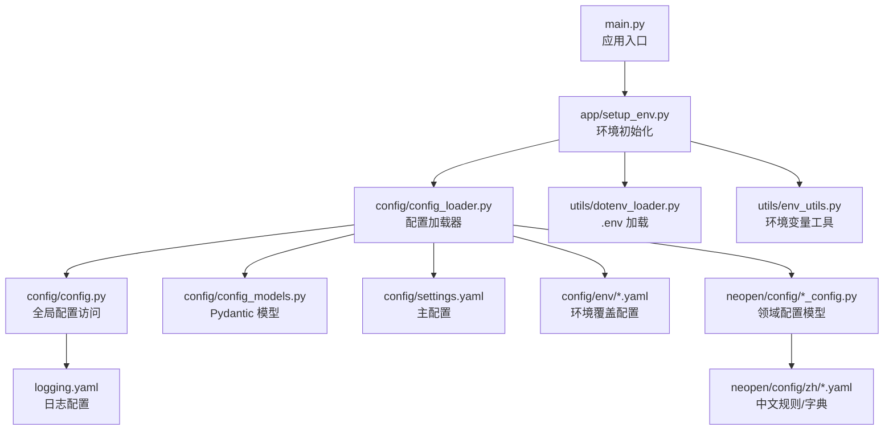
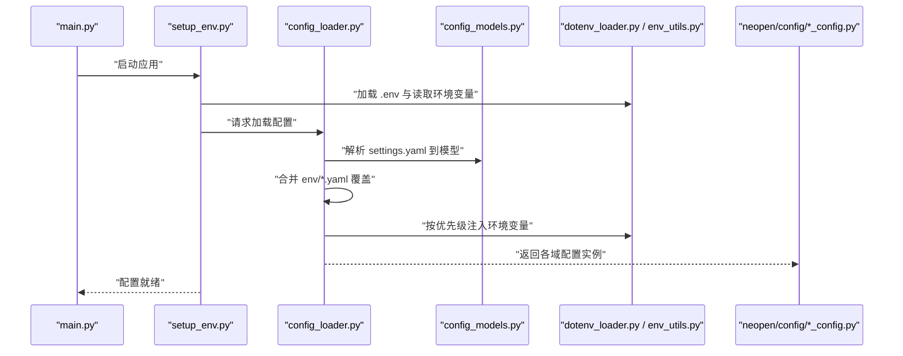
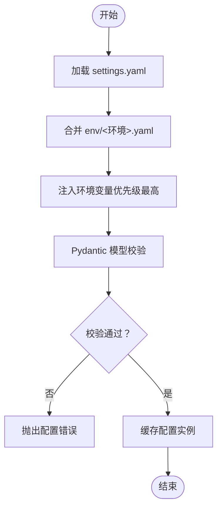
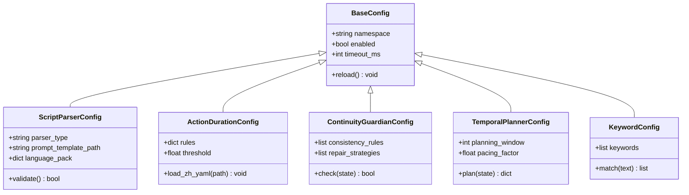
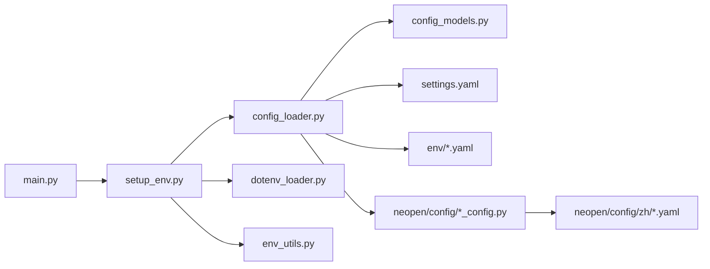

# 配置管理

<cite>
**本文引用的文件**   
- [src/penshot/config/config.py](file://src/penshot/config/config.py)
- [src/penshot/config/config_loader.py](file://src/penshot/config/config_loader.py)
- [src/penshot/config/config_models.py](file://src/penshot/config/config_models.py)
- [src/penshot/config/settings.yaml](file://src/penshot/config/settings.yaml)
- [src/penshot/config/env/development.yaml](file://src/penshot/config/env/development.yaml)
- [src/penshot/config/env/production.yaml](file://src/penshot/config/env/production.yaml)
- [src/penshot/app/setup_env.py](file://src/penshot/app/setup_env.py)
- [src/penshot/utils/dotenv_loader.py](file://src/penshot/utils/dotenv_loader.py)
- [src/penshot/utils/env_utils.py](file://src/penshot/utils/env_utils.py)
- [src/penshot/neopen/config/base_config.py](file://src/penshot/neopen/config/base_config.py)
- [src/penshot/neopen/config/script_parser_config.py](file://src/penshot/neopen/config/script_parser_config.py)
- [src/penshot/neopen/config/action_duration_config.py](file://src/penshot/neopen/config/action_duration_config.py)
- [src/penshot/neopen/config/continuity_guardian_config.py](file://src/penshot/neopen/config/continuity_guardian_config.py)
- [src/penshot/neopen/config/temporal_planner_config.py](file://src/penshot/neopen/config/temporal_planner_config.py)
- [src/penshot/neopen/config/keyword_config.py](file://src/penshot/neopen/config/keyword_config.py)
- [src/penshot/neopen/config/__init__.py](file://src/penshot/neopen/config/__init__.py)
- [src/penshot/neopen/config/zh/action_duration_config.yaml](file://src/penshot/neopen/config/zh/action_duration_config.yaml)
- [src/penshot/neopen/config/zh/duration_estimator_config.yaml](file://src/penshot/neopen/config/zh/duration_estimator_config.yaml)
- [src/penshot/neopen/config/zh/keyword_config.yaml](file://src/penshot/neopen/config/zh/keyword_config.yaml)
- [src/penshot/neopen/config/zh/script_parser_config.yaml](file://src/penshot/neopen/config/zh/script_parser_config.yaml)
- [src/penshot/config/logging.yaml](file://src/penshot/config/logging.yaml)
- [main.py](file://main.py)
</cite>

## 目录
1. [简介](#简介)
2. [项目结构](#项目结构)
3. [核心组件](#核心组件)
4. [架构总览](#架构总览)
5. [详细组件分析](#详细组件分析)
6. [依赖关系分析](#依赖关系分析)
7. [性能考虑](#性能考虑)
8. [故障排查指南](#故障排查指南)
9. [结论](#结论)
10. [附录](#附录)

## 简介
本文件面向 Video Shot Agent 的配置管理系统，系统性说明配置文件的层次结构与加载机制、YAML 配置格式与环境变量优先级、动态配置更新策略、多运行环境模板（开发、测试、预发布、生产）、敏感信息安全管理（密钥、加密、权限）、配置验证与默认值设置，以及配置变更的管理流程与版本控制策略。文档同时提供架构图与流程图，帮助读者快速理解并正确落地配置体系。

## 项目结构
配置相关代码与资源主要分布在以下位置：
- 应用级配置入口与模型定义：src/penshot/config
- 领域子模块配置（脚本解析、动作时长、连续性守护等）：src/penshot/neopen/config
- 环境变量与 .env 加载工具：src/penshot/utils
- 应用启动时环境初始化：src/penshot/app/setup_env.py
- 全局入口：main.py
- 日志配置：src/penshot/config/logging.yaml

图表来源
- [main.py:1-200](file://main.py#L1-L200)
- [src/penshot/app/setup_env.py:1-200](file://src/penshot/app/setup_env.py#L1-L200)
- [src/penshot/config/config_loader.py:1-200](file://src/penshot/config/config_loader.py#L1-L200)
- [src/penshot/config/config.py:1-200](file://src/penshot/config/config.py#L1-L200)
- [src/penshot/config/config_models.py:1-200](file://src/penshot/config/config_models.py#L1-L200)
- [src/penshot/config/settings.yaml:1-200](file://src/penshot/config/settings.yaml#L1-L200)
- [src/penshot/config/env/development.yaml:1-200](file://src/penshot/config/env/development.yaml#L1-L200)
- [src/penshot/config/env/production.yaml:1-200](file://src/penshot/config/env/production.yaml#L1-L200)
- [src/penshot/neopen/config/base_config.py:1-200](file://src/penshot/neopen/config/base_config.py#L1-L200)
- [src/penshot/neopen/config/script_parser_config.py:1-200](file://src/penshot/neopen/config/script_parser_config.py#L1-L200)
- [src/penshot/neopen/config/action_duration_config.py:1-200](file://src/penshot/neopen/config/action_duration_config.py#L1-L200)
- [src/penshot/neopen/config/continuity_guardian_config.py:1-200](file://src/penshot/neopen/config/continuity_guardian_config.py#L1-L200)
- [src/penshot/neopen/config/temporal_planner_config.py:1-200](file://src/penshot/neopen/config/temporal_planner_config.py#L1-L200)
- [src/penshot/neopen/config/keyword_config.py:1-200](file://src/penshot/neopen/config/keyword_config.py#L1-L200)
- [src/penshot/neopen/config/zh/action_duration_config.yaml:1-200](file://src/penshot/neopen/config/zh/action_duration_config.yaml#L1-L200)
- [src/penshot/neopen/config/zh/duration_estimator_config.yaml:1-200](file://src/penshot/neopen/config/zh/duration_estimator_config.yaml#L1-L200)
- [src/penshot/neopen/config/zh/keyword_config.yaml:1-200](file://src/penshot/neopen/config/zh/keyword_config.yaml#L1-L200)
- [src/penshot/neopen/config/zh/script_parser_config.yaml:1-200](file://src/penshot/neopen/config/zh/script_parser_config.yaml#L1-L200)
- [src/penshot/config/logging.yaml:1-200](file://src/penshot/config/logging.yaml#L1-L200)

章节来源
- [src/penshot/config/config.py:1-200](file://src/penshot/config/config.py#L1-L200)
- [src/penshot/config/config_loader.py:1-200](file://src/penshot/config/config_loader.py#L1-L200)
- [src/penshot/config/config_models.py:1-200](file://src/penshot/config/config_models.py#L1-L200)
- [src/penshot/config/settings.yaml:1-200](file://src/penshot/config/settings.yaml#L1-L200)
- [src/penshot/config/env/development.yaml:1-200](file://src/penshot/config/env/development.yaml#L1-L200)
- [src/penshot/config/env/production.yaml:1-200](file://src/penshot/config/env/production.yaml#L1-L200)
- [src/penshot/app/setup_env.py:1-200](file://src/penshot/app/setup_env.py#L1-L200)
- [src/penshot/utils/dotenv_loader.py:1-200](file://src/penshot/utils/dotenv_loader.py#L1-L200)
- [src/penshot/utils/env_utils.py:1-200](file://src/penshot/utils/env_utils.py#L1-L200)
- [src/penshot/neopen/config/base_config.py:1-200](file://src/penshot/neopen/config/base_config.py#L1-L200)
- [src/penshot/neopen/config/script_parser_config.py:1-200](file://src/penshot/neopen/config/script_parser_config.py#L1-L200)
- [src/penshot/neopen/config/action_duration_config.py:1-200](file://src/penshot/neopen/config/action_duration_config.py#L1-L200)
- [src/penshot/neopen/config/continuity_guardian_config.py:1-200](file://src/penshot/neopen/config/continuity_guardian_config.py#L1-L200)
- [src/penshot/neopen/config/temporal_planner_config.py:1-200](file://src/penshot/neopen/config/temporal_planner_config.py#L1-L200)
- [src/penshot/neopen/config/keyword_config.py:1-200](file://src/penshot/neopen/config/keyword_config.py#L1-L200)
- [src/penshot/neopen/config/zh/action_duration_config.yaml:1-200](file://src/penshot/neopen/config/zh/action_duration_config.yaml#L1-L200)
- [src/penshot/neopen/config/zh/duration_estimator_config.yaml:1-200](file://src/penshot/neopen/config/zh/duration_estimator_config.yaml#L1-L200)
- [src/penshot/neopen/config/zh/keyword_config.yaml:1-200](file://src/penshot/neopen/config/zh/keyword_config.yaml#L1-L200)
- [src/penshot/neopen/config/zh/script_parser_config.yaml:1-200](file://src/penshot/neopen/config/zh/script_parser_config.yaml#L1-L200)
- [src/penshot/config/logging.yaml:1-200](file://src/penshot/config/logging.yaml#L1-L200)
- [main.py:1-200](file://main.py#L1-L200)

## 核心组件
- 配置加载器（config_loader.py）
  - 负责合并 settings.yaml、env/*.yaml、.env 环境变量，生成最终配置对象。
  - 支持按运行环境选择覆盖配置，并提供热更新接口。
- 全局配置访问（config.py）
  - 暴露单例或延迟初始化的配置实例，供业务模块统一读取。
- 配置模型（config_models.py）
  - 使用 Pydantic 模型对配置进行强类型校验、默认值与约束定义。
- 领域配置（neopen/config/*_config.py）
  - 针对脚本解析、动作时长、连续性守护、时间规划、关键词等子域提供独立配置模型与加载逻辑。
- 环境变量与 .env 工具（utils/dotenv_loader.py, utils/env_utils.py）
  - 提供 .env 文件加载与便捷的环境变量读取方法。
- 应用环境初始化（app/setup_env.py）
  - 在应用启动阶段完成配置加载、日志初始化与必要的环境准备。
- 日志配置（config/logging.yaml）
  - 集中管理日志级别、输出目标与格式化策略。

章节来源
- [src/penshot/config/config_loader.py:1-200](file://src/penshot/config/config_loader.py#L1-L200)
- [src/penshot/config/config.py:1-200](file://src/penshot/config/config.py#L1-L200)
- [src/penshot/config/config_models.py:1-200](file://src/penshot/config/config_models.py#L1-L200)
- [src/penshot/neopen/config/base_config.py:1-200](file://src/penshot/neopen/config/base_config.py#L1-L200)
- [src/penshot/neopen/config/script_parser_config.py:1-200](file://src/penshot/neopen/config/script_parser_config.py#L1-L200)
- [src/penshot/neopen/config/action_duration_config.py:1-200](file://src/penshot/neopen/config/action_duration_config.py#L1-L200)
- [src/penshot/neopen/config/continuity_guardian_config.py:1-200](file://src/penshot/neopen/config/continuity_guardian_config.py#L1-L200)
- [src/penshot/neopen/config/temporal_planner_config.py:1-200](file://src/penshot/neopen/config/temporal_planner_config.py#L1-L200)
- [src/penshot/neopen/config/keyword_config.py:1-200](file://src/penshot/neopen/config/keyword_config.py#L1-L200)
- [src/penshot/app/setup_env.py:1-200](file://src/penshot/app/setup_env.py#L1-L200)
- [src/penshot/utils/dotenv_loader.py:1-200](file://src/penshot/utils/dotenv_loader.py#L1-L200)
- [src/penshot/utils/env_utils.py:1-200](file://src/penshot/utils/env_utils.py#L1-L200)
- [src/penshot/config/logging.yaml:1-200](file://src/penshot/config/logging.yaml#L1-L200)

## 架构总览
配置系统采用“基础配置 + 环境覆盖 + 环境变量注入”的分层模式，并通过 Pydantic 模型实现强类型校验与默认值管理。

图表来源
- [main.py:1-200](file://main.py#L1-L200)
- [src/penshot/app/setup_env.py:1-200](file://src/penshot/app/setup_env.py#L1-L200)
- [src/penshot/config/config_loader.py:1-200](file://src/penshot/config/config_loader.py#L1-L200)
- [src/penshot/config/config_models.py:1-200](file://src/penshot/config/config_models.py#L1-L200)
- [src/penshot/utils/dotenv_loader.py:1-200](file://src/penshot/utils/dotenv_loader.py#L1-L200)
- [src/penshot/utils/env_utils.py:1-200](file://src/penshot/utils/env_utils.py#L1-L200)
- [src/penshot/neopen/config/base_config.py:1-200](file://src/penshot/neopen/config/base_config.py#L1-L200)
- [src/penshot/neopen/config/script_parser_config.py:1-200](file://src/penshot/neopen/config/script_parser_config.py#L1-L200)
- [src/penshot/neopen/config/action_duration_config.py:1-200](file://src/penshot/neopen/config/action_duration_config.py#L1-L200)
- [src/penshot/neopen/config/continuity_guardian_config.py:1-200](file://src/penshot/neopen/config/continuity_guardian_config.py#L1-L200)
- [src/penshot/neopen/config/temporal_planner_config.py:1-200](file://src/penshot/neopen/config/temporal_planner_config.py#L1-L200)
- [src/penshot/neopen/config/keyword_config.py:1-200](file://src/penshot/neopen/config/keyword_config.py#L1-L200)

## 详细组件分析

### 配置加载器与模型（config_loader.py, config_models.py）
- 职责
  - 从 settings.yaml 加载基础配置，按运行环境合并 env/*.yaml 覆盖。
  - 将 YAML 映射为 Pydantic 模型，自动执行类型转换与约束校验。
  - 提供运行时热更新能力，允许在不重启进程的情况下刷新部分配置。
- 关键流程
  - 读取基础配置 → 应用环境覆盖 → 注入环境变量 → 构建模型实例 → 缓存并对外暴露。
- 复杂度
  - 合并与校验的时间复杂度近似 O(N)，N 为配置项数量；空间复杂度 O(N)。
- 优化建议
  - 对大型配置集合可引入增量校验与懒加载，减少冷启动开销。
  - 对频繁更新的键值对提供细粒度热更新接口，避免全量重建。

图表来源
- [src/penshot/config/config_loader.py:1-200](file://src/penshot/config/config_loader.py#L1-L200)
- [src/penshot/config/config_models.py:1-200](file://src/penshot/config/config_models.py#L1-L200)

章节来源
- [src/penshot/config/config_loader.py:1-200](file://src/penshot/config/config_loader.py#L1-L200)
- [src/penshot/config/config_models.py:1-200](file://src/penshot/config/config_models.py#L1-L200)

### 全局配置访问（config.py）
- 职责
  - 提供统一的配置访问入口，封装加载与缓存细节。
  - 暴露只读视图，防止外部随意修改导致状态不一致。
- 设计要点
  - 延迟初始化，按需加载配置。
  - 线程安全访问，避免并发读写冲突。

章节来源
- [src/penshot/config/config.py:1-200](file://src/penshot/config/config.py#L1-L200)

### 环境变量与 .env 工具（dotenv_loader.py, env_utils.py）
- dotenv_loader.py
  - 负责加载 .env 文件，将键值对注入进程环境变量。
- env_utils.py
  - 提供便捷的环境变量读取与类型转换方法，支持默认值与可选字段。

章节来源
- [src/penshot/utils/dotenv_loader.py:1-200](file://src/penshot/utils/dotenv_loader.py#L1-L200)
- [src/penshot/utils/env_utils.py:1-200](file://src/penshot/utils/env_utils.py#L1-L200)

### 应用环境初始化（setup_env.py）
- 职责
  - 在应用启动时完成 .env 加载、配置初始化、日志配置与应用上下文准备。
- 关键点
  - 确保配置加载顺序正确，避免后续模块因未初始化而崩溃。
  - 提供健康检查钩子，便于容器编排平台探测服务可用性。

章节来源
- [src/penshot/app/setup_env.py:1-200](file://src/penshot/app/setup_env.py#L1-L200)

### 领域配置模型（neopen/config/*_config.py）
- base_config.py
  - 定义通用配置基类与公共字段，如命名空间、开关、超时等。
- script_parser_config.py
  - 脚本解析相关配置，包括解析器选择、提示词模板路径、语言包等。
- action_duration_config.py
  - 动作时长估算配置，关联 zh/action_duration_config.yaml 中的规则与阈值。
- continuity_guardian_config.py
  - 连续性守护配置，包含一致性契约、修复策略、校验节点等。
- temporal_planner_config.py
  - 时间规划配置，用于镜头时序与节奏控制。
- keyword_config.py
  - 关键词库与匹配策略配置，关联 zh/keyword_config.yaml。

图表来源
- [src/penshot/neopen/config/base_config.py:1-200](file://src/penshot/neopen/config/base_config.py#L1-L200)
- [src/penshot/neopen/config/script_parser_config.py:1-200](file://src/penshot/neopen/config/script_parser_config.py#L1-L200)
- [src/penshot/neopen/config/action_duration_config.py:1-200](file://src/penshot/neopen/config/action_duration_config.py#L1-L200)
- [src/penshot/neopen/config/continuity_guardian_config.py:1-200](file://src/penshot/neopen/config/continuity_guardian_config.py#L1-L200)
- [src/penshot/neopen/config/temporal_planner_config.py:1-200](file://src/penshot/neopen/config/temporal_planner_config.py#L1-L200)
- [src/penshot/neopen/config/keyword_config.py:1-200](file://src/penshot/neopen/config/keyword_config.py#L1-L200)

章节来源
- [src/penshot/neopen/config/base_config.py:1-200](file://src/penshot/neopen/config/base_config.py#L1-L200)
- [src/penshot/neopen/config/script_parser_config.py:1-200](file://src/penshot/neopen/config/script_parser_config.py#L1-L200)
- [src/penshot/neopen/config/action_duration_config.py:1-200](file://src/penshot/neopen/config/action_duration_config.py#L1-L200)
- [src/penshot/neopen/config/continuity_guardian_config.py:1-200](file://src/penshot/neopen/config/continuity_guardian_config.py#L1-L200)
- [src/penshot/neopen/config/temporal_planner_config.py:1-200](file://src/penshot/neopen/config/temporal_planner_config.py#L1-L200)
- [src/penshot/neopen/config/keyword_config.py:1-200](file://src/penshot/neopen/config/keyword_config.py#L1-L200)

### 中文规则与字典（neopen/config/zh/*.yaml）
- 作用
  - 存放中文场景下的规则、阈值、关键词等数据驱动配置，便于本地化与运营调整。
- 典型文件
  - action_duration_config.yaml：动作时长估算规则
  - duration_estimator_config.yaml：时长估算器参数
  - keyword_config.yaml：关键词列表与权重
  - script_parser_config.yaml：脚本解析提示词与模板

章节来源
- [src/penshot/neopen/config/zh/action_duration_config.yaml:1-200](file://src/penshot/neopen/config/zh/action_duration_config.yaml#L1-L200)
- [src/penshot/neopen/config/zh/duration_estimator_config.yaml:1-200](file://src/penshot/neopen/config/zh/duration_estimator_config.yaml#L1-L200)
- [src/penshot/neopen/config/zh/keyword_config.yaml:1-200](file://src/penshot/neopen/config/zh/keyword_config.yaml#L1-L200)
- [src/penshot/neopen/config/zh/script_parser_config.yaml:1-200](file://src/penshot/neopen/config/zh/script_parser_config.yaml#L1-L200)

### 日志配置（logging.yaml）
- 内容
  - 日志级别、输出目标（控制台/文件）、格式化模板、轮转策略等。
- 集成
  - 在应用启动阶段由 setup_env.py 加载并初始化日志系统。

章节来源
- [src/penshot/config/logging.yaml:1-200](file://src/penshot/config/logging.yaml#L1-L200)
- [src/penshot/app/setup_env.py:1-200](file://src/penshot/app/setup_env.py#L1-L200)

## 依赖关系分析
- 模块耦合
  - main.py 依赖 setup_env.py 完成启动期初始化。
  - setup_env.py 依赖 config_loader.py、dotenv_loader.py、env_utils.py。
  - config_loader.py 依赖 config_models.py 与 YAML 配置文件。
  - neopen/config/*_config.py 依赖 base_config.py 与 zh/*.yaml。
- 外部依赖
  - PyYAML：解析 YAML 配置。
  - Pydantic：配置模型校验与序列化。
  - python-dotenv：加载 .env 文件。
- 潜在循环依赖
  - 当前结构以单向依赖为主，未见明显循环引用风险。

图表来源
- [main.py:1-200](file://main.py#L1-L200)
- [src/penshot/app/setup_env.py:1-200](file://src/penshot/app/setup_env.py#L1-L200)
- [src/penshot/config/config_loader.py:1-200](file://src/penshot/config/config_loader.py#L1-L200)
- [src/penshot/config/config_models.py:1-200](file://src/penshot/config/config_models.py#L1-L200)
- [src/penshot/config/settings.yaml:1-200](file://src/penshot/config/settings.yaml#L1-L200)
- [src/penshot/config/env/development.yaml:1-200](file://src/penshot/config/env/development.yaml#L1-L200)
- [src/penshot/config/env/production.yaml:1-200](file://src/penshot/config/env/production.yaml#L1-L200)
- [src/penshot/neopen/config/base_config.py:1-200](file://src/penshot/neopen/config/base_config.py#L1-L200)
- [src/penshot/neopen/config/script_parser_config.py:1-200](file://src/penshot/neopen/config/script_parser_config.py#L1-L200)
- [src/penshot/neopen/config/action_duration_config.py:1-200](file://src/penshot/neopen/config/action_duration_config.py#L1-L200)
- [src/penshot/neopen/config/continuity_guardian_config.py:1-200](file://src/penshot/neopen/config/continuity_guardian_config.py#L1-L200)
- [src/penshot/neopen/config/temporal_planner_config.py:1-200](file://src/penshot/neopen/config/temporal_planner_config.py#L1-L200)
- [src/penshot/neopen/config/keyword_config.py:1-200](file://src/penshot/neopen/config/keyword_config.py#L1-L200)
- [src/penshot/neopen/config/zh/action_duration_config.yaml:1-200](file://src/penshot/neopen/config/zh/action_duration_config.yaml#L1-L200)
- [src/penshot/neopen/config/zh/duration_estimator_config.yaml:1-200](file://src/penshot/neopen/config/zh/duration_estimator_config.yaml#L1-L200)
- [src/penshot/neopen/config/zh/keyword_config.yaml:1-200](file://src/penshot/neopen/config/zh/keyword_config.yaml#L1-L200)
- [src/penshot/neopen/config/zh/script_parser_config.yaml:1-200](file://src/penshot/neopen/config/zh/script_parser_config.yaml#L1-L200)

章节来源
- [src/penshot/config/config_loader.py:1-200](file://src/penshot/config/config_loader.py#L1-L200)
- [src/penshot/config/config_models.py:1-200](file://src/penshot/config/config_models.py#L1-L200)
- [src/penshot/neopen/config/base_config.py:1-200](file://src/penshot/neopen/config/base_config.py#L1-L200)

## 性能考虑
- 冷启动优化
  - 对大体积 YAML 配置采用懒加载与分块解析，降低首次启动耗时。
  - 对不常用的领域配置（如连续性守护）按需初始化。
- 运行时热更新
  - 仅对稳定且幂等的配置项提供热更新，避免频繁重建导致抖动。
  - 使用原子替换与快照回滚，保证一致性。
- 内存占用
  - 对静态字典与规则表进行去重与共享，减少重复对象创建。
- I/O 优化
  - 对频繁读取的 zh/*.yaml 文件启用文件系统缓存或内存缓存。

[本节为通用指导，无需具体文件来源]

## 故障排查指南
- 常见错误
  - 配置缺失或类型不匹配：查看 Pydantic 校验错误详情，定位具体字段。
  - 环境变量覆盖异常：确认 .env 文件路径与键名大小写。
  - 日志未生效：检查 logging.yaml 路径与权限。
- 诊断步骤
  - 打印最终合并后的配置快照，对比预期差异。
  - 逐步禁用环境覆盖文件，定位冲突来源。
  - 开启调试日志，追踪配置加载链路。
- 恢复策略
  - 回滚至上一版本配置快照。
  - 使用最小可用配置集启动，再逐步恢复变更。

章节来源
- [src/penshot/config/config_loader.py:1-200](file://src/penshot/config/config_loader.py#L1-L200)
- [src/penshot/config/config_models.py:1-200](file://src/penshot/config/config_models.py#L1-L200)
- [src/penshot/config/logging.yaml:1-200](file://src/penshot/config/logging.yaml#L1-L200)

## 结论
Video Shot Agent 的配置管理系统通过分层合并、强类型校验与热更新能力，提供了灵活、可靠且易维护的配置方案。结合多环境模板与敏感信息管理策略，可在不同部署场景中保持一致性与安全性。建议在持续演进中完善配置审计与变更审批流程，进一步提升运维效率与风险控制水平。

[本节为总结性内容，无需具体文件来源]

## 附录

### 配置文件层次结构与加载机制
- 层次结构
  - 基础配置：settings.yaml
  - 环境覆盖：env/development.yaml、env/production.yaml
  - 环境变量：.env 与进程环境变量
  - 领域配置：neopen/config/*_config.py 与 zh/*.yaml
- 加载顺序与优先级
  - 基础配置 → 环境覆盖 → 环境变量（最高优先级）
  - 环境变量可直接覆盖任意层级配置项

章节来源
- [src/penshot/config/config_loader.py:1-200](file://src/penshot/config/config_loader.py#L1-L200)
- [src/penshot/config/settings.yaml:1-200](file://src/penshot/config/settings.yaml#L1-L200)
- [src/penshot/config/env/development.yaml:1-200](file://src/penshot/config/env/development.yaml#L1-L200)
- [src/penshot/config/env/production.yaml:1-200](file://src/penshot/config/env/production.yaml#L1-L200)
- [src/penshot/utils/dotenv_loader.py:1-200](file://src/penshot/utils/dotenv_loader.py#L1-L200)
- [src/penshot/utils/env_utils.py:1-200](file://src/penshot/utils/env_utils.py#L1-L200)

### YAML 配置文件格式规范
- 键命名
  - 使用小写字母与下划线分隔，保持可读性与一致性。
- 数据类型
  - 字符串、数字、布尔、列表、字典等，遵循 Pydantic 模型定义。
- 注释
  - 使用 # 添加行内注释，便于维护与说明。
- 模板与占位符
  - 支持 ${ENV_VAR} 形式的占位符，由环境变量注入。

章节来源
- [src/penshot/config/config_models.py:1-200](file://src/penshot/config/config_models.py#L1-L200)
- [src/penshot/neopen/config/base_config.py:1-200](file://src/penshot/neopen/config/base_config.py#L1-L200)

### 环境变量优先级与注入
- 优先级
  - 环境变量 > 环境覆盖文件 > 基础配置
- 注入时机
  - 应用启动阶段由 setup_env.py 触发，dotenv_loader.py 加载 .env，env_utils.py 提供读取接口。
- 最佳实践
  - 敏感信息仅通过环境变量注入，避免写入仓库。

章节来源
- [src/penshot/app/setup_env.py:1-200](file://src/penshot/app/setup_env.py#L1-L200)
- [src/penshot/utils/dotenv_loader.py:1-200](file://src/penshot/utils/dotenv_loader.py#L1-L200)
- [src/penshot/utils/env_utils.py:1-200](file://src/penshot/utils/env_utils.py#L1-L200)

### 动态配置更新
- 支持范围
  - 非敏感、幂等配置项支持热更新。
- 更新流程
  - 接收更新请求 → 校验新配置 → 原子替换 → 记录审计日志 → 通知相关模块。
- 回滚策略
  - 保留历史快照，失败时自动回滚。

章节来源
- [src/penshot/config/config_loader.py:1-200](file://src/penshot/config/config_loader.py#L1-L200)

### 多运行环境配置模板
- 开发环境（development.yaml）
  - 开启详细日志、关闭严格校验、使用本地服务地址。
- 测试环境（test.yaml）
  - 使用测试数据库与 Mock 服务，缩短超时时间。
- 预发布环境（staging.yaml）
  - 接近生产配置，启用监控与告警，限制访问范围。
- 生产环境（production.yaml）
  - 严格校验、高性能参数、最小权限原则、完整审计。

章节来源
- [src/penshot/config/env/development.yaml:1-200](file://src/penshot/config/env/development.yaml#L1-L200)
- [src/penshot/config/env/production.yaml:1-200](file://src/penshot/config/env/production.yaml#L1-L200)

### 敏感信息安全管理
- 密钥管理
  - 通过环境变量注入 API Key、数据库密码等敏感信息。
- 配置加密
  - 对静态敏感配置进行加密存储，运行时解密后注入。
- 权限控制
  - 限制配置文件与密钥文件的访问权限，最小授权原则。
- 审计与合规
  - 记录配置访问与变更日志，满足合规要求。

章节来源
- [src/penshot/utils/dotenv_loader.py:1-200](file://src/penshot/utils/dotenv_loader.py#L1-L200)
- [src/penshot/utils/env_utils.py:1-200](file://src/penshot/utils/env_utils.py#L1-L200)

### 配置验证机制与默认值设置
- 验证机制
  - 基于 Pydantic 模型的强类型校验与自定义约束。
- 默认值
  - 为可选字段提供合理默认值，提升鲁棒性。
- 错误处理
  - 明确错误消息与定位信息，便于快速修复。

章节来源
- [src/penshot/config/config_models.py:1-200](file://src/penshot/config/config_models.py#L1-L200)

### 配置变更管理与版本控制策略
- 变更流程
  - 提交变更 → 代码审查 → 自动化校验 → 合并分支 → 发布。
- 版本控制
  - 使用语义化版本号标记配置变更，保留历史快照。
- 灰度发布
  - 先在小范围环境验证，再逐步推广至全量。

章节来源
- [src/penshot/config/config_loader.py:1-200](file://src/penshot/config/config_loader.py#L1-L200)