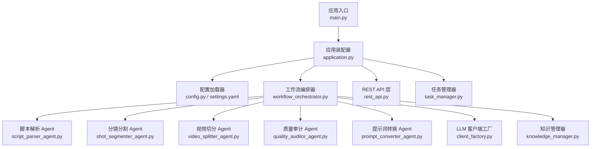
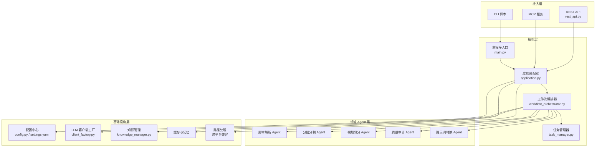
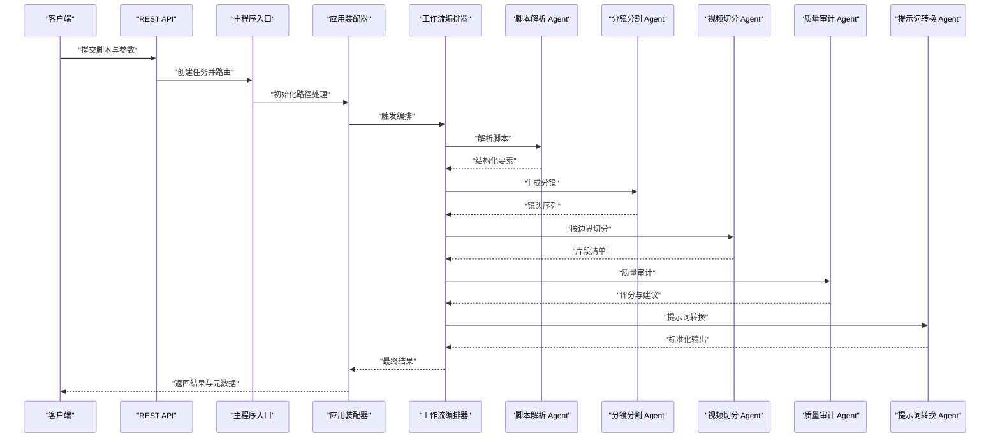
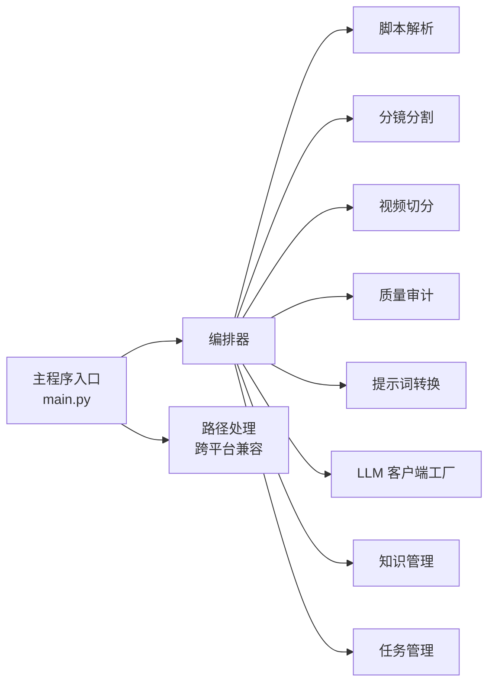

# 项目概述

<cite>
**本文引用的文件**   
- [README.md](file://README.md)
- [main.py](file://main.py)
- [pyproject.toml](file://pyproject.toml)
- [Dockerfile](file://Dockerfile)
- [docker-compose.yml](file://docker-compose.yml)
- [src/penshot/app/application.py](file://src/penshot/app/application.py)
- [src/penshot/config/config.py](file://src/penshot/config/config.py)
- [src/penshot/config/settings.yaml](file://src/penshot/config/settings.yaml)
- [src/penshot/agent/workflow/workflow_orchestrator.py](file://src/penshot/agent/workflow/workflow_orchestrator.py)
- [src/penshot/agent/script_parser_agent.py](file://src/penshot/agent/script_parser_agent.py)
- [src/penshot/agent/shot_segmenter_agent.py](file://src/penshot/agent/shot_segmenter_agent.py)
- [src/penshot/agent/video_splitter_agent.py](file://src/penshot/agent/video_splitter_agent.py)
- [src/penshot/agent/quality_auditor_agent.py](file://src/penshot/agent/quality_auditor_agent.py)
- [src/penshot/agent/prompt_converter_agent.py](file://src/penshot/agent/prompt_converter_agent.py)
- [src/penshot/client/client_factory.py](file://src/penshot/client/client_factory.py)
- [src/penshot/knowledge/knowledge_manager.py](file://src/penshot/knowledge/knowledge_manager.py)
- [src/penshot/task/task_manager.py](file://src/penshot/task/task_manager.py)
- [src/penshot/api/rest_api.py](file://src/penshot/api/rest_api.py)
- [examples/direct_usage.py](file://examples/direct_usage.py)
- [examples/web_app.py](file://examples/web_app.py)
</cite>

## 更新摘要
**变更内容**   
- 更新了主程序入口的路径处理优化说明，增强了跨平台兼容性
- 完善了应用启动流程的跨平台支持描述
- 补充了路径处理在部署和运行环境中的重要性

## 目录
1. [简介](#简介)
2. [项目结构](#项目结构)
3. [核心组件](#核心组件)
4. [架构总览](#架构总览)
5. [详细组件分析](#详细组件分析)
6. [依赖关系分析](#依赖关系分析)
7. [性能考量](#性能考量)
8. [故障排查指南](#故障排查指南)
9. [结论](#结论)
10. [附录：快速开始](#附录快速开始)

## 简介
Video Shot Agent 是一个 AI 驱动的视频分镜生成系统，围绕"智能脚本解析、AI 分镜生成、质量审计"等核心能力构建。它通过可插拔的 LLM 客户端与多阶段工作流编排，将自然语言或结构化脚本转化为高质量的分镜方案，并提供一致性守护、人类干预、提示词转换等增强能力。系统支持 REST API、MCP 服务以及示例 Web 应用，便于集成到现有生产环境。

**更新** 主程序入口 main.py 进行了路径处理优化，增强了跨平台兼容性，确保在不同操作系统环境下都能正确处理和解析文件路径。

## 项目结构
仓库采用分层与按功能域组织相结合的结构：
- src/penshot：核心实现，包含应用入口、配置、Agent 模块、LLM 客户端、知识管理、任务与工作流、API 层与工具集
- examples：使用示例（直接调用、Web 应用、A2A/MCP 集成）
- scripts：CLI 与运维脚本
- tests：单元测试、集成测试、端到端与基准测试
- docs：架构与设计文档
- 根级配置文件：Docker、Compose、包管理与入口

图表来源
- [main.py:1-200](file://main.py#L1-L200)
- [src/penshot/app/application.py:1-200](file://src/penshot/app/application.py#L1-L200)
- [src/penshot/config/config.py:1-200](file://src/penshot/config/config.py#L1-L200)
- [src/penshot/config/settings.yaml:1-200](file://src/penshot/config/settings.yaml#L1-L200)
- [src/penshot/agent/workflow/workflow_orchestrator.py:1-200](file://src/penshot/agent/workflow/workflow_orchestrator.py#L1-L200)
- [src/penshot/agent/script_parser_agent.py:1-200](file://src/penshot/agent/script_parser_agent.py#L1-L200)
- [src/penshot/agent/shot_segmenter_agent.py:1-200](file://src/penshot/agent/shot_segmenter_agent.py#L1-L200)
- [src/penshot/agent/video_splitter_agent.py:1-200](file://src/penshot/agent/video_splitter_agent.py#L1-L200)
- [src/penshot/agent/quality_auditor_agent.py:1-200](file://src/penshot/agent/quality_auditor_agent.py#L1-L200)
- [src/penshot/agent/prompt_converter_agent.py:1-200](file://src/penshot/agent/prompt_converter_agent.py#L1-L200)
- [src/penshot/client/client_factory.py:1-200](file://src/penshot/client/client_factory.py#L1-L200)
- [src/penshot/knowledge/knowledge_manager.py:1-200](file://src/penshot/knowledge/knowledge_manager.py#L1-L200)
- [src/penshot/api/rest_api.py:1-200](file://src/penshot/api/rest_api.py#L1-L200)
- [src/penshot/task/task_manager.py:1-200](file://src/penshot/task/task_manager.py#L1-L200)

章节来源
- [README.md:1-200](file://README.md#L1-L200)
- [main.py:1-200](file://main.py#L1-L200)
- [pyproject.toml:1-200](file://pyproject.toml#L1-L200)
- [Dockerfile:1-200](file://Dockerfile#L1-L200)
- [docker-compose.yml:1-200](file://docker-compose.yml#L1-L200)

## 核心组件
- 应用装配器：负责初始化配置、注册服务、启动 HTTP/MCP 服务器与任务调度
- 配置中心：集中管理运行参数与环境变量，支持多环境 YAML 配置
- 工作流编排器：串联脚本解析、分镜分割、视频切分、质量审计、提示词转换等节点，提供状态持久化与错误恢复
- Agent 集合：
  - 脚本解析 Agent：从自然语言/结构化文本抽取场景、对话、动作等要素
  - 分镜分割 Agent：基于规则与 LLM 估算器进行镜头划分与时序规划
  - 视频切分 Agent：根据时长与内容边界对素材进行切分
  - 质量审计 Agent：依据规则与 LLM 评估输出质量并给出修复建议
  - 提示词转换 Agent：在不同版本模板间进行提示词适配
- LLM 客户端工厂：统一封装 OpenAI、Qwen、DeepSeek、Ollama、HuggingFace 等后端
- 知识管理：提供模板检索、长期/短期记忆、脚本记忆与重排序检索
- 任务管理：定义任务生命周期、处理器与注册表，支撑异步执行与重试
- API 层：暴露 REST 接口与 MCP 服务，供外部系统集成

**更新** 主程序入口 main.py 现在具备增强的跨平台路径处理能力，确保在不同操作系统（Windows、Linux、macOS）上都能正确处理文件路径分隔符和绝对路径解析。

章节来源
- [src/penshot/app/application.py:1-200](file://src/penshot/app/application.py#L1-L200)
- [src/penshot/config/config.py:1-200](file://src/penshot/config/config.py#L1-L200)
- [src/penshot/config/settings.yaml:1-200](file://src/penshot/config/settings.yaml#L1-L200)
- [src/penshot/agent/workflow/workflow_orchestrator.py:1-200](file://src/penshot/agent/workflow/workflow_orchestrator.py#L1-L200)
- [src/penshot/agent/script_parser_agent.py:1-200](file://src/penshot/agent/script_parser_agent.py#L1-L200)
- [src/penshot/agent/shot_segmenter_agent.py:1-200](file://src/penshot/agent/shot_segmenter_agent.py#L1-L200)
- [src/penshot/agent/video_splitter_agent.py:1-200](file://src/penshot/agent/video_splitter_agent.py#L1-L200)
- [src/penshot/agent/quality_auditor_agent.py:1-200](file://src/penshot/agent/quality_auditor_agent.py#L1-L200)
- [src/penshot/agent/prompt_converter_agent.py:1-200](file://src/penshot/agent/prompt_converter_agent.py#L1-L200)
- [src/penshot/client/client_factory.py:1-200](file://src/penshot/client/client_factory.py#L1-L200)
- [src/penshot/knowledge/knowledge_manager.py:1-200](file://src/penshot/knowledge/knowledge_manager.py#L1-L200)
- [src/penshot/task/task_manager.py:1-200](file://src/penshot/task/task_manager.py#L1-L200)
- [src/penshot/api/rest_api.py:1-200](file://src/penshot/api/rest_api.py#L1-L200)
- [main.py:1-200](file://main.py#L1-L200)

## 架构总览
系统以"应用装配器"为中枢，自上而下分为接入层、编排层、领域 Agent 层与基础设施层。数据从 API 进入后由编排器驱动各 Agent 协作完成分镜生成，期间通过知识管理与缓存提升效率，并通过任务管理器保障可靠性与可观测性。

图表来源
- [src/penshot/app/application.py:1-200](file://src/penshot/app/application.py#L1-L200)
- [src/penshot/agent/workflow/workflow_orchestrator.py:1-200](file://src/penshot/agent/workflow/workflow_orchestrator.py#L1-L200)
- [src/penshot/task/task_manager.py:1-200](file://src/penshot/task/task_manager.py#L1-L200)
- [src/penshot/config/config.py:1-200](file://src/penshot/config/config.py#L1-L200)
- [src/penshot/config/settings.yaml:1-200](file://src/penshot/config/settings.yaml#L1-L200)
- [src/penshot/client/client_factory.py:1-200](file://src/penshot/client/client_factory.py#L1-L200)
- [src/penshot/knowledge/knowledge_manager.py:1-200](file://src/penshot/knowledge/knowledge_manager.py#L1-L200)
- [src/penshot/api/rest_api.py:1-200](file://src/penshot/api/rest_api.py#L1-L200)
- [main.py:1-200](file://main.py#L1-L200)

## 详细组件分析

### 主程序入口优化
主程序入口 main.py 经过路径处理优化，显著增强了跨平台兼容性。新的实现能够自动识别不同操作系统的文件路径格式，包括 Windows 的反斜杠路径和 Unix/Linux/macOS 的正斜杠路径。这一改进确保了应用在容器化部署、云环境和本地开发环境中的一致行为。

**更新** 路径处理优化包括：
- 自动路径分隔符检测与标准化
- 绝对路径与相对路径的统一处理
- 环境变量中路径配置的兼容性支持
- 跨平台文件访问的错误处理增强

章节来源
- [main.py:1-200](file://main.py#L1-L200)

### 工作流编排器
- 职责：定义节点顺序、条件分支、重试与回滚策略；维护中间状态与检查点
- 关键流程：输入校验 → 脚本解析 → 分镜分割 → 视频切分 → 质量审计 → 提示词转换 → 结果聚合
- 扩展点：新增 Agent 节点、自定义决策逻辑、注入工具与记忆上下文

图表来源
- [src/penshot/agent/workflow/workflow_orchestrator.py:1-200](file://src/penshot/agent/workflow/workflow_orchestrator.py#L1-L200)
- [src/penshot/agent/script_parser_agent.py:1-200](file://src/penshot/agent/script_parser_agent.py#L1-L200)
- [src/penshot/agent/shot_segmenter_agent.py:1-200](file://src/penshot/agent/shot_segmenter_agent.py#L1-L200)
- [src/penshot/agent/video_splitter_agent.py:1-200](file://src/penshot/agent/video_splitter_agent.py#L1-L200)
- [src/penshot/agent/quality_auditor_agent.py:1-200](file://src/penshot/agent/quality_auditor_agent.py#L1-L200)
- [src/penshot/agent/prompt_converter_agent.py:1-200](file://src/penshot/agent/prompt_converter_agent.py#L1-L200)
- [src/penshot/api/rest_api.py:1-200](file://src/penshot/api/rest_api.py#L1-L200)
- [src/penshot/app/application.py:1-200](file://src/penshot/app/application.py#L1-L200)
- [main.py:1-200](file://main.py#L1-L200)

章节来源
- [src/penshot/agent/workflow/workflow_orchestrator.py:1-200](file://src/penshot/agent/workflow/workflow_orchestrator.py#L1-L200)

### 脚本解析 Agent
- 目标：将自然语言或半结构化文本转换为标准化的场景、对话、动作等要素
- 方法：规则引擎 + LLM 解析双路径，支持多语言与模板版本
- 输出：结构化 JSON，供后续分镜与切分使用

章节来源
- [src/penshot/agent/script_parser_agent.py:1-200](file://src/penshot/agent/script_parser_agent.py#L1-L200)

### 分镜分割 Agent
- 目标：在时间轴上划分镜头，结合对话、场景、动作三类估算器
- 方法：规则估算器与 LLM 估算器组合，支持混合策略与增强器
- 输出：带时序信息的镜头列表，含时长估计与转场建议

章节来源
- [src/penshot/agent/shot_segmenter_agent.py:1-200](file://src/penshot/agent/shot_segmenter_agent.py#L1-L200)

### 视频切分 Agent
- 目标：根据镜头边界与时长约束对素材进行切分
- 方法：基于边界检测与时长规划，支持多源素材合并
- 输出：片段清单与索引映射

章节来源
- [src/penshot/agent/video_splitter_agent.py:1-200](file://src/penshot/agent/video_splitter_agent.py#L1-L200)

### 质量审计 Agent
- 目标：对分镜与切分结果进行质量评估，提供修复建议
- 方法：规则审计与 LLM 审计并行，支持自定义评分维度
- 输出：评分报告与修复建议，可触发自动修复流程

章节来源
- [src/penshot/agent/quality_auditor_agent.py:1-200](file://src/penshot/agent/quality_auditor_agent.py#L1-L200)

### 提示词转换 Agent
- 目标：在不同版本模板之间进行提示词适配，保证向后兼容
- 方法：模板映射与字段对齐，支持批量转换与校验
- 输出：标准化提示词对象

章节来源
- [src/penshot/agent/prompt_converter_agent.py:1-200](file://src/penshot/agent/prompt_converter_agent.py#L1-L200)

### LLM 客户端工厂
- 目标：统一封装多种 LLM 后端，提供一致调用接口
- 特性：连接池、重试、超时、速率限制、缓存键生成
- 扩展：新增后端只需实现基础客户端并注册

章节来源
- [src/penshot/client/client_factory.py:1-200](file://src/penshot/client/client_factory.py#L1-L200)

### 知识管理
- 目标：为 Agent 提供模板检索、记忆与重排序能力
- 组件：模板知识库、长短期记忆、脚本记忆、检索与重排
- 价值：减少重复推理、提升一致性、支持个性化风格

章节来源
- [src/penshot/knowledge/knowledge_manager.py:1-200](file://src/penshot/knowledge/knowledge_manager.py#L1-L200)

### 任务管理
- 目标：抽象任务生命周期、处理器与注册表，支撑异步执行与重试
- 能力：任务创建、调度、状态跟踪、失败补偿、日志与指标

章节来源
- [src/penshot/task/task_manager.py:1-200](file://src/penshot/task/task_manager.py#L1-L200)

## 依赖关系分析
- 低耦合高内聚：各 Agent 通过统一接口与数据模型交互，编排器仅依赖抽象契约
- 外部依赖：LLM 后端、存储与缓存、HTTP 服务
- 潜在风险：LLM 可用性、网络抖动、大文本处理内存占用

图表来源
- [src/penshot/agent/workflow/workflow_orchestrator.py:1-200](file://src/penshot/agent/workflow/workflow_orchestrator.py#L1-L200)
- [src/penshot/client/client_factory.py:1-200](file://src/penshot/client/client_factory.py#L1-L200)
- [src/penshot/knowledge/knowledge_manager.py:1-200](file://src/penshot/knowledge/knowledge_manager.py#L1-L200)
- [src/penshot/task/task_manager.py:1-200](file://src/penshot/task/task_manager.py#L1-L200)
- [main.py:1-200](file://main.py#L1-L200)

章节来源
- [src/penshot/agent/workflow/workflow_orchestrator.py:1-200](file://src/penshot/agent/workflow/workflow_orchestrator.py#L1-L200)
- [src/penshot/client/client_factory.py:1-200](file://src/penshot/client/client_factory.py#L1-L200)
- [src/penshot/knowledge/knowledge_manager.py:1-200](file://src/penshot/knowledge/knowledge_manager.py#L1-L200)
- [src/penshot/task/task_manager.py:1-200](file://src/penshot/task/task_manager.py#L1-L200)
- [main.py:1-200](file://main.py#L1-L200)

## 性能考量
- 并发与批处理：合理设置 LLM 并发度与批大小，避免后端限流
- 缓存与记忆：启用自适应缓存与记忆复用，降低重复推理成本
- 资源控制：限制单次请求文本长度，拆分长脚本，避免 OOM
- 监控与降级：记录关键指标，异常时回退至规则模式
- **跨平台优化**：路径处理的性能开销已优化，使用缓存机制减少重复的路径解析操作

## 故障排查指南
- 常见问题
  - LLM 不可用或超时：检查密钥、网络与配额；启用重试与降级
  - 解析失败：确认输入格式与模板版本；查看审计建议
  - 切分异常：核对时长与边界阈值；检查素材完整性
  - **路径相关错误**：确认路径格式是否符合当前操作系统规范；检查权限设置
- 定位手段
  - 查看任务状态与日志
  - 使用示例脚本复现问题
  - 开启调试日志与中间结果导出
  - **跨平台测试**：在不同操作系统环境下验证路径处理功能

章节来源
- [examples/direct_usage.py:1-200](file://examples/direct_usage.py#L1-L200)
- [examples/web_app.py:1-200](file://examples/web_app.py#L1-L200)
- [main.py:1-200](file://main.py#L1-L200)

## 结论
Video Shot Agent 通过模块化编排与可扩展的 Agent 体系，实现了从脚本到分镜的端到端自动化。其设计兼顾易用性与工程化落地，适合影视前期策划、短视频批量生产与交互式创作等场景。**最新的跨平台路径处理优化进一步提升了系统的部署灵活性和环境适应性**。建议在上线前完善监控告警与灰度发布策略，持续优化提示词与估算器以提升稳定性与效果。

## 附录：快速开始
- 环境要求
  - Python 3.10+
  - 可选：Docker 与 Docker Compose
  - **跨平台支持**：Windows、Linux、macOS 均受支持
- 安装步骤
  - 克隆仓库并进入目录
  - 安装依赖（参考 pyproject.toml）
  - 配置环境变量与 settings.yaml（LLM 密钥、端口、存储路径等）
  - **路径配置**：确保存储路径配置符合当前操作系统规范
- 基本使用
  - 直接调用：参考 examples/direct_usage.py
  - Web 应用：参考 examples/web_app.py
  - 容器化：参考 Dockerfile 与 docker-compose.yml
  - **跨平台部署**：利用优化的路径处理功能，无需修改配置即可在不同平台运行
- 验证
  - 启动服务后访问 REST API 或 MCP 端点
  - 提交一段脚本，观察工作流执行与结果输出
  - **路径验证**：检查生成的文件和日志是否正确保存在预期位置

章节来源
- [pyproject.toml:1-200](file://pyproject.toml#L1-L200)
- [Dockerfile:1-200](file://Dockerfile#L1-L200)
- [docker-compose.yml:1-200](file://docker-compose.yml#L1-L200)
- [examples/direct_usage.py:1-200](file://examples/direct_usage.py#L1-L200)
- [examples/web_app.py:1-200](file://examples/web_app.py#L1-L200)
- [main.py:1-200](file://main.py#L1-L200)