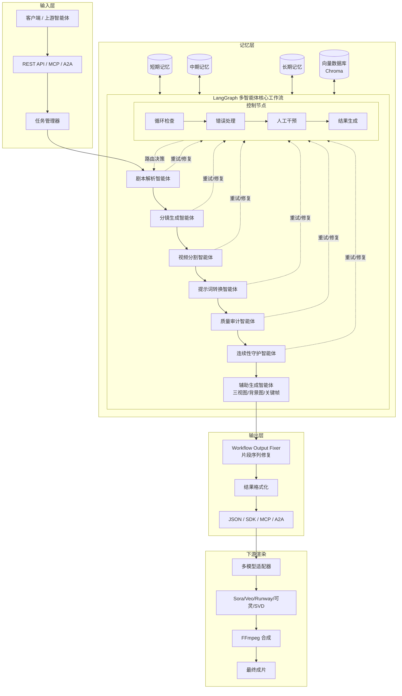

<p align="center">
  <h1 align="center">🎬 剧本分镜智能体 (PenShot)</h1>
  <p align="center">
    <strong>基于 LangChain + LangGraph 多智能体协作的剧本转分镜系统，确保叙事连续性与镜头级提示词生成。</strong>
  </p>
  
  <p align="center">
  <!-- 第一行：技术栈与生态依赖 -->
  <a href="https://langchain-ai.github.io/langgraph/"></a>
  <a href="https://www.llamaindex.ai/"></a>
  <a href="https://github.com/neopen/story-shot-agent"></a>
  <a href="https://redis.io/"></a>
  <a href="https://www.python.org/"></a>
</p>
<p align="center">
  <!-- 第二行：包版本、社区数据与许可证 -->
  <a href="https://pypi.org/project/penshot/"></a>
  <a href="https://pepy.tech/project/penshot"></a>
  <a href="https://hub.docker.com/r/neotems/penshot"></a>
  <a href="https://github.com/neopen/story-shot-agent"></a>
  <a href="./LICENSE"></a>
</p>
  
<p align="center">
    <a href="./README.md">English</a> •
    <a href="https://shot.helpenx.com/">官网演示</a> •
    <a href="https://pengline.cn/2026/02/7e6cd67dd5ee45248f2276ac145555f5/">官方文档</a> •
    <a href="https://pengline.cn/2026/02/df16e7d36e5d41d2ad9d7934b28f94e4/">集成指南</a> •
    <a href="https://pengline.cn/2026/02/b027d930c0b84ba6abd24bbef7d78afc/">MCP 服务</a> •
    <a href="https://pypi.org/project/penshot/">PyPI</a>
</p>

---
> 🚀 **一键转换**：支持任意格式剧本（电影、短剧、动漫、小说等） → 镜头级描述 → **Sora / Veo / Runway / 可灵 Ready Prompt**  
> 🧠 **连续性保障**：三视图 + RAG 知识库+ 三级记忆 + Chroma 向量检索 + 快照机制 + 多维召回，确保角色/场景/剧情跨片段一致  
> 🔌 **多端生态支持**：开箱即用 **Python SDK、MCP 服务、Function Calling、REST API 及 LangGraph 节点**  
> ⚡ **5 分钟上手**：`pip install penshot` + 3 行代码集成。或者 `docker pull neotems/penshot` 启动服务

------


## 为什么选择 PenShot？

| 痛点                          | PenShot 解决方案                                      |
| ----------------------------- | ----------------------------------------------------- |
| 剧本太长，AI 视频模型吃不下   | 智能分段 + 时长精准规划，输出模型友好型片段           |
| 角色换装/场景跳变，视频不连贯 | 多级记忆池 + Chroma 向量检索，自动维持上下文一致性    |
| 手动写 Prompt 费时费力        | 自动生成中英双语视觉描述 + 负面词 + 音频提示词        |
| 多模型适配复杂                | 一套代码，支持 OpenAI/Qwen/DeepSeek/Ollama 等主流 LLM |


------

## 核心功能

| 特性             | 说明                                                         |
| ---------------- | ------------------------------------------------------------ |
| 智能剧本解析     | 自动识别场景、对话和动作指令，理解故事结构，支持长文本分段处理 |
| 精准时序规划     | 按镜头粒度智能切分内容，分配合理时长，严格适配 AI 视频生成模型的时长限制 |
| 连续性守护       | 基于任务池优先级排队、多层级记忆（短期/中期/长期）与 Chroma 向量检索，确保相邻分镜间角色状态、场景和情节高度一致 |
| 高质量提示词输出 | 生成详细的中英双语画面描述、负面提示词及音频提示词，开箱即用 |
| 多模型兼容       | 支持 OpenAI、Qwen、DeepSeek、Ollama 等主流 LLM 提供商，可插拔切换 |
| 多协议集成       | 提供 Python SDK、REST API、LangGraph 节点、A2A 协作协议与 MCP 标准接口 |
| 健壮性与可追溯   | 内置自动重试、错误降级机制，每个分镜片段均可双向追溯至原剧本位置 |


------

## 系统架构与创作流程


<details>
<summary>🔍 <strong>点击查看 《基础架构 UML 图》</strong></summary>

<p align="center">
  

</p>

</details>

该系统为典型的自然语言处理（NLP）应用场景，通过多智能体协作与记忆机制实现端到端的分镜转码。详细架构设计、记忆池实现与一致性保障机制请参考：[《架构设计与实现》](https://pengline.cn/2026/02/7e6cd67dd5ee45248f2276ac145555f5/)


------

## 快速开始

### 1. 依赖安装

```bash
# 直接安装 PyPI 包
pip install penshot
```

### 2. 环境配置

```bash
cp .env.example .env
```

编辑 `.env` 文件，配置必要的 LLM 与 Embedding 参数：

```properties
########################## LLM 模型配置 #########################
PENSHOT_LLM__DEFAULT__BASE_URL=https://dashscope-intl.aliyuncs.com/api/v1
PENSHOT_LLM__DEFAULT__API_KEY=sk-xxxxxxxxxxxxxxxxxxxxxxxxxxxxxxxxxxxxxxxx
PENSHOT_LLM__DEFAULT__MODEL_NAME=qwen-plus

########################## 嵌入模型配置 #########################
PENSHOT_EMBED__DEFAULT__BASE_URL=https://dashscope-intl.aliyuncs.com/api/v1
PENSHOT_EMBED__DEFAULT__API_KEY=sk-xxxxxxxxxxxxxxxxxxxxxxxxxxxxxxxxxxxxxxxx
PENSHOT_EMBED__DEFAULT__MODEL_NAME=text-embedding-v4

########################## Redis 配置 ##########################
PENSHOT_REDIS_URL=redis://:123456@localhost:6379/0
```

### 3. 使用方式

#### 1. Python SDK 调用

```python
from penshot.api import create_penshot_agent

agent = create_penshot_agent(max_concurrent=5)

script = "早晨，一个女孩在咖啡馆读书，阳光透过窗户..."
task_id = agent.breakdown_script_async(
    script,
    callback=lambda r: print(f"任务 {r.task_id} 已完成")
)

status = agent.get_task_status(task_id)
result = await agent.wait_for_result_async(task_id)
```

完整示例：[sdk/01_sync_breakdown.py](https://github.com/neopen/story-shot-agent/blob/main/examples/sdk/01_sync_breakdown.py)

#### 2. 嵌入 FastAPI Web 应用

可通过标准 HTTP 接口集成至现有业务系统：

```python
from fastapi import FastAPI, HTTPException
from penshot.api import create_penshot_agent

app = FastAPI(title="Penshot API", version="0.1.0")
agent = create_penshot_agent(max_concurrent=5)

@app.post("/api/generate")
async def generate(script_text: str):
    task_id = agent.breakdown_script_async(script_text)
    return {"task_id": task_id, "status": "PENDING"}
```

完整示例：[integrations/fastapi_web_app.py](https://github.com/neopen/story-shot-agent/blob/main/examples/integrations/fastapi_web_app.py)

#### 3. LangGraph 节点集成

支持作为独立 Node 接入 LangChain/LangGraph 工作流，实现端到端自动化流水线。 完整示例：[workflow/01_langgraph_integration.py](https://github.com/neopen/story-shot-agent/blob/main/examples/workflow/01_langgraph_integration.py)

#### 4. A2A 协议协作

支持与上游剧本创作 Agent、下游文生视频/剪辑 Agent 进行上下文传递与任务编排。 完整示例：[integrations/a2a_integration.py](https://github.com/neopen/story-shot-agent/blob/main/examples/integrations/a2a_integration.py)

#### 5. MCP (Model Context Protocol) 支持

启动 MCP Server：

```bash
python -m penshot.mcp_server --max-concurrent 5 --queue-size 500
```

客户端调用工具 `breakdown_script` 与 `get_task_result` 即可无缝接入支持 MCP 的 IDE 或 Agent 框架。 完整示例：[mcp/mcp_client.py](https://github.com/neopen/story-shot-agent/blob/main/examples/mcp/mcp_client.py)


<details>
<summary>🔍 <strong>点击查看输出数据结构</strong></summary>


系统返回标准化的 JSON 格式，包含视频提示词、负面提示词、时长估算、风格参数及配套的音频提示词：

```json
{
  "fragments": [
    {
      "fragment_id": "frag_001",
      "prompt": "wide shot, late night 11 PM, dim city apartment living room, heavy rain outside window, rain muffled by glass, Lin Ran wrapped in gray worn wool blanket curled on gray sofa, TV playing silent black-and-white old movie, light and shadows flickering on wall, half-drunk cold tea on coffee table with condensation, brown old photo album with worn leather cover and faded photos, black phone with dark screen on corner of table, Fujifilm ETERNA grading, natural overcast lighting, 35mm lens, static camera\n\n全景镜头：深夜11点，昏暗的城市公寓客厅，窗外大雨滂沱，雨声被玻璃隔绝，林然裹着灰色旧羊毛毯蜷在灰色沙发上，电视静音播放黑白老电影，光影在墙上晃动，茶几上半杯凉茶凝出水雾，旁边摊开一本棕色旧相册，封面皮革磨损，内页照片褪色，手机黑色屏幕暗着放在茶几一角，富士ETERNA色调，阴天自然光，35mm镜头，静态镜头",
      "negative_prompt": "bright lighting, sunny, dry room, modern decor, colorful, cartoon style, blurry details, wrong blanket color, wrong phone color",
      "main_character": "",
      "duration": 4.63,
      "model": "runway_gen2",
      "style": "cinematic realism, Fujifilm ETERNA, dim interior",
      "audio": {
        "audio_id": "audio_001",
        "prompt": "heavy rain against window, muffled thunder, distant city hum, silence of TV static, occasional creak of old sofa, condensation drip\n\n窗外大雨滂沱，雷声低沉，远处城市嗡鸣，电视静音静电声，旧沙发偶尔吱嘎，水雾凝结滴落",
        "negative_prompt": "noisy, low quality, distorted, robotic, bad audio",
        "model_type": "AudioLDM_3",
        "voice_type": "narration",
        "audio_style": "cinematic",
        "voice_character": "",
        "voice_description": "deep, resonant, calm, slightly melancholic",
        "speed": 1,
        "pitch_shift": 0,
        "emotion": "melancholic",
        "stability": 0.7,
        "duration_seconds": 4.63,
        "sound_attributes": {
          "intensity": 0.8,
          "reverb": 0.3
        },
        "format": "wav",
        "sample_rate": 24000,
        "seed": 751512420,
        "scene_context": "late night, dim apartment living room, heavy rain outside, silent TV, old photo album, condensation on glass",
        "previous_audio_id": null
      }
    },
    {
      "fragment_id": "frag_002",
      "prompt": "medium shot, cinematic lighting, heavy rain outside window, Lin Ran wrapped in gray worn wool blanket, curled up on sofa, phone screen lights up showing 'Unknown Number', staring at screen for three seconds, finger hovering over answer button, throat moving slightly, finally pressing answer button, bringing phone to ear, tense atmosphere, Fujifilm ETERNA grading, natural overcast, 35mm lens\n\n中景镜头：窗外大雨，林然裹着灰色旧羊毛毯蜷在沙发上，手机屏幕亮起显示'未知号码'，盯着屏幕看了三秒，指尖悬停在接听键上方，喉头轻轻滚动，终于按下接听，将手机贴到耳边，紧张氛围，富士ETERNA色调，阴天自然光，35mm镜头",
      "negative_prompt": "blurry screen, wrong blanket color, smiling, bright lighting, cartoon style",
      "main_character": "",
      "duration": 2,
      "model": "runway_gen2",
      "style": "cinematic realism, Fujifilm ETERNA",
      "requires_special_attention": false,
      "audio": {
        "audio_id": "audio_002",
        "prompt": "continuous heavy rain outside window, phone vibrating, brief silence, soft breathing, rain pattering on glass\n\n窗外持续的大雨声，手机震动声，短暂沉默，轻柔的呼吸声，雨点打在玻璃上的声音",
        "negative_prompt": "noisy, low quality, distorted, robotic, bad audio",
        "model_type": "AudioLDM_3",
        "voice_type": "narration",
        "audio_style": "cinematic",
        "voice_character": "Lin Ran",
        "voice_description": "soft female voice, slightly trembling, tense",
        "speed": 1,
        "pitch_shift": 0,
        "emotion": "tense",
        "stability": 0.7,
        "duration_seconds": 2,
        "sound_attributes": {
          "intensity": 0.8,
          "reverb": 0.3
        },
        "format": "wav",
        "sample_rate": 24000,
        "seed": 751512420,
        "scene_context": "Lin Ran in dark living room, heavy rain outside, phone vibrating with unknown caller",
        "previous_audio_id": "audio_001"
      }
    },
    {
      "fragment_id": "frag_003",
      "prompt": "extreme close-up, cinematic lighting, dim apartment, Lin Ran pressing black smartphone to ear, rain against window, tense atmosphere, shallow depth of field, Fujifilm ETERNA grading, natural overcast, 35mm lens\n\n极端特写镜头：林然将黑色手机贴紧耳边，窗外大雨，紧张氛围，浅景深，富士ETERNA色调，阴天自然光，35mm镜头",
      "negative_prompt": "blurry phone, wrong phone color, smiling, bright lighting, cartoon style",
      "main_character": "",
      "duration": 3,
      "model": "runway_gen2",
      "style": "cinematic realism, Fujifilm ETERNA",
      "requires_special_attention": false,
      "audio": {
        "audio_id": "audio_003",
        "prompt": "continuous heavy rain, faint static from phone, low male voice whispering 'It's me', tense silence\n\n持续的大雨声，手机微弱的静电声，低沉男声低语'是我'，紧张的沉默",
        "negative_prompt": "noisy, low quality, distorted, robotic, bad audio",
        "model_type": "AudioLDM_3",
        "voice_type": "character_dialogue",
        "audio_style": "cinematic",
        "voice_character": "陈默",
        "voice_description": "low, husky male voice, tense and mysterious",
        "speed": 1,
        "pitch_shift": -2,
        "emotion": "tense",
        "stability": 0.7,
        "duration_seconds": 3,
        "sound_attributes": {
          "intensity": 0.8,
          "reverb": 0.3
        },
        "format": "wav",
        "sample_rate": 24000,
        "seed": 751512420,
        "scene_context": "close-up of Lin Ran holding phone to ear in dim apartment, heavy rain outside",
        "previous_audio_id": "audio_002"
      }
    }
  ]
}
```

</details>


------

## Docker 快速部署

### 1. 下载配置文件
```bash
# Docker Compose 配置文件
wget https://raw.githubusercontent.com/neopen/story-shot-agent/main/docker-compose.yml
# penshot 配置文件
wget https://raw.githubusercontent.com/neopen/story-shot-agent/main/.env.example -O .env
```

### 2. 配置环境变量

修改 `.env` 文件，填入你的 OpenAI API Key 及相关模型配置：`vim .env`

### 3. 启动服务

`docker compose up -d`


---

### `docker run` 命令启动

如果不想下载 Compose 文件，只希望直接执行 `docker run` 命令启动容器，可以通过 `-e` 参数直接将配置注入容器内部。
> 密码为 123456，`host.docker.internal` 表示自动映射的宿主机IP

```bash
############ Linux 版
docker run -d \
  --name penshot \
  -p 8000:8000 \
  -e PENSHOT_LLM__DEFAULT__BASE_URL="https://api.deepseek.com" \
  -e PENSHOT_LLM__DEFAULT__API_KEY="sk-xxxxxxxxxxxxxxxxxxxxxxxxxxx" \
  -e PENSHOT_LLM__DEFAULT__MODEL_NAME="deepseek-v4-flash" \
  -e PENSHOT_EMBED__DEFAULT__BASE_URL="https://dashscope-intl.aliyuncs.com/api/v1" \
  -e PENSHOT_EMBED__DEFAULT__API_KEY="sk-xxxxxxxxxxxxxxxxxxxxxxxxxxx" \
  -e PENSHOT_EMBED__DEFAULT__MODEL_NAME="text-embedding-v4" \
  -e PENSHOT_REDIS_URL="redis://123456:@host.docker.internal:6379/0" \
  ghcr.io/neopen/penshot:latest
  
############ Windows 版  
docker run -d `
  --name penshot `
  -p 8000:8000 `
  -e PENSHOT_LLM__DEFAULT__BASE_URL="https://api.deepseek.com" `
  -e PENSHOT_LLM__DEFAULT__API_KEY="sk-xxxxxxxxxxxxxxxxxxxxxxxxxxx" `
  -e PENSHOT_LLM__DEFAULT__MODEL_NAME="deepseek-v4-flash" `
  -e PENSHOT_EMBED__DEFAULT__BASE_URL="https://dashscope-intl.aliyuncs.com/api/v1" `
  -e PENSHOT_EMBED__DEFAULT__API_KEY="sk-xxxxxxxxxxxxxxxxxxxxxxxxxxx" `
  -e PENSHOT_EMBED__DEFAULT__MODEL_NAME="text-embedding-v4" `
  -e PENSHOT_REDIS_URL="redis://:@host.docker.internal:6379/0?protocol=2" `
  neotems/penshot:latest  
```


------

## 系统说明与注意事项

| 类别       | 说明                                                   |
| ---------- | ------------------------------------------------------ |
| 网络依赖   | 需稳定访问外部 LLM API，建议配置代理或国内镜像源       |
| 长文本处理 | 超长剧本建议分段输入，系统已内置上下文记忆与 RAG 机制  |
| 生成时长   | AI 视频模型输出时长可能存在 ±10% 偏差，属行业正常现象  |
| 多语言支持 | 当前针对中文剧本深度优化，其他语言效果持续迭代中       |
| 声音同步   | 当前提供音频提示词，口型同步与环境音融合需下游工具配合 |
| 错误处理   | 内置自动重试与降级机制，极端异常情况可能需人工介入     |


------

## 开发路线图

<p align="center">
  
</p>


### 短期规划

- 智能长镜头分割逻辑优化，保持动作连贯性
- 角色服装、位置、道具的一致性校验器
- 针对 Sora、Pika 等模型的提示词格式专项适配
- 规则引擎与 LLM 混合处理架构
- 完整英文剧本支持与节点失败智能降级
- 片段置信度评分与调试模式（中间结果保存）

### 中期规划

- 复杂镜头语言支持（推拉摇移跟）
- 情感分析驱动视觉风格自动调整
- 超长剧本分块处理 + 向量数据库上下文记忆
- 多剧本批量队列处理与 Web 可视化界面
- 角色/场景参考图接入与多格式导出（XML/EDL/JSON）

### 长期规划

- 多模态输入（图+音+文混合）
- 实时低分辨率预览与自动连续性修复
- 专业剪辑软件插件（Premiere/FCP/DaVinci）
- 多人协同、版本控制与从用户反馈中自动学习进化
- 剧本-片段双向追溯、语义对齐度检测与多轮修正机制

### 终极目标

实现任意长度/语言/类型剧本的零信息损失视觉化，输出达到专业导演分镜水准的标准化工作流。系统具备风格可定制、结果可追溯、自动优化循环与跨模态高度一致性能力。


------

## 贡献指南

欢迎通过 Issue 或 Pull Request 参与项目共建：

- 报告问题：请提供复现步骤、环境信息与错误日志
- 功能建议：使用 `Enhancement` 标签
- 代码优化：性能调优、架构重构或补充测试用例
- 文档完善：翻译、示例补充或技术细节修正

开发环境快速搭建：

```bash
git clone https://github.com/neopen/story-shot-agent.git
cd story-shot-agent
pip install -e ".[dev]"
pytest tests/
```


------

## 许可证

本项目采用 MIT 开源协议，详见 [LICENSE](LICENSE) 文件。 

[MIT](LICENSE) © 2025 HiPeng (NeoPen)

> 本项目采用 MIT 开源协议，您可以自由使用、修改和分发，只需保留原始版权声明。


------

## 联系方式

- GitHub：https://github.com/neopen/story-shot-agent
- 邮箱：helpenx@gmail.com
- 文档：https://pengline.cn/2026/02/7e6cd67dd5ee45248f2276ac145555f5/


感谢 LangChain、LangGraph、Chroma、Ollama 及开源社区的技术支持。如本项目对您的工作有帮助，欢迎 Star 关注与反馈。
