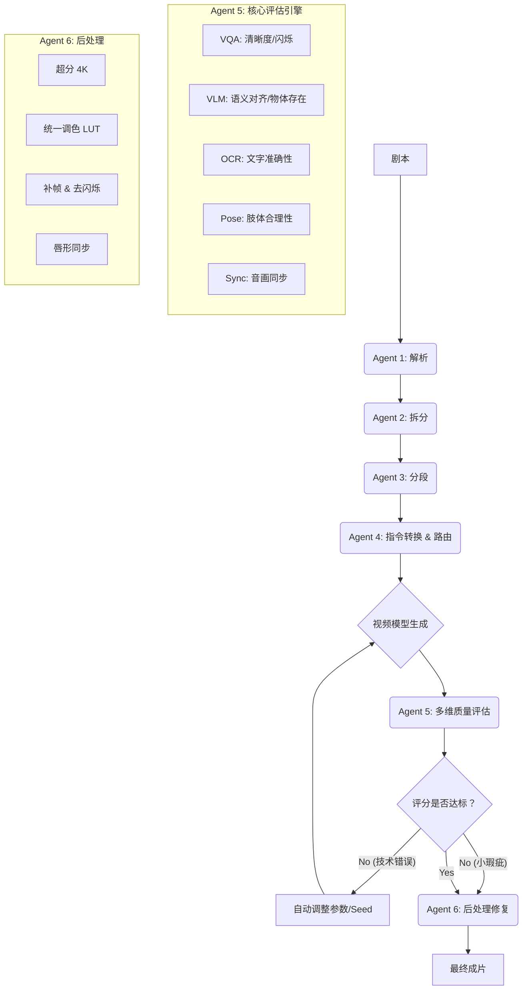

需要完成的任务和计划

## 主要任务

### 任务池

- 支持并发，限制并发数

### 开放协议

- MCP
- REST API 
- Function Call

给出使用示例

### 一致性增强(角色与场景)

- 通过ChromaDB/Qdrant（quadrant）+ RAG 实现（提示词方面）
- **引入“角色/资产锚点”工作流**
  - **Character Sheets (角色设定图)**：在生成视频前，Agent应先生成一套标准的角色三视图（正、侧、背）和关键道具（书、票根）的高清静帧图。
  - Image-to-Video (图生视频) 优先：不要只用Text-to-Video。将 生成改为 Image-to-Video模式。
    - *流程优化*：先用Flux/Midjourney V7生成包含精确文字（借阅卡名字、电影票日期）的静帧 -> 将该静帧作为首帧（Start Frame）或参考图（Reference Image）输入给Runway Gen-4/Kling 3.0 -> 生成动态视频。
  - **Face/ID Locking**：在Agent内部集成类似InsightFace或模型原生的ID保持功能，确保林小雨的脸在三个片段中是同一个“人”，而不是三个相似的“演员”。

### 镜头语言的智能化升级

模拟真实摄影机的运动逻辑，增加动态张力。

- 建议方案：结构化相机控制 (Camera Control)
  - 运镜参数化：不要只写在Prompt里。现在的模型（如Runway Gen-3/4, Pika 2.0）支持独立的相机控制参数（Pan, Tilt, Zoom, Roll, Motion Bucket）。
    - *示例*：在 `frag_003` 中，可以明确指定 `Zoom In: 1.5x` (缓慢推近书本) 或 `Rack Focus` (焦点从雨滴转移到书上的字)。
  - 动态分镜脚本：Agent可以分析剧本情感，自动推荐运镜。
    - *焦虑时*：使用轻微的手持晃动 (`Handheld shake: 0.3`)。
    - *温柔回忆时*：使用平滑的滑轨移动 (`Dolly Smooth`)。
  - **帧率与快门**：在Prompt或参数中明确 `Shutter Angle: 180` (电影感动态模糊) 或 `FPS: 24`，避免AI视频常见的“过度流畅”导致的肥皂剧效应。

### 音频的深度整合（**唇形同步**）

音频设计已经非常出色（双耳声场、分层音效），但在“语音与口型同步”以及“声音的物理交互”上还有提升空间。

- 建议方案：唇形同步与物理拟音
  - **Lip-Sync (唇形同步)**：最终结构化中有台词。目前的XTTSv2生成音频后，必须经过一个 **Audio-to-Video Lip Sync** 的步骤（使用Wav2Lip的进阶版、HeyGen API或Sync Labs技术），确保林小雨说话时嘴型与声音完美匹配。这是打破“恐怖谷”效应的关键。
  - 动态混音 (Dynamic Mixing)：目前的音频是预生成的。更高级的做法是根据视频画面的动作动态调整音量。
    - *例如*：当画面中风铃微动时，实时增强风铃的高频泛音；当人物蹲下靠近地面时，自动提升雨滴落在积水的声音比例。
  - **环境声的连续性**：使用音频Inpainting技术，确保 `audio_001` 到 `audio_003` 的背景雨声底噪是**完全连续**的波形，而不是三段拼接的，避免听觉上的微小断裂。

### 文本渲染（对话文本）

在Prompt中对书本上的文字描述非常细致（“Chen Yang → Lin Xiaoyu”, “Next Wednesday 19:00”）。这是目前视频生成的**地狱级难度**。纯靠Prompt很难保证文字不闪烁、不扭曲。

- 建议方案：后期合成前置化 (Compositing-aware Generation)
  - **策略A (推荐)**：Agent生成视频时，**故意留白**或使用模糊占位符。先生成没有文字或文字模糊的视频，然后利用OCR定位区域，使用After Effects脚本或DaVinci Resolve API，将渲染好的高清静态文字图层（带透视变形）合成到视频上。这样能保证文字100%清晰且静止稳定。
  - **策略B**：如果必须依靠生成模型，务必使用最新的 **Region Prompting (区域提示词)** 功能（如果模型支持），单独框选书本封面区域进行高权重的文字生成，而不对背景做过多干涉。

### 参考图控制（ControlNet/IP-Adapter）

在 Stable Diffusion (WebUI 或 ComfyUI) 中使用 ControlNet 设置参考图，核心目的是**让 AI 生成的图像在构图、姿态、线条或风格上遵循你提供的参考图**。

> - **预处理器：** 用于处理你上传的参考图（例如提取线条、识别骨架）。如果你上传的已经是处理好的图（如纯线条图），预处理器选 `none`。
> - **模型：** 用于指导 AI 生成。必须与预处理器对应。
> - 调整参数：
>   - Control Weight (控制权重)： 0~2 之间。
>     - `1.0` 是标准强度。
>     - 如果生成的图太像参考图，**缺乏创意，降低权重** (如 0.6-0.8)。
>     - 如果参考图没起作用，提高权重 (如 1.2-1.5)。
>   - Starting/Ending Control Step (开始/结束控制步数)：
>     - 通常保持 `0.0` 到 `1.0`。
>     - 如果在生成后期希望 AI 自由发挥，可以将结束步数设为 `0.8` 左右。
>   - **Pixel Perfect (像素完美)：** **强烈建议勾选**。它会自动计算最佳分辨率，避免参考图变形。

进阶技巧 (多参考与微调)

> 1. 多重 ControlNet (Multi-ControlNet)：
>    - 你可以同时启用多个 ControlNet 单元（点击 `Unit 1`, `Unit 2` 展开）。
>    - **例子：** 单元 0 用 `OpenPose` 控制动作，单元 1 用 `Depth` 控制场景深度，单元 2 用 `Reference` 控制颜色风格。
>    - *注意：* 多个控制条件可能会冲突，需要调整各自的权重来平衡。
> 2. 仅参考风格 (Reference Only)：
>    - 如果你只想参考参考图的**颜色和风格**，而不想参考它的构图：
>    - 预处理器选择：`reference_only` (旧版) 或 `ip-adapter` (新版推荐)。
>    - 如果是 **IP-Adapter**：这是目前最强的风格/内容参考工具。选择 `ip-adapter_sd15` 模型，预处理器选 `ip-adapter_clip_sd15`。它可以实现“换脸”或“风格迁移”。
> 3. 局部控制 (Inpaint + ControlNet)：
>    - 在 `Inpaint` (局部重绘) 标签页下也可以启用 ControlNet。
>    - 这允许你只修改画面的某一部分（例如只重绘手部），并让这部分遵循新的参考图。

常见问题排查

> - 生成的图黑屏或全是噪点：
>   - 检查 ControlNet 模型是否下载完整。
>   - 检查**预处理器**是否选错（例如用 Depth 模型却选了 Canny 预处理器）。
>   - 尝试**降低** Control Weight。
> - 参考图不起作用：
>   - 勾选 `Pixel Perfect`。
>   - **提高** Control Weight。
>   - 确保参考图的内容清晰（例如 OpenPose 需要图中有人物）。
> - 画面变形严重：
>   - 确保生成设置的**分辨率比例**与参考图不要相差太大。
>   - **降低** Control Weight。

### 上下文管理

1. **上下文存储**

- **会话状态**：使用数据结构（如字典或数据库）存储每个会话的状态，包括角色信息、对话历史及关键事件等。
- **记忆机制**：对于会话进行记忆管理，保留重要信息，使其在后续对话中可用。

2. **分段处理**

- **文本分块**：将剧本或对话分成小片段进行处理，同时保持每个片段的上下文信息，以减少处理复杂性。
- **自适应上下文**：根据当前话题或情节动态调整上下文范围，只保留相关信息。

3. **动态更新**

- **实时更新**：随着对话的进行，实时更新存储的上下文信息，确保最新情况被纳入考虑。
- **重要性评估**：引入机制评估哪些信息最重要，根据需要调整上下文的完整性和详细程度。

4. **上下文传递**

- **上下文传入**：在调用 LLM 时，将当前上下文信息作为输入传递，使模型能够考虑到之前的对话或场景设置。
- **结构化上下文**：使用标记或格式化字符串把关键信息传递给模型，使模型能正确理解上下文。

5. **长短期记忆**

- **长短期记忆管理**：结合长短期记忆策略，存储必要的长期信息，同时保持对当前对话上下文的敏感性。
- **重播与回顾**：定期回顾和总结先前的上下文信息，确保关键细节不会遗失。

6. **上下文简化**

- **信息压缩**：采取方法对上下文进行简化或摘要，节省空间，同时保留最重要的信息。
- **过滤冗余信息**：剔除不必要或重复的信息，确保上下文简洁明了。

### 质量检测

**引入三大核心评估维度** (The "3C" Framework)

利用 2025-2026 年成熟的 **Video Quality Assessment (VQA)** 模型和 **Vision-Language Models (VLM)**，对每个生成的视频片段进行打分：

| 维度                      | 指标名称                              | 检测内容                                                     | 推荐技术/模型 (2026标准)                                     | 阈值建议    |
| :------------------------ | :------------------------------------ | :----------------------------------------------------------- | :----------------------------------------------------------- | :---------- |
| **一致性 (Consistency)**  | **Subject Consistency** (主体一致性)  | 角色长相、服装、关键道具（如那本书）是否在帧间发生突变或漂移？ | **VBench-Consistency**, **CLIP-Similarity (Frame-to-Frame)** | > 0.85      |
|                           | **Temporal Stability** (时间稳定性)   | 画面是否有闪烁、抖动、物体凭空消失/出现？                    | **Optical Flow Analysis**, **PSNR/SSIM (相邻帧)**            | < 5% 波动   |
| **内容对齐 (Alignment)**  | **Text-Video Alignment** (文视对齐度) | 生成的画面是否忠实于 Prompt？（如：Prompt 说“下雨”，画面是否真的有雨？） | **BLIP-2 / LLaVA-Video** (描述视频并与 Prompt 比对)          | > 0.9       |
|                           | **Object Presence** (物体存在性)      | 关键物体（书、风铃、长椅）是否出现？位置是否正确？           | **Grounding DINO + Tracking**                                | 100% 存在   |
| **美学质量 (Aesthetics)** | **Motion Smoothness** (运动流畅度)    | 动作是否自然？有无肢体扭曲、鬼影？                           | **Motion Vector Analysis**, **Human Pose Estimation (OpenPose)** | 异常帧 < 2% |
|                           | **Visual Aesthetics** (视觉美感)      | 构图、光影、色彩是否符合“电影感”？有无过曝、噪点？           | **LAION-Aesthetic Predictor V2**, **NVVQA**                  | > 7.5/10    |

#### 文本检测

对智能体各个阶段生成的效果做质量检测

**工作流程升级：从“检查”到“迭代”**

不要只输出“修正建议列表”，要建立**自动修复闭环**：

1. **生成 (Generate)**: Agent 4 调用视频模型生成片段。
2. **评估 (Evaluate)**: Agent 5 调用上述 VQA/VLM 模型进行多维度打分。
3. 决策 (Decision):
   - **Pass**: 所有指标达标 →→ 进入下一环节。
   - **Retry (自动重试)**: 如果是技术性错误（如人物崩坏、严重闪烁、文字乱码），Agent 5 自动生成**负面提示词 (Negative Prompt)** 或调整参数（如增加 `--seed` 变化），命令 Agent 4 **重新生成**该片段（最多重试 3 次）。
   - **Fix (后期修复)**: 如果是小瑕疵（如某几帧闪烁、口型微偏），标记该片段，送入**后处理管线**（如插帧、去闪烁、唇形同步），而不是重新生成视频。
   - **Flag (人工介入)**: 如果多次重试仍不达标，标记为“需人工审核”，并生成详细的诊断报告（例如：“书本上的文字在第 2.5 秒开始扭曲，建议更换文生图工作流”）。

1. **检测“角色/道具一致性”** (Consistency Check)

- **痛点**: 林小雨在 `frag_002` 和 `frag_003` 中长得像两个人，或者书的颜色变了。
- 解决方案:
  - **Face ID Embedding**: 提取第一帧中人物的人脸特征向量 (Embedding)，计算后续每一帧与该向量的余弦相似度。如果相似度低于阈值，判定为“角色漂移”。
  - **Object Tracking**: 使用 **YOLO-World** 或 **Grounding DINO** 锁定关键道具（如“cobalt-blue book”）。如果检测框在视频中丢失或类别置信度大幅下降，判定为“道具丢失”。
  - **CLIP Score**: 计算视频帧平均 CLIP Embedding 与 Prompt 的相似度，确保整体语义未偏离。

2. **检测“文字渲染质量”** (Text Rendering Check)

- **痛点**: 书上的字 "Chen Yang" 变成了乱码。
- 解决方案:
  - **OCR + Edit Distance**: 对视频关键帧（特别是特写镜头）运行高精度 OCR (如 PaddleOCR v4 或 Google Cloud Vision)。将识别出的文字与 Prompt 中的目标文字计算 **编辑距离 (Levenshtein Distance)**。
  - **逻辑**: 如果 `Distance > 2` 或 `Confidence < 0.8`，直接判定失败，触发“文生图+图生视频”的重试机制。

3. **检测“运动物理合理性”** (Motion Physics Check)

- **痛点**: 雨滴向上飞，或者人蹲下时腿穿模了。
- 解决方案:
  - **Optical Flow (光流法)**: 计算相邻帧的光流场。如果光流向量出现异常的突变（Magnitude 过大或方向混乱），通常意味着画面闪烁或物体扭曲。
  - **Pose Estimation (姿态估计)**: 使用 **OpenPose** 或 **MediaPipe** 提取人体关键点。如果检测到“膝盖反向弯曲”、“三只手”、“脖子长度异常”，直接判定为“肢体崩坏”。

4. **检测“视听同步”** (Audio-Visual Sync)

- **痛点**: 林小雨说话时嘴没动，或者雨声和画面雨势不符。
- 解决方案:
  - **SyncNet Score**: 使用经典的 SyncNet 模型计算口型与音频的特征距离。得分低则触发唇形同步修复。
  - **Event Alignment**: 检测音频中的瞬态事件（如“水滴声”、“脚步声”），并在视频中对应时间点检测视觉变化（如水波纹、脚部接触地面）。如果时间差 > 200ms，判定为不同步。

**增加“后处理智能体” (Agent 6)**

在你的现有 5 个智能体之后，建议增加第 6 个智能体：**“后处理与增强智能体” (Post-Processing & Enhancement Agent)**。

- **职责**: 接收 Agent 5 通过的（或标记为需修复的）视频片段，进行最后的“抛光”。
- 功能模块:
  1. **Super-Resolution (超分)**: 将所有片段统一 upscale 到 4K (使用 Real-ESRGAN 或 Topaz 类算法)。
  2. **Frame Interpolation (补帧)**: 如果模型生成的视频只有 24fps 且运动有卡顿，补帧至 60fps 并做动态模糊处理，增加流畅度。
  3. **Color Grading (统一调色)**: 加载一个统一的 LUT (如你 Prompt 中的 Fujifilm Superia 风格 LUT)，强制所有片段的色调、对比度、颗粒感保持一致，消除不同模型生成带来的色差。
  4. **Deflicker (去闪烁)**: 专门处理 AI 视频常见的亮度/噪点闪烁问题。
  5. **Lip-Sync (唇形修正)**: 对有台词的片段强制运行唇形同步模型。

#### 视频检测

视频生成智能体阶段

### **智能模型路由**

智能体（Agent）架构中，内置一个**“决策大脑”**。这个大脑不会盲目地把所有任务都丢给同一个模型（比如全部只用 Runway Gen-2），而是根据当前片段的具体需求（画面内容、动作复杂度、文字量、风格要求等），**自动分析并选择最擅长该任务的模型或工作流**。

在 AI 视频生成领域，**没有一个是“全能冠军”**。每个模型都有自己的“偏科”：

- **Runway Gen-3/Gen-4**: 擅长电影感运镜、物理模拟好，但文字渲染较弱。
- **Kling (可灵) 3.0 / Sora 2**: 擅长长时长、复杂人物动作一致性，但可能对特定艺术风格（如胶片颗粒）的控制不如专用模型。
- **Luma Dream Machine**: 擅长首尾帧控制，动态幅度大。
- **Ideogram / Flux + Luma**: 组合拳，专门解决“画面中有清晰文字”的难题。
- **Pika 1.5/2.0**: 擅长二次元、动画风格或特定的局部修改（Inpainting）。

这个过程通常分为三步：**分析 -> 匹配 -> 执行**。

#### 1. 分析阶段 (Analysis)

Agent 读取你生成的结构化片段（JSON），提取关键特征标签：

- `has_text`: 是否包含需要清晰显示的文字？（如你的案例中的“借阅卡名字”、“电影票日期”）
- `motion_complexity`: 动作复杂度？（静止风景 vs. 人物下蹲+表情变化+手部精细动作）
- `consistency_need`: 是否需要与上一帧高度一致？（角色连续镜头）
- `style`: 风格要求？（写实电影 vs. 动漫 vs. 油画）
- `duration`: 需要多长？（>5秒可能需要特定长视频模型）

#### 2. 匹配阶段 (Matching)

根据预设的**路由规则表 (Routing Rules)**，将任务分发到最佳模型：

| 场景特征                                                     | 推荐路由策略                                                 | 原因                                                         |
| :----------------------------------------------------------- | :----------------------------------------------------------- | :----------------------------------------------------------- |
| **含大量清晰文字** (如：招牌、书信、手机屏幕)                | **Route A: 文生图 + 图生视频** (Flux/Ideogram -> Luma/Runway) | 纯视频模型很难一次性生成完美的动态文字。先用最强的文生图模型生成完美静帧，再让它动起来，成功率提升 90%。 |
| **复杂人物动作 + 表情** (如：你的 `frag_002` 林小雨蹲下、微笑) | **Route B: 高一致性视频模型** (Kling 3.0 / Sora 2 / Runway Gen-4) | 这些模型在人体结构、动作连贯性和面部表情控制上目前最强，不易出现肢体扭曲。 |
| **空镜/风景/氛围** (如：你的 `frag_001` 雨景街道)            | **Route C: 高美学视频模型** (Runway Gen-3 / Midjourney Video) | 这类模型对光影、构图、胶片质感的理解最深，能生成极具艺术感的画面。 |
| **需要严格首尾控制** (如：从书封面推到人物脸)                | **Route D: 首尾帧控制模型** (Luma Dream Machine / Kling)     | 这些模型对 Start Frame 和 End Frame 的控制力最强，能精准执行运镜。 |
| **二次元/动画风格**                                          | **Route E: 专用动画模型** (Pika / Niji-Journey Video)        | 避免写实模型强行渲染动漫风格导致的“恐怖谷”效应。             |

#### 3. 执行阶段 (Execution)

Agent 自动调用对应模型的 API，传入优化后的 Prompt 和参数。如果选择了“组合拳”（如 Route A），Agent 会自动串联多个步骤：

1. 调用 Flux 生成带文字的封面图。
2. 将该图作为 `image_prompt` 传给 Luma。
3. 等待 Luma 生成视频。
4. 将结果返回给用户。

#### 示例

针对 `frag_002` (人物动作 + 台词 + 道具细节)

> - **分析**: 检测到 `complex_action` (蹲下), `facial_expression_change` (焦虑转微笑), `critical_text` (借阅卡文字)。
> - **决策**: 单一模型难以同时完美搞定动作和文字。
> - 路由路径:
>   1. **Step 1 (静态资产)**: 调用 **Flux Pro 1.1** (目前文字渲染最强) 生成一张完美的林小雨手持书的静帧图，确保文字 "Chen Yang → Lin Xiaoyu" 绝对正确。
>   2. **Step 2 (动态生成)**: 调用 **Kling 3.0** 或 **Runway Gen-4** (动作一致性最强)，使用 Step 1 的图作为 `Start Frame`，Prompt 强调 "squatting motion, subtle smile"。
>   3. **Step 3 (后期)**: 调用 **Sync Labs** 或 **Wav2Lip** 进行唇形同步。
> - **结果**: 动作流畅，文字完美，口型对得上。

针对 `frag_003` (微距特写 + 水渍细节)

> - **分析**: 检测到 `extreme_close_up` (特写), `texture_detail` (水渍晕染), `static_camera` (基本静止，主要靠推镜头)。
> - **决策**: 需要极高的纹理清晰度和光影质感，动作幅度小。
> - 路由路径:
>   1. **Step 1**: 调用 **Midjourney V7** 或 **Ideogram 2.0** 生成超高分辨率的书本特写图（重点表现水渍和纸张纹理）。
>   2. **Step 2**: 调用 **Luma Dream Machine**，设置 `Camera Zoom In`，让图片缓慢推进，产生电影感。
> - **结果**: 画质达到 4K 级别，水渍细节逼真，无噪点。

## 实现技术

1. **向量数据库（Vector DB）**

- **推荐**：Pinecone、Weaviate、FAISS、Milvus
- **作用**：存储上下文片段的向量表示，实现语义搜索和快速上下文检索，帮助模型调用和融合之前的相关内容。

2. **记忆管理模块**

- **推荐**：LangChain 的 Memory 功能（如 ConversationBufferMemory、ConversationSummaryMemory）
- **作用**：维护会话历史，进行上下文摘要和调用，实现上下文持续传递和记忆管理。

3. **分布式缓存/数据库**

- **推荐**：Redis、MongoDB
- **作用**：高性能存储和管理上下文信息，支持快速读写和并发访问，适合多轮交互场景。

4. **文本摘要技术**

- 推荐：
  - LLM 生成式摘要（如调用GPT等模型做重点信息提取）
  - 传统 NLP 摘要算法（TextRank、BART、PEGASUS）
- **作用**：对长文本或历史上下文内容进行压缩，提炼有效信息，减少传递给模型的上下文长度。

5. **上下文窗口管理技术**

- 实现方案：
  - 动态上下文窗口：根据当前任务动态调整传入模型的上下文范围
  - 滑动窗口技术（Sliding Window）
- **作用**：控制上下文输入长度，避免超出模型令牌限制，同时保证关键信息覆盖。

6. **结构化上下文设计**

- **推荐**：自定义JSON或Schema格式，结合模板引擎（如Jinja2）
- **作用**：将上下文信息结构化传给LLM，提高模型理解和生成的准确性。

7. **多模态上下文融合**

- 技术方向：
  - 将文字上下文与图像/视频元数据结合
  - 利用多模态模型（如CLIP变体）辅助上下文表达
- **作用**：为“Text to Video”任务提供更丰富的上下文支持。

8. **容错与版本控制**

- 推荐工具：
  - Git（用于剧本文本版本管理）
  - 数据库事务或状态快照机制
- **作用**：确保上下文和剧本版本一致，避免不一致性带来的上下文混乱。

## 近期计划